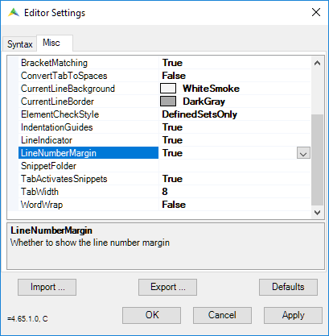
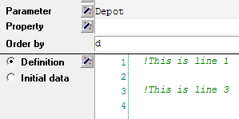
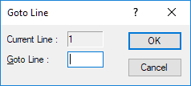
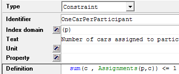
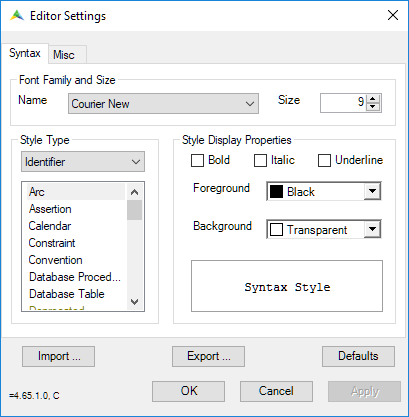
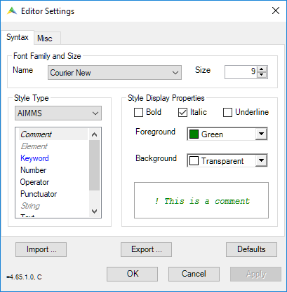

Configuring AIMMS IDE
==============================================================

.. meta::
   :description: How to enable line numbers and customize syntax highlighting in the AIMMS IDE Editor.
   :keywords: Editor, line numbers, syntax highlighting, settings, display, customization

The AIMMS IDE Editor offers options for displaying line numbers and customizing syntax highlighting, 
which can enhance code readability and ease of navigation. 
This article explains how to enable line numbers, customize display options, and manage syntax colors to suit your preferences.

Displaying Line Numbers
-----------------------

By default, line numbers are hidden in the AIMMS Editor, but you can enable them for easier reference and debugging. 
This feature is helpful when discussing specific parts of your model with others, as it allows you to point directly to line numbers within procedures or definitions.

To enable line numbers in the Editor:

1. Go to :menuselection:`Settings > Editor Settings`.
2. In the dialog that appears, select the :menuselection:`Misc` tab.
3. Set the :menuselection:`LineNumberMargin` option to :menuselection:`True`.

   AIMMS IDE Editor settings

With this setting enabled, line numbers appear next to all attributes that span multiple lines, as shown below:

   Line numbers displayed in multiline attributes

### Jump to Specific Line Number

You can quickly navigate to a particular line number using the keyboard shortcut ``Ctrl + G`` or by selecting *Edit > Goto Line* in the menu. This will open a dialog where you can specify the line number to jump to.

   Jump to specific line number by pressing Ctrl + G

**Note:** The *Goto Line* function is available even when line numbers are hidden.

Customizing Syntax Highlighting
-------------------------------

AIMMS applies a default syntax highlighting theme to help you quickly interpret various elements in the Editor. However, you can modify the colors for different identifier types, such as variables or keywords, to suit your preferences.

For instance, in the following image, the variable ``Assignments`` is highlighted in green:

   Display variables in green

To customize syntax highlighting:

1. Go to *Settings > Editor Settings*. A settings dialog will appear.
2. In the *Style Type* section on the left, select the identifier type you want to modify.
3. Adjust the display settings on the right to change the color, style (e.g., bold, italic, underline), or other attributes.

   Editor settings for identifiers

In addition to identifiers, you can customize the styling for comments, keywords, and other elements by selecting *AIMMS* in the *Style Type* section.

   Editor settings for AIMMS elements

### Importing and Exporting Style Settings

You can save your style settings as an ``.xml`` file, which allows you to share custom configurations with others in your organization. Use the *Import* and *Export* buttons in the *Editor Settings* dialog to manage these files.

AIMMS' in-house Editor settings, as seen in How-To articles and User Support training materials, are available for download below:

:download:`AIMMS Editor Settings <downloads/EditorSettingsCommunity.xml>`
