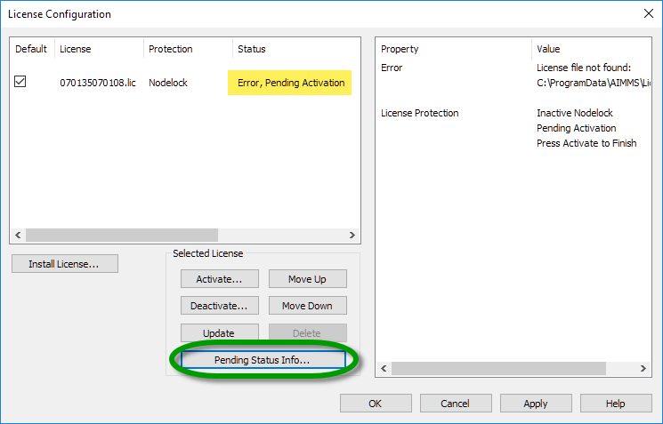
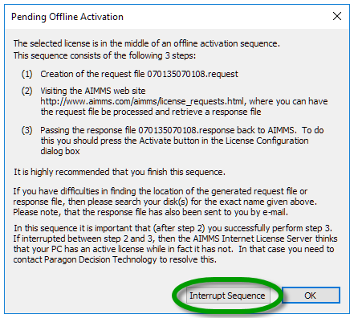
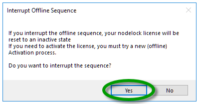
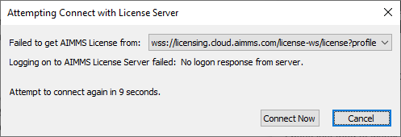
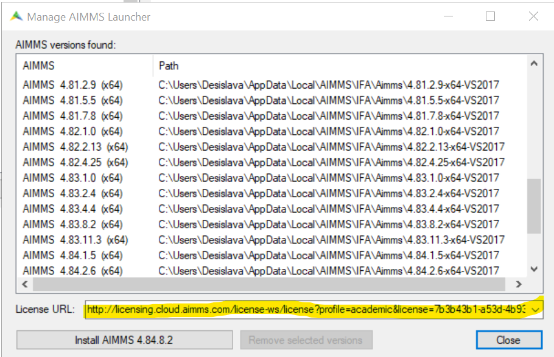

Academic and Community License Troubleshooting
###################################################

.. meta::
   :keywords: license, error, nodelock, activation, ip, subnet
   :description: Resolving AIMMS license issues regarding personal nodelock, pending activation, and IP subnet.

Error: This License Can Only Be Activated Using a Personal Nodelock
--------------------------------------------------------------------

**Issue:** You cannot activate your `Academic License <https://licensing.cloud.aimms.com/license/academic.htm>`_ with machine nodelock.  

**Cause:** You must select personal nodelock when activating an AIMMS `Academic License <https://licensing.cloud.aimms.com/license/academic.htm>`_. You must be connected to your school network.

**Solution:** Go :menuselection:`Back` in license setup and select :menuselection:`Personal Nodelock`. 

Ensure that you are connected to your university network. If working remotely, connect to a VPN service provided by your university (if available).

Error: Pending Activation
---------------------------

**Issue:** You cannot activate your `Academic License <https://licensing.cloud.aimms.com/license/academic.htm>`_ because you selected machine nodelock with offline activation.  

**Cause:** During setup you must select personal nodelock when activating an AIMMS `Academic License <https://licensing.cloud.aimms.com/license/academic.htm>`_. You must be connected to your school network. If you have chosen machine nodelock and offline activation, your license will show the status ``Error, Pending Activation``.

**Solution:** Follow the steps below.

1. Click :menuselection:`Pending Status Info` to cancel your license configuration. 

|

2. Click :menuselection:`Interrupt Sequence` in the window that appears. Click :menuselection:`Yes` to confirm.

|

Your license status returns to normal.  

.. note::
    To cancel/reset a pending activation on Linux machines, you need to delete all the files related to the specific license in the sub-folders of ``usr/local/AIMMS``: Config, Licenses, and Nodelocks. 

3. Try to activate your license again. Ensure that you are connected to your university network. If working remotely, connect to a VPN service provided by your university (if available).

Error: The IP Can Only be Activated from Within a Specified IP Subnet
----------------------------------------------------------------------

**Issue:** You cannot activate your `Academic License <https://licensing.cloud.aimms.com/license/academic.htm>`_ because your IP subnet does not match your university according to our database.

**Cause:** Some universities have multiple subnet ranges that are not recorded in our database, so an IP subnet error may occur even while you are connected to your university network.

**Solution:** Ensure you are connected to your university network and try activation again. If the IP subnet error occurs even when connected to your university network, contact AIMMS Support by sending an e-mail to support@aimms.com and provide the following information:

*   Your name

*   Email address used for registration

*   License number

*   Activation code

*   Academic domain

*   IP subnet - Go to an IP checker such as **checkip.dyndns.org**: ``http://checkip.dyndns.org/`` or **whatismyipaddress.com**: ``https://whatismyipaddress.com/`` and copy the public IP address you see there.

Our support team can then verify the information and update your license activation range to resolve the error.

Error: No Logon Response from Server
--------------------------------------------
**Issue:** If you have requested an  `Academic License <https://licensing.cloud.aimms.com/license/academic.htm>`_ or `Community License <https://licensing.cloud.aimms.com/license/community.htm?utm_source=website&utm_medium=footer>`_ on our website you have most probably 
received an e-mail from AIMMS Licensing containing instructions on how to install AIMMS and use your license. In this e-mail there should also be a unique license URL you will need in order to be able to open AIMMS.  

In some cases however while launching AIMMS on your computer you get the error message below:

|

**Solution:** There are a few possible reasons for you to be getting the above error.

* **Wrong or Misspelled License URL:** 
   Find the last e-mail you received from AIMMS Licensing with subject "Your AIMMS Academic/Community Edition account has been verified" and look for the License URL. Does it completely match the URL in the field "License URL" in the AIMMS Launcher? 
   
   Make sure the you have copied correctly the whole link from your e-mail into the License URL field of the Launcher. 
   
   Be careful: in case this is not your first AIMMS academic or community edition license it is possible that the License URL field contains the URL of your previous (expired) license. 
   In this case please make sure that the correct URL has been pasted in the field.  

|

* **Expired License:** 
   The academic/community license expires if unused for 6 months in a row. If you are not sure when you have used AIMMS for the last time please contact support@aimms.com so we can check that for you. 
   
   If your license has expired you need to reapply on our website for a new `academic <https://licensing.cloud.aimms.com/license/academic.htm>`_ or `community <https://licensing.cloud.aimms.com/license/community.htm?utm_source=website&utm_medium=footer>`_ license.

* **Outgoing Network Issue:** 
   Please make sure that you have excluded the above issues as possible reasons for the error. 
   The connection (web-socket connection) between the computer you are running AIMMS on and our license server may not be established 
   due to security mechanisms in place in the network or on the computer you are using. 
   For example corporate networks have these issues as well as a lot of university networks (like proxy servers, firewalls, virus scanners or restricted web socket connections whatsoever). 

   You can start by testing if the issue is: 

   * with your network > try changing the network with and alternative network or even a mobile Hot spot > if one of the alternatives works there may be a network security mechanism in place.
   * with your computer > try changing the computer > if the alternative computer works for you there may be something blocking the web-socket connection on your machine.

   Depending on who owns the network or machine you are using please contact the relevant IT department and request for allowing the usage of web-socket connections to ``licensing.cloud.aimms.com``.