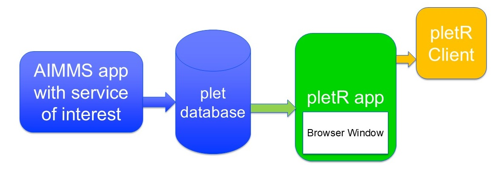

A Framework for Progress, Logging, and Error Handling of Tasks
===============================================================

.. Asked Copilot to provide me with an introduction as follows:
.. Hello, can you help me with the following?
.. I would like to create an introduction to a framework, whereby 
.. a service doing a potentially long running task is extended with progress 
.. logging and error handling facilities such that 
.. * Developers of that service know why a certain call took long or even failed, and
.. * Users of that service know how far that call is

Introduction
^^^^^^^^^^^^^

In modern software development, services often perform long-running tasks 
that can be challenging to monitor and debug. 
To address these challenges, we propose a framework that extends existing 
services with robust progress logging and error handling capabilities. 
This framework aims to provide clear insights for both developers and users, 
ensuring transparency and reliability.

Key Objectives:
""""""""""""""""""""

#. Developer Insights:

    *   Detailed Logging: Capture comprehensive logs that detail the execution flow, 
        including timestamps, intermediate states, and resource usage.

    *   Error Tracking: Implement mechanisms to log errors with contextual information, 
        making it easier to diagnose and resolve issues.

    *   Performance Metrics: Record metrics such as execution time and resource consumption 
        to identify bottlenecks and optimize performance.

#. User Transparency:

    *   Progress Indicators: Provide real-time updates on the progress of long-running tasks, 
        allowing users to understand how far along the process is.

    *   User-Friendly Error Messages: Display clear and informative error messages that 
        help users understand what went wrong and potential next steps.

        ..  *   Completion Estimates: Offer estimated completion times based on historical data and current progress.

Framework Components:
"""""""""""""""""""""""

#.  Logging Module:

    *   Structured Logging: Use structured logging formats 
        to ensure logs are easily searchable and analyzable.

        ..  *   Log Aggregation: Integrate with log aggregation 
        ..      tools (e.g., ELK stack) to centralize and visualize logs.

#.  Error Handling Module:

    *   Exception Handling: Implement a standardized approach to catching and logging exceptions, 
        including stack traces and relevant context.

        ..  *   Retry Mechanisms: Introduce automatic retry logic for transient errors, 
        ..      with configurable backoff strategies.

#.  Progress Tracking Module:

    *   Progress API: Develop an API endpoint that clients can query to get 
        the current status and progress of a task.

        ..  *   WebSocket Integration: Use WebSockets to push real-time progress updates to clients, 
        ..      enhancing the user experience.

#.  Monitoring and Alerts:

    *   Health Checks: Implement periodic health checks to ensure the service is running smoothly.

        ..  *   Alerting System: Set up alerts for critical issues, such as task failures or 
        ..      performance degradation, to notify developers promptly.

This framework not only improves the observability and reliability of long-running tasks but 
also enhances the overall user experience by providing transparency and actionable insights. 
By adopting this approach, developers can more effectively monitor and debug their services, 
while users benefit from clear progress updates and informative error messages.

Architecture
^^^^^^^^^^^^

The architecture consists of several components:

#.  It starts with a service of interest, in the remainder called the **macro service**.

#.  The logging statement in this macro service record events in the MySQL database schema **plet**.

#.  The AIMMS application **pletR** reads that database, and provides:

	#.  An 

Index
^^^^^^^^^^^^

.. toctree::
   :maxdepth: 1

   /Articles/658/658-pletR-application
   /Articles/658/658-plet-library

.. spelling:word-list::

   observability
   gitignore
   plet
   pletR