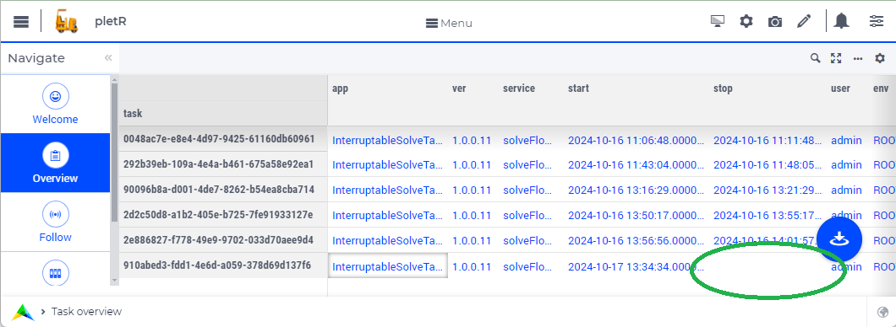
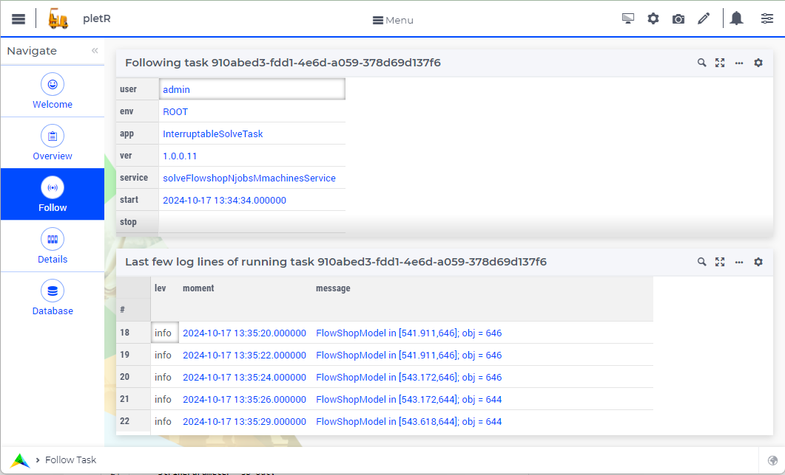

The AIMMS application pletR
============================

:download:`AIMMS 24.5 project download <model/pletR.zip>` 

The AIMMS 24.5 application pletR administers, reports on, and follows the MySQL database **plet**.

Install **plet** database.
^^^^^^^^^^^^^^^^^^^^^^^^^^

When the ``plet`` action is greyed, this means that the database was installed previously.
Otherwise, install the ``plet`` MySQL database on the cloud at hand by invoking the ``install`` action. 
This action will first beg for the db admin name and password, and subsequently install the 
``plet`` database schema.

You can test the installation by invoking the action ``Diagnostic`` which will test by running a small
task.  The diagnostic will be green when it successfully logged start, finish and two small warnings.

 

Overview of tasks
^^^^^^^^^^^^^^^^^^

The page "Overview" provides an overview of the tasks ran, and the tasks are sorted by start time.

Note that the last entry misses the stop time; indicating that this task is still running.

Follow of a task
^^^^^^^^^^^^^^^^^^^^^^

The page "Follow" offers you the chance of following a running task: showing the five last log lines of that 
running task and refreshing that window every five seconds.

After selecting that running task, the window may look as follows:

Providing both the administrative details of the task, and the last few log lines.

Details of a task
^^^^^^^^^^^^^^^^^^^^

The page "Details" provides the details of a task.  
The task just executed did not encounter any errors, 
therefor the corresponding tables remain empty:

Provides services
^^^^^^^^^^^^^^^^^^^^

Currently, pletR provides two services: ``taskTail``, and  ``taskLog``. 
 
The request of ``taskTail``  service should provide the task id and number of lines requested. 
For instance:

.. code-block:: json 
    :linenos:

    {
        "nolines": 3.0,
        "taskId": "9aaa3808-78ab-467a-a9d0-6bd27a23af8d"
    }

The response of this service provides the last few log lines. For instance:

.. code-block:: json 
    :linenos:

    {
        "tail": [
            {
                "task": "9aaa3808-78ab-467a-a9d0-6bd27a23af8d",
                "line": "3",
                "lev": 3.0,
                "mom": "2024-10-04 09:27:37.000000",
                "msg": "Diagnostic finish"
            },
            {
                "task": "9aaa3808-78ab-467a-a9d0-6bd27a23af8d",
                "line": "4",
                "lev": 2.0,
                "mom": "2024-10-04 09:27:37.000000",
                "msg": "At 2024-10-04 09:27:37 handling warning: Warning: To be Frank, I have to change my name!"
            },
            {
                "task": "9aaa3808-78ab-467a-a9d0-6bd27a23af8d",
                "line": "5",
                "lev": 2.0,
                "mom": "2024-10-04 09:27:37.000000",
                "msg": "At 2024-10-04 09:27:37 handling warning: Warning: Inspecting mirrors is a job where I could really see myself!"
            }
        ]
    }

The second service ``taskLog`` only needs the task id.
It will generate a similar log file, just all lines, for instance:

.. code-block:: json 
    :linenos:

    {
        "tail": [
            {
                "task": "9aaa3808-78ab-467a-a9d0-6bd27a23af8d",
                "line": "3",
                "lev": 3.0,
                "mom": "2024-10-04 09:27:37.000000",
                "msg": "Diagnostic finish"
            },
            
        ]
    }

.. spelling:word-list::

   pletR