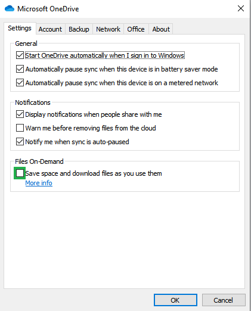

:orphan:
Storing Project in OneDrive
============================

.. meta::
   :description: Explains how OneDrive's on-demand file sync causes AIMMS project write errors and how to fix it by disabling the "Save space and download files as you use them" setting.
   :keywords: OneDrive, sync, webui.json, boost filesystem, file download on demand, AIMMS project, local copy, settings

Symptom
-----------

The error message:

.. code-block:: none

    awf.state: Problem writing 'MainProject/webui.json' on the server (500: boost::filesystem::create_directory: a file cannot be created when it already exists

By copying the same project to a folder that is not managed by OneDrive, the same error is not reported.

Explanation
------------

Default settings of OneDrive is to download files as you use them, so there is a physical copy of only those files which it thinks are being used. 
This does not always work well with an AIMMS project which is a collection of files and folders. 

If you change your settings to always keep copies on your laptop, you should not have any problem. 
Below is my OneDrive settings and I work on AIMMS projects in this directory. 

Solution
----------

The settings of OneDrive should be such that a copy of a file is always stored on your laptop.
This corresponds to unchecking the option ``Save space and download files as you use them``.

