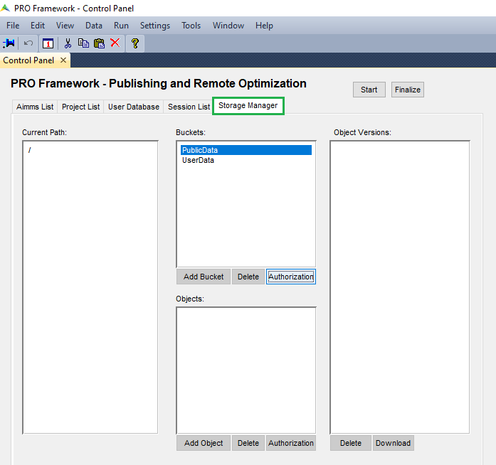
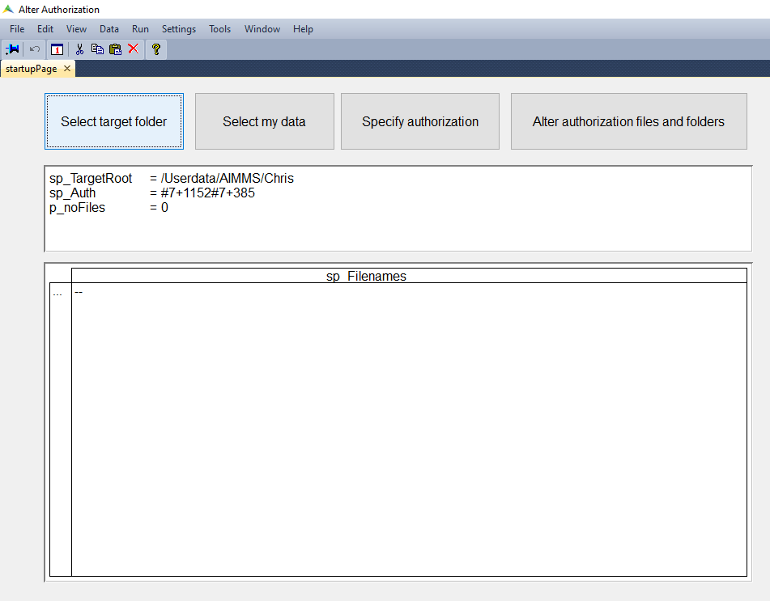

Control Panel
=========================================

.. meta::
   :description: Utility apps for AIMMS PRO Storage, available for download including a brief user guide.
   :keywords: AIMMS PRO storage, deployment, utility

This article provides for the source of four utility apps to operate on AIMMS PRO Storage.

To access the apps, create an ``.aimmspack`` from these sources and publish them on your AIMMS Cloud.

The app sources are available for download in the sections below:

#. Alter authorization and/or delete individual files and folders: 323-control-panel_ 

#. Alter authorization of files in a pro storage folder: 323-alter-authorization_ 

.. _323-control-panel:

PRO Storage
-----------------

.. topic:: Download

    :download:`Alter authorization and/or delete individual files and folders <model/ControlPanel.zip>`

This is a WinUI app, and when you select the storage tab, the screen looks as follows:

For individual files (objects) and folders (buckets) you can alter the authorization, add them or delete them.

* When you delete a folder (bucket), you delete all its files and subfolders.
* If you change the authorization of a folder (bucket), you do not change the authorization of its files or subfolders.

.. note:: The default setup is such that users that are not members of the group Admin, ordinary users for short, cannot read the folder ``/userdata``.  To provide them with this access, a user that is the admin, or a member of the group Admin, can provide Read access to all of the folder ``/userdata`` and of the direct sub folders corresponding to the environments. Note that the consequence of this action is that a user sees which other users are on the AIMMS Cloud.  This may, or may not, be a violation of the security protocols; and is therefore not provided by default.

.. _323-alter-authorization:

Alter Authorization
-----------------------

.. caution:: Please create an AIMMS Cloud backup before you make any authorization changes, or ask your AIMMS Cloud administrator to create one for you!

.. topic:: Download 

    :download:`Alter authorization of files in a pro storage folder <model/AlterAuthorization.zip>`

``AlterAuthorization`` is a WinUI app that starts with the following screen:

There are four buttons that allow you to operate this app:

#.  ``Select Target Folder``.  This will bring up the following dialog:

    .. image:: images/AlterAuthorizationSelectTargetFolderDialog.png
        :align: center

    In this dialog you can click on:
    
    #. A number, then you will get in the indicated subfolder.
    
    #. The button ``up``; then you will go up one level in the directory structure.
    
    #. The button ``cancel``, ignore changes made in the dialog.
    
    #. The button ``ok``, accept changes made in the dialog.
    
#.  ``Select my data``. Directly select the folder ``/Userdata/<env>/<username>``
    The reason for this button is, as explained above, that ordinary users cannot read the folder ``/Userdata``. 
    They can, however, browse through it. This button does just that to land at one own's files.
    
#.  ``Specify Authorization``. In this dialog you can specify an authorization to be used.

    .. image:: images/AlterAuthorizationSelectTargetFolderDialog.png
        :align: center

    To select a new authorization, you should:
    
    #.  Select the environment, in the example ``AIMMS`` is selected.
    
    #.  Select a user, or a group of users.  In the example, the user ``Chris`` is selected.
    
    #.  A new entry appears in the table ``Current Authorization``. Here you can check/uncheck tick marks as required.
    
#.  ``Alter authorization files and folders``. Pressing this button will apply the authorization specified to the target folder specified and all files and folders therein.

