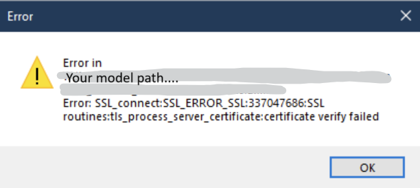
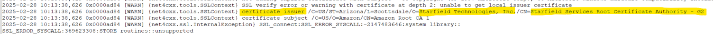

AIMMS IDE Troubleshooting
===========================================

Error: Handling SSL Errors in your AIMMS Project 
-------------------------------------------------

**Issue:** While you are opening your AIMMS project you may experience a crash which can manifest with a pop-up error message looking like one of these below:

|

|

In any case, in the message you will see the following string "certificate verify failed".

**Cause:** This happens mostly when AIMMS is trying to connect to our `Library Repository <https://library-repository.aimms.com>`_. 
The library repository connection is necessary when your project is using one of our `repository libraries <https://documentation.aimms.com/library-repository.html>`_ and, for some reason, the relevant library has not been yet downloaded to this particular machine. 
To verify if you are using a repository library, you can open your ``.aimms`` file in a text editor and look for lines starting with ``RepositoryLibrary``, like in the screenshot below:

|

Normally, when you, as a modeler, add a repository library to your project, it will be downloaded to ``%localappdata%\AIMMS\AutoLib`` onto your machine, so that, when you open the project in the future, it is available locally. 
However, when transferring projects between different machines, this initial download is skipped, so the download on each new machine is triggered when the project is being opened there for the first time.

.. topic:: What is the most probable reason for the error?

    The connection between your machine and our repository library is secure - it happens through https. This means that, in order to be able to establish this connection, you need to be able to validate the SSL certificate, installed on our repository library. 
    In order for this validation to be performed, however, your machine needs to be equipped with up-to date local certificates (this happens, for example, when you are regularly updating your Operating System). 
    In the majority of the cases when this certificate error is generated, the relevant local certificate is missing on the machine. 

.. topic:: How to verify that this really is your problem? 

    The best way to make sure that the problem is related to validation of our Library Repository certificate is to inspect the logs while you are opening your project.
    You can enable logging for your AIMMS project, using the techniques described in `this article <https://how-to.aimms.com/Articles/329/329-more-logging.html#for-logging-in-aimms-developer>`_.
    By default the logfile should be in the "log" folder of your project, with a name "aimms-log.txt", unless you have modified the default settings in the LoggerConfig file, as described `here <https://how-to.aimms.com/Articles/329/329-more-logging.html#control-of-the-logging>`_)
    When reviewing the log lines, look for lines containing the following:

    "[INFO] {ProxyResolver.PlatformResolver} Resolving proxy information for 'https://library-repository.aimms.com:443/x64_vc143_Release.all'"
    ...and then, further down along the loglines, please look for lines containing
    "[WARN] {net4cxx.tools.SSLContext} SSL verify error or warning with certificate at depth 2: unable to get local issuer certificate"
    or
    "SSL_ERROR_SYSCALL:167772294:SSL routines::certificate verify failed"
    or simply "certificate verify failed"

**Solution:** Being now sure that the problem is with the validation of the Library repository certificate, you can perform the steps below to solve it:

1. Try running your Windows updates and restarting your computer. 
The windows updates will also update your local certificates, after which you have a better chance to be able to go through the validation process. 

2. Open the repository library in MS Edge in Internet Explorer mode. 
The current versions of MS Edge have the option to open Edge in Internet Explorer mode. 
To activate and apply this, you can follow `these steps <https://support.microsoft.com/en-us/microsoft-edge/internet-explorer-mode-in-microsoft-edge-6604162f-e38a-48b2-acd2-682dbac6f0de#:~:text=To%20turn%20on%20Internet%20Explorer,Restart%20Microsoft%20Edge.>`_.
Opening `Library Repository <https://library-repository.aimms.com>`_ like this, the local certificate will get downloaded automatically and then you should be able to open your AIMMS project.

3. Transfer a certificate from a machine where you know that the project can be opened 
Alternatively, you can transfer a certificate from a machine when you know that you still are able to reach the repository library from AIMMS. To make sure that this is the case, you can open AIMMS and just try andding any library, following `these guidelines <https://how-to.aimms.com/Articles/84/84-using-libraries.html#to-add-a-new-library>`_.
If you succeed, this means that the relevant machine possesses the correct local certificate. 
To figure out which certificate you need from that machine, you can go back to the logfile and look for details on the certificate that can not be validated. For example in the screenshot below you will see the following certificate details: 

|

Then you go to the machine that can connect to the Repository Library, open the Certificate Manager (in your Windows search menu, look for "certmgr") and navigate to Trusted Root Certification Authorities -> Certificates. 
Then look for the certificate from the logs. In my case I find this one.

|

You should be able to export the certificate like this: 

|

|

|

|

|

|

|

...and import it onto the new machine like this:

|

|

|

.. topic:: If all the above does not work, is there a work-around? 

    There is a quick work-around for this problem, which bypasses the access to the Library Repository, but it will not help you if you need additional libraries in the future.
    You can copy the libraries from a machine where you know that the project is successfully opening - you should navigate to %localappdata%\AIMMS\AutoLib onto that machine and copy the library folder, together with the library version subfolder to the machine where you are working.

    Alternatively, if you do not have an access to a machine where the project can be opened, you can contact us at support@aimms.com, sharing the library version you need. This way we can share with you the relevant library.

.. spelling:word-list::
    aimms
    RepositoryLibrary
    localappdata
    AIMMSAutoLib
    logfile
    ProxyResolver
    PlatformResolver
    loglines
    cxx
    SSLContext
    andding
    logfile
    certmgr
    AIMMSAutoLib