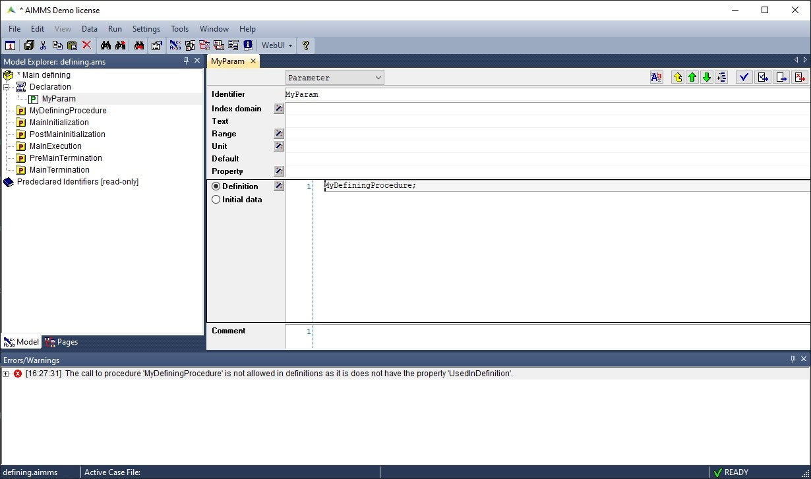

Support for Defining Procedure in New Compiler
================================================

Starting from AIMMS version 25.4, a new procedure property is available: ``UsedInDefinition``. This will be mandatory to allow a procedure to be used in the definition of a parameter or set.
This property dictates that the statements in the body of the procedure are not allowed to make changes to any global identifier in the model, unless explicitly specified.

If you are working with defining procedures in a AIMMS version before 25.4 and updates to 25.4, you will see the following error:

|

To fix the error, go to the procedure you are using to define parameters and add the ``UsedInDefinition`` setting.

|

Below you can see three ways in which a procedure can be used in the definition of a parameter or set:

Procedure as a Function
-----------------------

When the procedure is actually a kind of function: it may have a number of input arguments,
but no output arguments, and the returned value of the procedure is used as the evaluated value of the definition.

.. code-block:: aimms

    Procedure pr_divideByTen {
        Arguments: p_in_arg;
        Property: UsedInDefinition;
        Body: {
            p_loc_dividedByTen := p_in_arg / 10;
            return p_loc_dividedByTen;
        }
        Parameter localParameter;
        Parameter p_in_arg {
            Property: input;
        }
    }
    Parameter p_def_dividedByTenAsFunction {
        Definition: pr_divideByTen(4);
    }

Procedure with One Output Argument
-----------------------------------

The procedure has exactly one output argument, and no other arguments. 
In the definition of a parameter or set you can pass this parameter or set as the argument of the procedure.

.. code-block:: aimms

    Procedure pr_fourDivideByTen {
        Arguments: p_out_arg;
        Property: UsedInDefinition;
        Body: {
            p_out_arg := 4 / 10;
        }
        Parameter p_out_arg {
            Property: output;
        }
    }
    Parameter p_def_procedureOneOutputArgument {
        Definition: pr_fourDivideByTen(p_def_procedureOneOutputArgument);
    }

Procedure with No Arguments
----------------------------

The procedure has no arguments, but it explicitly states that it changes some global identifiers 
via the new attribute ``DefinesIdentifiers``.
This is especially usefull if you have more than one parameter or set that are calculated in one procedure.

.. code-block:: aimms

    Procedure pr_findMinMax {
        Property: UsedInDefinition;
        DefinesIdentifier: p_def_minValueA, p_def_maxValueA;
        Body: {
            for (i) do
                p_def_minValueA = min(p_def_minValueA, A(i));
                p_def_maxValueA = min(p_def_maxValueA, A(i));
            endfor;
        }
    }
    Parameter p_def_minValueA {
        Definition: pr_findMinMax;
    }
    Parameter p_def_maxValueA {
        Definition: pr_findMinMax;
    }

.. spelling:word-list::
