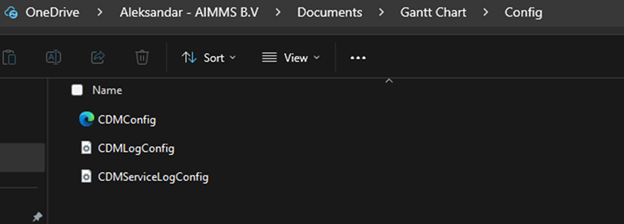
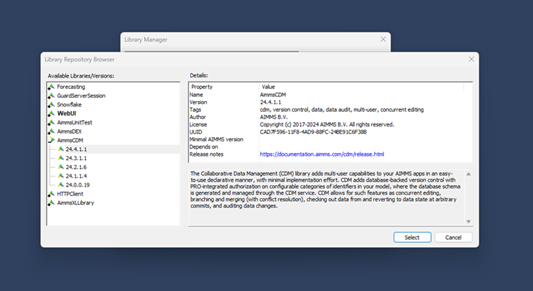
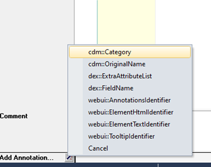
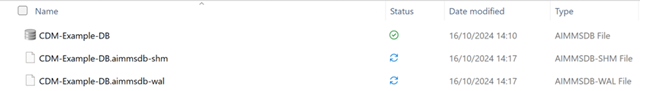

How to Integrate the CDM library to your AIMMS application
==========================================================

AIMMS Collaborative Data Management (CDM) provides the capability to turn any AIMMS project into a multi-user scenario planning application. It does so by backing the AIMMS app by a versioned application database managed by the AIMMS CDM component, which is able to capture any collection of data changes made by a user throughout the app into a single tractable transaction.

Configure your application to run it locally using SQLite
---------------------------------------------------------

Prerequisites
-------------

• You need to have a working project (you can use our :download:`Gantt Chart application <download/GanttChart.zip>`).
• You need to download the :download:`CDM Config files <download/Config.zip>`.
These files need to be put in a Config folder where your app is found (as shown below).

|

Download SQLite Browser version 3.12.2 (use this specific version and don’t use the latest one).

Integration
-----------

First step that you need to do is add the CDM library to your project. To do so open the Library Manager, File > Library Manager, and select the option Add Library from Repository and select the latest version of AimmsCDM.

|

Once you add the library, save your project.

The next step is to choose which data you would like to synchronize. Once you have managed to select the data you need to add annotation to which CDM category that data will belong. There are two level options, you can do it on a section level or parameter level.

|

In this field you are free to write any category that you deem fit. If you add the CDM category on a section level, all the sets and parameters within that section will inherit that annotation (you do have the option to override the inherited value).

Now you need to add an initialization script. Create a new procedure and use the code below.

.. code-block:: aimms

    cdm::ApplicationDatabase := "<Name of the MySQL Schema>";
    cdm::DataSchemaVersion := "1"; 
    if (ProjectDeveloperMode) then
        cdm::UseEmbeddedServer := 1;
    else
        pro::Initialize();
        cdm::CloudServiceName := "<You can name the service as you wish>";
        cdm::DatabaseHost := "<Connection to the MySQL server>";
        cdm::DatabaseUser := "<User that has full permissions to the Schema>";
        cdm::DatabasePassword := "<Password>";
        cdm::CallTimeout := 300000;
        cdm::ServiceLogLevel := 'TRACE';
    endif;
    cdm::ConnectToApplicationDB;
    cdm::ListenToDataChanges := 1;
    cdm::AutoCommitCategory(cdm::cat) := 1;
    cdm::AutoPullCategory(cdm::cat) := 1;
    cdm::StartListeningToDataChanges;

Once done, you need to add this procedure to your start up procedure in your project. Save the project.

This is everything that you initially need to do to add CDM to your project. If you close and re-open the project you will see in your Data folder that a local CDM database with extension aimmsdb is created.

|

Using the SQLite Browser you can open this file and see the structure. There will be some default tables along with the tables created for your sets and parameters that you previously added the CDM category annotation.

Configure your application to use MySQL on AIMMS Cloud
------------------------------------------------------

Once you are ready for the application to be published on PRO, using SQLite should be changed to using our MySQL DB which is found on our cloud solution.

The initialization script that you have used for CDM can handle connection to the MySQL database on your cloud account (if you have one). All is already setup and you can create your aimmspack file and upload it to AIMMS PRO.

To access the MySQL DB and see the data live you need to follow this process:

`<https://how-to.aimms.com/Articles/596/596-mysql-db-cloud.html>`

.. spelling:word-list::

    aimmsdb