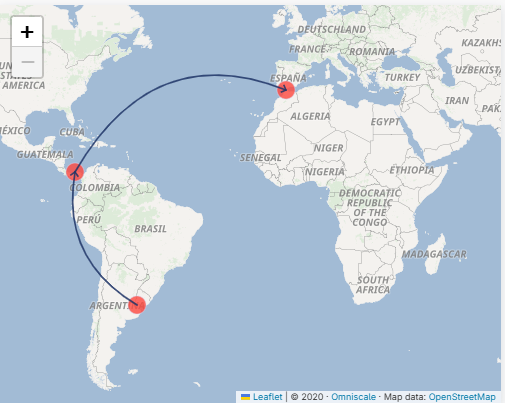
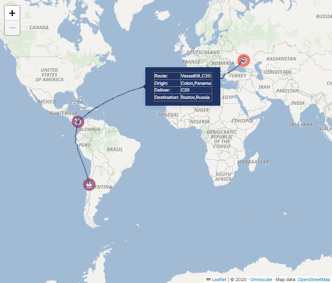

Orchestrating the ``searoute`` Python Library from AIMMS 
==============================================================================

Python has a vast and growing ecosystem of libraries that can add 
valuable functionality to your Operations Research applications developed in AIMMS. 
The AIMMS Python-Bridge connects the two environments, providing a crucial two-way link:

#.  A Python application to use an AIMMS model.

#.  An AIMMS application to use Python libraries.

This article focuses on the second scenario, demonstrating how to use 
the open-source ``searoute`` library to enhance a strategic maritime application. 

.. important:: 

    To set up a minimal Python environment to execute this example, please read this article: :doc:`../676/676-starting-with-python`.

Exploring the ``searoute`` Library
-------------------------------------

Running example of this article is the :doc:`Vessel Scheduling<../590/590-vessel-scheduling>` application
that uses the Python `searoute <https://pypi.org/project/searoute/>`_ library, for the following two purposes:

#.  To calculate more accurate distances between harbors, improving optimization quality.

#.  To visualize realistic routes on a map, enhancing user insight.

The Python library ``searoute`` accepts coordinates in the order of ``[longitude, latitude]`` and 
returns a ``geojson`` object containing the route information.  

A typical call in a Python script looks like:

.. code-block:: python
    :linenos:
    :emphasize-lines: 3

    origin = [-44.37, -2.565] # Ponta da Madeira, Brazil 
    destination = [-74.22, 11.07] # Puerto Prodeco, Colombia
    route = sr.searoute(origin,destination)

The ``geojson`` object contains the useful data within its ``properties`` and ``geometry`` attributes:

*   ``properties.length``: the accurate distance in kilometers.

*   ``geometry.coordinates``: the list of ``[lon, lat]`` coordinates that describe the route.

In the :doc:`Vessel Scheduling<../590/590-vessel-scheduling>` application we are interested in the: 

*   distance, which is given by ``properties.length``, and

*   in the actual route, which is given in ``geometry.coordinates`` as a list of ``[lon, lat]`` tuples.

Integrating with AIMMS
---------------------------

To utilize the ``searoute`` functionality, the necessary Python libraries must be available. 
The ``pyproject.toml`` file ensures that the correct versions of the libraries are loaded automatically:

.. code-block:: toml
    :linenos:

    [project]
    name = "vessel_scheduling_with_sea_route"
    version = "0.1.0"
    description = "Use Python library Sea Route to compute usable sea routes for large vessels"
    requires-python = "==3.13.*"
    dependencies = [
        "aimmspy",
        "pandas>=2.3.2",
        "searoute",
    ]

In addition, the AIMMS project requires the  
`the pyaimms repository library <https://documentation.aimms.com/aimmspy/pyaimms/pyaimms.html>`_
is essential as it is the Python client that allows your script to access and interact with the AIMMS model's data.

To enable the AIMMS compiler to link and scan the Python code (in our case, ``leverage-sea-route.py``), 
you use the ``py::run_python_script`` statement:

.. code-block:: aimms

    py::run_python_script("leverage-sea-route.py");

Using ``searoute`` to Compute Distances
-----------------------------------------

In the Vessel Scheduling example, 
the difference between the geometric haversine distance and 
the ``searoute`` distance can be significant. 
For instance, the haversine distance between Caldera (Chile) and Bahia Blanca (Argentina) is 1520 km, 
whereas ``searoute`` calculates a more realistic route of 5180 km.

To compute an entire distance matrix, the Python script retrieves location data from AIMMS, 
calculates the distances, and sends the results back via a pandas ``DataFrame``.

.. code-block:: python
    :linenos:

    def searoute_distance_matrix():
        # Step 1: Retrieve data from the AIMMS model and store in a pandas DataFrame
        distance_mat_list = []
        df_location_overview = aimms_model.multi_data(["i_loc","p_latitude","p_longitude"])
        
        # ... code for iterating and calculating distances ...
        
        # Step 2: Build a DataFrame with the calculated distances
        distance_columns = ['i_loc_from','i_loc_to','p_distance_searoute']
        distance_df = pd.DataFrame(distance_mat_list,columns=distance_columns)

        # Step 3: Pass the DataFrame back to the AIMMS model
        aimms_model.p_distance_searoute.assign(distance_df)

.. note:: Efficiency Consideration 

    Calculating routes can take some time. 
    To avoid unnecessary recalculations, the distance matrix is cached in a ``.parquet`` file within the AIMMS model.

Visualizing Routes
-----------------------------------------

|

By using the waypoints provided by ``searoute``, the application can display a much more realistic route on a map, 
offering better visual insights than a simple line.

|

The AIMMS procedure ``ui::pr_openPageSeaRouteMap`` concatenates the waypoints computed by the searoute library
for each of the routes in the optimal solution.

.. seealso::

    *   `uv <https://docs.astral.sh/uv/>`_

    *   `pandas <https://pandas.pydata.org/docs/>`_

    *   `pyaimms <https://documentation.aimms.com/pyaimms/pyaimms.html>`_

    *   `aimmspy <https://documentation.aimms.com/aimmspy/aimmspy.html>`_

    *   `searoute <https://pypi.org/project/searoute/>`_

.. spelling:word-list::

    uv
    aimmspy
    searoute
    lon
    lat
    toml
    haversine
    dataframe
    geojson