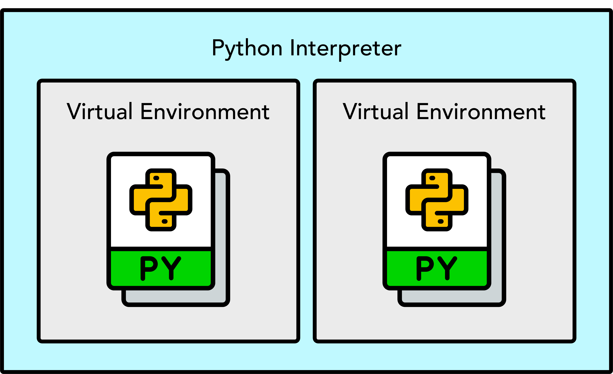

Minimal Python Environment for the Vessel Scheduling Example
==============================================================

.. meta::
    :keywords: Python environment, virtual environment, pyenv, uv, aimmspy, dependency management, Vessel Scheduling, Python 3.13
    :description: Guide to setting up a minimal, isolated Python 3.13 environment for AIMMS's Vessel Scheduling example. Uses 'pyenv' and the fast package manager 'uv' to manage dependencies like 'aimmspy' and 'pandas'.

Introduction: Why Use a Virtual Environment?
--------------------------------------------

When working on Python projects, it is essential to keep the dependencies (the specific libraries and their versions) for each project **isolated**.

A **Virtual Environment** creates a self-contained space for your project. This prevents "dependency conflicts" where different projects might require different, incompatible versions of the same library.

For the :doc:`Vessel Scheduling<../590/590-vessel-scheduling>` example, we need a specific **Python version (3.13)** and a 
few key libraries to manage the data exchange with AIMMS.

|

Actionable Setup Guide
----------------------

The following tools are used to establish a minimal, clean, and functional 
environment for the :doc:`Vessel Scheduling<../590/590-vessel-scheduling>` example:

#.  **Python Version Manager:** ``pyenv``

    This tool allows you to easily **install and switch between different Python versions** 
    on your system without conflicts.

    * **Tool:** `pyenv <https://github.com/pyenv/pyenv>`_ (for Linux/macOS) or `pyenv-win <https://github.com/pyenv-win/pyenv-win>`_ (for Windows).
    * **Goal:** Ensure you are using the required **Python 3.13**.

    .. hint:: 

        Install and select Python 3.13 using ``pyenv`` before proceeding:
       
        .. code-block:: bat
        
            pyenv install 3.13
            pyenv global 3.13

#.  **Package Manager and Virtual Environment Creator:** ``uv``

    The ``uv`` library is a modern, extremely fast tool that can manage both the creation of 
    virtual environments and the installation of packages (like a faster replacement for ``pip``).

    * **Tool:** `uv <https://docs.astral.sh/uv/>`_.
    * **Goal:** Create the isolated environment and install the required libraries. 
    
    For instance, execute in the Python-Bridge folder:

    .. code-block:: bat
    
        uv init
        uv venv
        .venv\Scripts\activate.ps1 (or .venv\Scripts\activate.bat)
        uv pip install -r requirements.txt

Required Python Libraries (Dependencies)
----------------------------------------

All necessary libraries should be documented in the ``requirements.txt`` file for the project. 
For your reference, here are the key packages used for both modes of the AIMMS Python-Bridge:

#.  Core AIMMS Python-Bridge Package:

    * ``aimmspy``: The official library for data exchange between AIMMS and Python. `(Required for both lead modes).`

#.  Data Handling and Utilities:

    * ``pandas``: Essential for structured data manipulation and highly efficient data transfer.

    * ``searoute``: Used specifically for geographical calculations within the scheduling logic.

#.  Standard Python Libraries (Often Bundled/Not Explicitly Installed):
    The following are standard, built-in libraries often imported but do not need 
    explicit installation via ``uv`` or ``pip``: ``time``, ``datetime``, ``os``, ``pathlib``, ``sys``.

.. seealso:: 

    -   For a practical application of this setup, please refer to the :doc:`Vessel Scheduling<../590/590-vessel-scheduling>` example, 
        which demonstrates how to leverage this Python environment to interact with an AIMMS model effectively.
    -   :doc:`../676/676-running-aimms-app` article.
    -   :doc:`../676/676-leveraging-python-lib` article.
