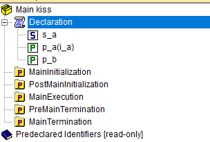
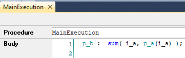

Hello to the World of AIMMSPY from Python-Bridge
=================================================

.. meta::
    :keywords: AIMMS, Python-Bridge, aimmspy, Hello World, Python-in-the-lead, data exchange, pyenv, uv, virtual environment
    :description: An introductory guide to using aimmspy from the AIMMS Python-Bridge using a 'Hello World' example. Learn to open an AIMMS session, exchange data, and execute procedures from a Python script using 'aimmspy'.

This **Hello World** guide introduces aimmspy from the AIMMS Python-Bridge, focusing on the core "Python-in-the-lead" workflow.

Specifically, the Python script will manage the AIMMS application to:

* Open and manage an AIMMS application instance.
* Exchange data (read and write) with the AIMMS model.
* Execute AIMMS procedures.

Please use the :download:`Hello World <model/hello-world-aimmspy.zip>`  project to follow this article.

Prerequisites & Environment Setup
---------------------------------

To ensure reproducibility and manage dependencies, this tutorial focuses on using a specific Python version within an isolated **virtual environment**.

.. note::

    This tutorial focuses on a specific environment setup for reproducibility. Other configurations are possible but are outside the scope of this article.

Install Dependency Tools
^^^^^^^^^^^^^^^^^^^^^^^^^^^^^^^^^^

If you haven't already, please install the recommended dependency management tools:

#.  ``pyenv`` (for managing Python versions): `pyenv <https://github.com/pyenv/pyenv>`_ (for Linux/macOS) or `pyenv-win <https://pypi.org/project/pyenv-win/>`_ (for Windows).
    
#.  ``uv`` (for fast package and environment management): `uv <https://docs.astral.sh/uv/>`_.

Initialize the Environment
^^^^^^^^^^^^^^^^^^^^^^^^^^^^^^^^^^

Start a PowerShell or terminal, navigate to the directory containing the Python ``main.py`` file, and 
execute the following commands:

.. code-block:: bash
    :linenos:

    pyenv install 3.13
    pyenv local 3.13
    uv init
    uv venv
    .venv\Scripts\activate

Remarks:

* Lines 1-2: Set Python **3.13** as the interpreter for the current directory.
* Lines 3-4: Initialize the project and create a new virtual environment (``.\venv``).
* Line 5: Activate the newly created virtual environment.

.. hint::

    If you face an error while ``pyenv install 3.13``, use ``pyenv install --list`` to see all available python versions. 
    And, if you don't find the Python version you'd like to use, please run ``pyenv update`` and try again. 

Install Dependencies
^^^^^^^^^^^^^^^^^^^^^^^^^^^^^^^^^^

The documentation mentions that a ``pip install aimmspy`` is needed to use the ``aimmspy`` library.
In Python applications, it is customary to enumerate such dependencies in a ``requirements.txt`` file.
Here we use 

.. code-block:: bash

    aimmspy
    pandas 

as ``requirements.txt`` file; such that 

.. code-block:: bash

    uv pip install -r requirements.txt

will install the dependencies used.
    
AIMMS Model
---------------------------------

The accompanying AIMMS model, ``hello.aimms``, is intentionally simple. It defines an input array (``p_A``) 
and calculates the scalar sum of its elements, storing the result in an output parameter (``p_B``).

    AIMMS Model Explorer showing input parameter ``p_A`` and output parameter ``p_B``.

    AIMMS procedure ``MainExecution`` containing a single assignment statement.

Python Script
---------------------------------

The Python script uses the ``aimmspy`` library to control the AIMMS session.

.. code-block:: python
    :linenos:

    # Import necessary classes and functions.
    from aimmspy.project.project import Project, Model
    from aimmspy.utils import find_aimms_path

    # Initialize the AIMMS project
    project = Project(

        # Path to the AIMMS Bin folder  
        aimms_path=find_aimms_path("25"), 

        # Path to the AIMMS project file (relative to the script).
        #aimms_project_file=projectfile,
        aimms_project_file = "..\\AIMMS\\hello.aimms", 
        
        # Optional: Add your licensing URL here.
    )
    aimms_model : Model = project.get_model(__file__)

    # Send data to the AIMMS model
    hello_world_dict = { "hello" : 1, "world" : 2 }
    aimms_model.p_a.assign( hello_world_dict )

    # Run an AIMMS procedure
    aimms_model.MainExecution()

    # Get results back and print.
    hello_world_result = aimms_model.p_b.data()
    print(f"Hello world: sum is {hello_world_result}")

Expected Output
^^^^^^^^^^^^^^^^^^^^^^^^^^^^^^^^^^

The script can now be executed using:

.. code-block:: bash

    uv run main.py

When the script is executed, the AIMMS session opens, data is exchanged, and 
the result is returned to Python:

.. code-block:: none
    :linenos:

    C:\Users\ChrisKuip\AppData\Local\AIMMS\IFA\Aimms\25.7.7.4-x64-VS2022\Bin --as-server "..\AIMMS\hello.aimms"
    Hello world: sum is 3.0
    
Summary
^^^^^^^^^^^^^^^^^^^^^^^^^^^^^^^^^^

You have now established a connection between a Python environment and an AIMMS model using aimmspy. 
By following this "Hello World" workflow, you have successfully:

* Established a communication channel from Python to a running AIMMS session.
* Modified AIMMS model data from an external script.
* Triggered AIMMS procedures to utilize its optimization and logic capabilities.

With this foundation, you can now use Python as a driver to orchestrate your AIMMS models, 
allowing you to incorporate powerful optimization solvers into your broader Python-based workflows and applications.

As a next step, you may want to check out: 
`Orchestrating Contract Allocation AIMMS App from Python <file:///C:/u/s/how-to/fb-679-make-it-aimmspy/_build/html/Articles/680/680-running-aimms-app.html>`_.

References
^^^^^^^^^^^^^^^^^^^^^^^^^^^^^^^^^^

*   `Python Bridge reference documentation <https://documentation.aimms.com/python-bridge/index.html>`_
*   `Python package index for aimmspy <https://pypi.org/project/aimmspy/>`_
*   `Python Bridge official getting started <https://documentation.aimms.com/aimmspy/getting-started.html>`_
*   `Announcement of Python Bridge: connecting the worlds of Python and AIMMS <https://community.aimms.com/product-updates/python-bridge-connecting-the-worlds-of-python-and-aimms-1839>`_
