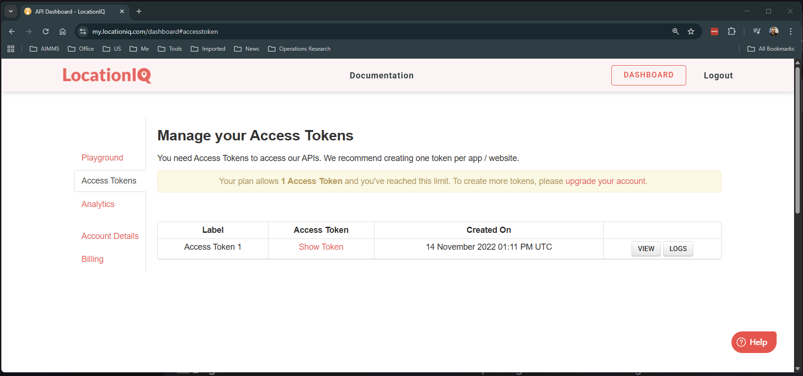
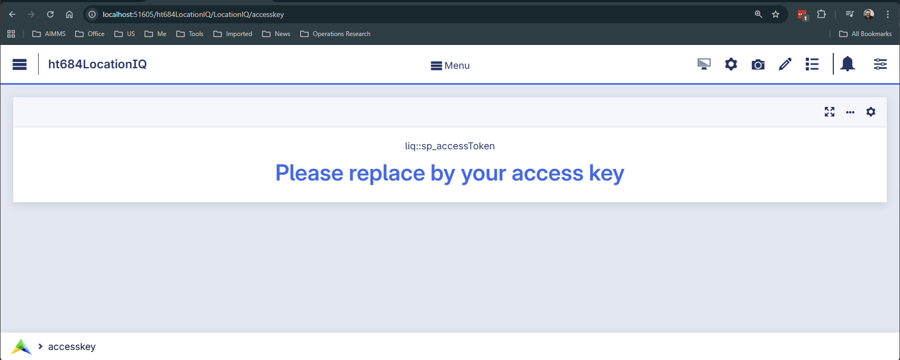
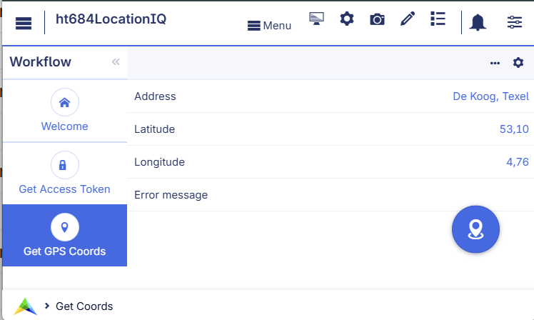

LocationIQ Integration with AIMMS
=====================================

.. image:: https://img.shields.io/badge/Zip-white?style=for-the-badge&logo=github&labelColor=000081&color=1847c9
   :target: https://github.com/aimms/684-location-iq/archive/refs/heads/main.zip

.. image:: https://img.shields.io/badge/Repository-white?style=for-the-badge&logo=github&labelColor=000081&color=1847c9
   :target: https://github.com/aimms/684-location-iq

.. image:: https://img.shields.io/badge/AIMMS-25.9-white?style=for-the-badge&labelColor=009B00&color=00D400

.. image:: https://img.shields.io/badge/WebUI-25.9.1.0-white?style=for-the-badge&labelColor=009B00&color=00D400

.. image:: https://img.shields.io/badge/AimmsDEX-25.10.1.2-white?style=for-the-badge&labelColor=009B00&color=00D400

.. meta::
    :keywords: AIMMS, LocationIQ, Geocoding, REST API, DEX library, asynchronous, JSON mapping, HTTP GET, error handling, GPS coordinates
    :description: Learn to integrate LocationIQ with AIMMS using the DEX library for high-performance, asynchronous geocoding, JSON data mapping, and robust error handling.

The legacy AIMMS function `GeoFindCoordinates <https://documentation.aimms.com/functionreference/system-interaction/environment-functions/geofindcoordinates.html>`_ 
is constrained by its reliance on Nominatim. Nominatim enforces strict rate limits, typically 
permitting at most one GPS coordinate request per second, which can significantly impede performance 
for batch geocoding tasks.

To overcome these limitations, AIMMS applications can utilize external REST services. 
While this article features LocationIQ as the primary example, the implementation logic 
remains consistent across most modern geocoding providers.

Please use download the example project to follow along this article.

Geocoding Service Selection
---------------------------

The choice of geocoding provider depends on data coverage requirements, pricing, and terms of service. 
We utilize LocationIQ for this demonstration due to its ease of setup, robust documentation, 
and generous free-tier rate limits.

.. note::

    Since AIMMS handles HTTP requests generically via the Data Exchange library, you can adapt 
    this approach for other services:

    * `Google Maps Platform <https://mapsplatform.google.com>`_
    * `Mapbox <https://www.mapbox.com>`_ 
    * `OpenCage <https://opencagedata.com>`_
    * `Bing Maps <https://www.microsoft.com/maps>`_
    * `HERE Technologies <https://www.here.com>`_
    * `TomTom <https://developer.tomtom.com>`_

By using the `AIMMS Data Exchange (DEX) Library <https://documentation.aimms.com/dataexchange/index.html>`_, these services are accessed asynchronously, 
ensuring the user interface remains responsive during network operations.

Prerequisites and Configuration
-------------------------------

Obtaining an Access Token
^^^^^^^^^^^^^^^^^^^^^^^^^^^^

To authenticate with the LocationIQ API, you must obtain a unique Access Token. 
This token identifies your application and monitors usage limits. You can generate one at the 
`LocationIQ Dashboard <https://my.locationiq.com/dashboard#accesstoken>`_.

|

Specifying the Token in AIMMS
^^^^^^^^^^^^^^^^^^^^^^^^^^^^^^^^

Once obtained, the token must be stored within your AIMMS application. In the provided 
example project, the token is entered on the configuration page and stored in the 
scalar parameter ``sp_accessToken``.

In the enclosed AIMMS App, navigate to the page: ``liq::accesstoken``.

|

Implementation Steps
--------------------

The integration follows a three-step process: constructing the request, mapping the JSON response, 
and handling the result via a callback.

Constructing the API Request
^^^^^^^^^^^^^^^^^^^^^^^^^^^^^^^

The Geocoding endpoint (``/v1/search``) converts a human-readable address into geographic 
coordinates (Latitude and Longitude). This process is known as forward geocoding.

|

The API call is constructed as a standard HTTP GET request. The URL must include the Access Token, 
the query string (``q``), and the output format (``format=json``).

.. code-block:: aimms 
    :linenos:

    _sp_url := 
        formatString("https://%s.locationiq.com/v1/search?" , _sp_reg) +
        formatString("key=%s&", sp_accessToken) +
        formatString("q=%s&format=json&", _sp_query);

The request is executed using ``dex::client::NewRequest``. We specify a response file 
and an asynchronous callback (``_ep_callback``).

.. code-block:: aimms 
    :linenos:

    dex::client::NewRequest(
        theRequest    :  _sp_theRequest, 
        url           :  _sp_url, 
        callback      :  _ep_callback, 
        httpMethod    :  'GET', 
        requestFile   :  "", 
        responseFile  :  sp_libfolder + "/data/getLocation.json", 
        traceFile     :  "", 
        requestOffset :  0, 
        requestSize   :  0);
    dex::client::AddRequestTag(_sp_theRequest, _sp_theRequest);
    dex::client::PerformRequest(_sp_theRequest);

The JSON Response Structure
^^^^^^^^^^^^^^^^^^^^^^^^^^^^^^^^^^^^^^ 

The API returns a JSON array. Each object in the array represents a matching location with its latitude and longitude.

.. code-block:: json 
    :linenos:
    
    [
        {
            "boundingbox": [
                "53.0625606",
                "53.1235639",
                "4.7043896",
                "4.8031591"
            ],
            "class": "boundary",
            "display_name": "De Koog, Texel, North Holland, Netherlands",
            "icon": "https://locationiq.org/static/images/mapicons/poi_boundary_administrative.p.20.png",
            "importance": 0.653932315897569,
            "lat": "53.0998817",
            "licence": "https://locationiq.com/attribution",
            "lon": "4.7626457",
            "osm_id": "2730421",
            "osm_type": "relation",
            "place_id": "157813526",
            "type": "administrative"
        },
        { "...":"..." }
    ]

Mapping JSON to AIMMS Identifiers
^^^^^^^^^^^^^^^^^^^^^^^^^^^^^^^^^^^^^^^

The AimmsJSONMapping instructs ``dex::ReadFromFile`` how to translate the JSON data. 
The root array maps to the AIMMS index ``liq::i_result``, and specific values are bound to ``liq::i_placeId``, ``liq::p_Latitude``, and ``liq::p_Longitude``.

.. code-block:: xml 
    :linenos:

    <AimmsJSONMapping>
        <ArrayMapping>
            <ObjectMapping iterative-binds-to="liq::i_result">
                <ValueMapping name="place_id" binds-to="liq::i_placeId"/>
                <ValueMapping name="lat" maps-to="liq::p_Latitude(liq::i_result,liq::i_placeId)"/>
                <ValueMapping name="lon" maps-to="liq::p_Longitude(liq::i_result,liq::i_placeId)"/>
            </ObjectMapping>
        </ArrayMapping>
    </AimmsJSONMapping>

The Callback Procedure
^^^^^^^^^^^^^^^^^^^^^^^^^^^^^^^^^^^^^^^^^^^^ 

The callback procedure, specified via ``_ep_callback``, is automatically executed once the HTTP request completes. 
It acts as the "bridge" between the external JSON file and your AIMMS model logic.

The logic follows these steps:

* Success Handling (Status ``200``):
    * The `dex::ReadFromFile <https://documentation.aimms.com/dataexchange/api.html#dex-ReadFromFile>`_ function uses the defined mapping (``getLocationJSON``) to parse the response file and populate the indexed parameters ``p_latitude`` and ``p_longitude``.
    * Since the API can return multiple matches, the code typically isolates the first result (the most relevant match).
    * The coordinates from this first result are then assigned to global scalar parameters (``p_globLat``, ``p_globLon``) for immediate use in the model or on a map UI.

* Error Handling:
    * If the statusCode indicates a failure (e.g., ``401`` for an invalid key or ``429`` for rate limiting), the execution jumps to an error handling routine to alert the user.

The following callback routine captures and transforms the response:

.. code-block:: aimms 
    :linenos:

    if statusCode = 200 then
        dex::ReadFromFile(
            dataFile         :  sp_libfolder + "/data/getLocation.json", 
            mappingName      :  "getLocationJSON", 
            emptyIdentifiers :  0, 
            emptySets        :  0, 
            resetCounters    :  0);
    
        _ep_first_res := first( s_results );
        _ep_first_pid := first( s_placeIds );
        p_globLat := p_latitude(  _ep_first_res, _ep_first_pid );
        p_globLon := p_longitude( _ep_first_res, _ep_first_pid );
    else
        ! Error handling.

Error Handling
--------------

When communicating with external APIs, it is essential to handle potential network issues or invalid queries.

.. code-block:: aimms 
    :linenos:

    if statusCode = 0 then
        ! Message from CURL.
        dex::client::GetErrorMessage(errorCode,_sp_curl_message);
        _sp_error_message := formatString("Error obtaining GPS coordinates from LocationIQ for \"%s\", CURL details: \"%s\"", 
            sp_req_address, _sp_curl_message);
    else
        ! Message from Server
        _ep_statusCode := StringToElement(dex::HTTPStatusCodes, formatString("%i", statusCode),create:0);
        if _ep_statusCode then
            dex::ReadFromFile(
                dataFile         :  sp_libfolder + "/data/getLocation.json", 
                mappingName      :  "errorJSON", 
                emptyIdentifiers :  0, 
                emptySets        :  0, 
                resetCounters    :  0);
            _sp_error_message := formatString("Error obtaining GPS coordinates from LocationIQ for \"%s\", status code %e: \"%s\", error code: %i, LocationIQ feedback: \"%s\"", 
                sp_req_address, _ep_statusCode, dex::HTTPStatusCodeDescription(_ep_statusCode), errorCode, sp_locationIQ_error_message );
        else
            ! Shouldn't happen, unknown status/error code. 
            _sp_error_message := formatString("Error obtaining GPS coordinates from LocationIQ for \"%s\", unknown status code: %i, error code: %i", 
                sp_req_address, statusCode, errorCode );
        endif ;
    endif ;
    raise error _sp_error_message ;

Remarks:

* Lines 3-5: Handles cases where the server cannot be reached (CURL errors).
* Lines 10-17: Handles server-side errors (e.g., ``401`` Unauthorized) by reading the error feedback from the JSON response.

Conclusion
----------

This article outlines the integration of the LocationIQ API within AIMMS to perform high-performance forward geocoding. 
It demonstrates how to replace the legacy ``GeoFindCoordinates`` function with AIMMS Data Exchange (DEX) 
to achieve higher rate limits and asynchronous processing. 
The guide covers obtaining an API access key, constructing RESTful ``GET`` requests, 
mapping ``JSON`` responses to AIMMS identifiers, and implementing callback procedures to 
handle both successful data retrieval and potential communication errors.

.. spelling:word-list::
    
    geocoding
    dex
    responseFile
    statusCode
    LocationIQ
    integrations
    scalable
    RESTful