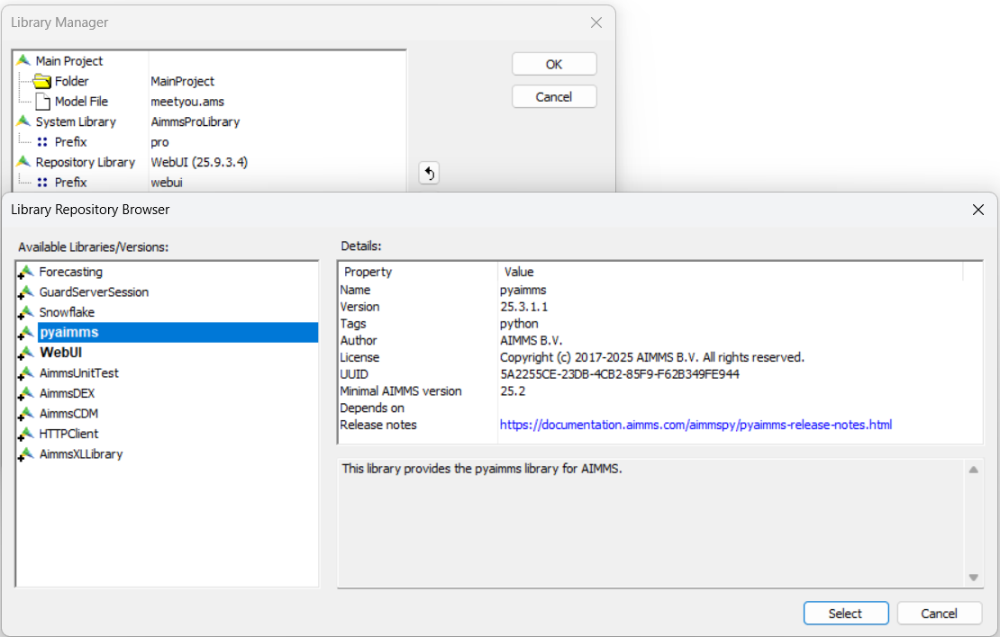
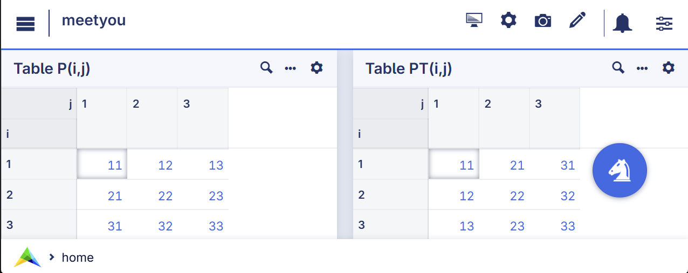

Nice to meet you: PYAIMMS from Python Bridge
================================================

The Python bridge enables AIMMS applications to leverage the power of Python libraries seamlessly, 
for example for advanced data manipulation, analytics, or machine-learning workflows that are not native to AIMMS.
To integrate Python into your application, follow these steps to set up your environment and exchange data.

Example Scenario
--------------------

Goal: Given a square matrix :math:`P(i,j)` in AIMMS, obtain the transpose :math:`P^T(j,i)` using the Python Polars library.

Download here :download:`AIMMS 25.9 project download <model/meetyou.zip>`

Requirements
---------------------

* Python: Version 3.10 and onwards

* AIMMS: Version 25.4 and onwards

Step 1. Add the toml file
--------------------------

AIMMS uses `uv <https://docs.astral.sh/uv/>`_ to manage Python versions and virtual environments automatically.

A minimal ``pyproject.toml`` file is as follows:

.. code-block:: none
    :linenos:
    :emphasize-lines: 9,10

    [project]
    name = "nice-to-meet-you-transpose-matrix"
    version = "0.1.0"
    description = "Good to see you again (after aimmspy)"
    requires-python = "==3.13.*"
    dependencies = [
        "aimmspy>=25.2.1.12"
    ]
    [tool.uv] 
    python-preference = "managed"

Download here :download:`sample pyproject.toml <model/pyproject.toml>`

The ``pyproject.toml`` file registers the dependencies.

Remarks: 

*   Line 5: PYAIMMS is available from Python 3.10 onwards; here we choose Python 3.13.

For instance, to add the Python library ``Polars``, execute the command:

.. code-block:: bash
    :linenos:

    uv add polars

This will create / update the virtual environment ``.venv``, and change the dependencies list to:

.. code-block:: none
    :linenos:
    :emphasize-lines: 3

    dependencies = [
        "aimmspy>=25.2.1.12",
        "polars>=1.30.0"
    ]
    

Step 2. Define the Connection (singleton.py)
-----------------------------------------------

This file defines how AIMMS and Python talk to each other.

.. code-block:: Python
    :linenos:
    :emphasize-lines: 5,6

    from aimmspy.project.project import Project, Model
    from aimmspy.model.enums.data_return_types import DataReturnTypes

    project : Project = Project(
        exposed_identifier_set_name = "AllIdentifiers",
        data_type_preference = DataReturnTypes.POLARS
    )

    my_aimms : Model = project.get_model("model_stub.py")

Remarks:

*   line 5: Allows Python scripts to exchange data with all identifiers declared in the AIMMS model.

*   line 6: Indicates which Python library is used for exchanging data of multi-dimensional identifiers with the AIMMS model.
    Currently available are DICT, ARROW, PANDAS, and POLARS. In this example, we choose POLARS.

Step 3. Write the Logic (transpose.py)
---------------------------------------

After all this generic setup; we move on to more specific parts of the example at hand.  
How does the Python code to transpose look like?

.. code-block:: Python
    :linenos:
    :emphasize-lines: 9,15

    from singleton import my_aimms

    def transpose_matrix():
        """
        Transposes matrix p to pt.
        """

        # Get the DataFrame from AIMMS.
        p_df = my_aimms.p.data()

        # Swap index dimensions and rename the value column.
        pt_df = p_df.rename({'j': 'i', 'i': 'j', 'p': 'pt'})

        # Send data back to AIMMS.
        my_aimms.pt.assign(pt_df)

Remarks:

*   Line 9: Copy the data from AIMMS parameter ``p`` into Python Polars DataFrame ``p_df``

*   Line 12: Because multi-dimensional AIMMS parameters are transferred as long-format DataFrames, 
    transposing a matrix corresponds to swapping the index columns ``i`` and ``j``.

*   Line 15: And copy the data from Polars DataFrame ``pt_df`` into the AIMMS parameter ``pt``

Step 4. Prepare AIMMS project
-------------------------------------
 
Add the pyaimms repository library via the Library Manager in AIMMS Developer:

This makes the ``py::`` procedures available inside the AIMMS model.

Step 5. Create the link from the AIMMS model to the Python function
-------------------------------------------------------------------

.. code-block:: Python
    :linenos:

    py::run_python_script("transpose.py");

This will scan the Python script ``transpose.py`` make the function ``transpose_matrix`` available.
In the example project provided, this procedure is called during initialization.

Step 6. Execute the Python function from within AIMMS model
--------------------------------------------------------------

.. code-block:: Python
    :linenos:

    py::run_python_statement("transpose_matrix()");
    
This statement will execute the Python function ``transpose_matrix`` once.

Step 7. Run a single Python procedure
-------------------------------------------------

After running the workhorse from the WebUI:

Summary
----------------

In this how-to the following is covered:

*   Manage dependencies with uv.

*   Connect via aimmspy using a singleton pattern to ensure a single shared connection between AIMMS and Python.

*   Transfer data using DataFrames (Polars, Pandas, etc.).

*   Call Python logic directly from AIMMS procedures.

References
-----------------

*   :doc:`Hello to the World of AIMMSPY from Python-Bridge <../679/679-hello-world-aimmspy>`

*   `PYAIMMS reference documentation <https://documentation.aimms.com/python-bridge/pyaimms/pyaimms.html>`_

.. spelling:word-list::

    aimmspy
    pyaimms
    toml
    uv