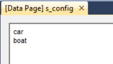

Sets for Configuration
=======================

Introduction
--------------

Some sets in AIMMS are not data-driven, but represent configuration 
choices or application logic switches—for example:

*   steps/modes in a solution algorithm (e.g., warm start on/off, leasing allowed on/off),

*   which dataset or view to present in the UI.

If you hard-code element names like 'boat' throughout procedures and pages, renaming becomes tedious and causes noisy Git diffs across many files.

**Best practice: use element parameters as named constants**

Represent each configuration option once as an element parameter constant, 
and compare against that constant everywhere else. 
Then renaming an option requires changing only a single definition.

Example: transport mode
---------------------------

Using AIMMS' sets and element parameters, there is an easy way 
to enable changing the names of elements in sets for configuration.

This is illustrated in the accompanying example.

Step 1:  Declare the configuration set:

.. code-block:: aimms 
    :linenos:

    Set s_config {
        Index: i_config;
    }

Step 2: Declare the "named constants" for each option:

.. code-block:: aimms 
    :linenos:

    ElementParameter ep_configCar {
        Range: s_config;
        Definition: 'car';
    }
    ElementParameter ep_configBoat {
        Range: s_config;
        Definition: 'boat';
    }

Step 3: Define the set from the constants

And then add the following definition to ``s_config``:

.. code-block:: aimms 
    :linenos:

    Definition: {
        { ep_configCar, ep_configBoat }
    }

Compile it all and show data of ``s_config``:

Next, we are going to introduce the element parameter ``ep_transportVehicle``:

.. code-block:: aimms 
    :linenos:

    ElementParameter ep_transportVehicle {
        Range: s_config;
        InitialData: '';
    }

Remark:

*   The initial data is assigned at the beginning; and ``''`` denotes the empty element.
    This indicates that the transport vehicle is not selected.

Such an element parameter will be used throughout the application, 
and can take on values ``'car'`` and ``'boat'``.

We will use it in code like:

.. code-block:: aimms 
    :linenos:
    :emphasize-lines: 4

    if ep_transportVehicle = '' then
        ep_transportVehicle := ep_configCar ;
    endif ;
    if ep_transportVehicle = ep_configBoat then
        display "Going over water" ;
    else
        display "Going via the highway" ;
    endif ;

On line 4, the element parameter is not compared directly against ``'boat'`` but against the element parameter.
By comparing ``ep_transportVehicle`` to ``ep_configBoat`` instead of the string ``'boat'``, your code becomes refactor-safe. 
If you rename ``'boat'`` to ``'vessel'``, you only update one definition, 
and the logic in your procedures remains valid and unchanged in Git.

