Hello World of Sensai Apps
===========================

Sensai Apps brings AI assistance directly into AIMMS Developer, built on top
of AIMMS's established Operations Research platform. This article walks
through a first hands-on session: connecting AIMMS Developer to Sensai,
opening the Sensai chat in a new project, asking Sensai to create and apply
a small skill, and reviewing exactly what it changed, including the skill
definition it saved for reuse.

This article covers:

-  Preparing for Sensai Apps
-  Opening Sensai Apps in a new project
-  Specifying a small skill
-  Observing the results
-  The skill definition

Prerequisites
-------------

-  A license for AIMMS Developer version 26.4 or later.
-  Access to an AIMMS Cloud with Sensai activated.

Preparing for Sensai Apps
-------------------------

Step 1:
~~~~~~~~~

Open AIMMS Developer and choose :menuselection:`Tools > Cloud Login`.

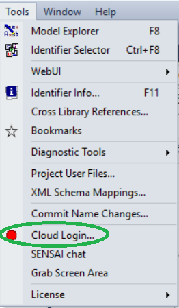

|

Step 2: 
~~~~~~~~~

In the :menuselection:`Sign in to AIMMS Cloud` dialog, enter the cloud account
you're allowed to use, and press :menuselection:`Sign in`. 
This opens a browser window to complete the sign-in; if the
dialog briefly shows :menuselection:`Sign-in failed, please try again` as in the
screenshot below, just retry. It typically succeeds on the next attempt.

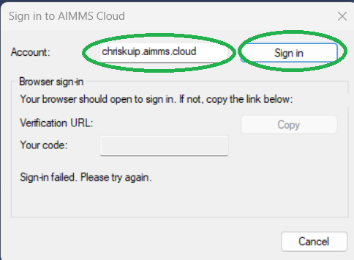

|

Step 3: 
~~~~~~~~~
Connect the device. In the browser, approve the request:

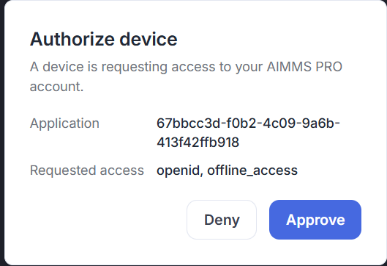

|

Pressing Approve gives AIMMS Developer access:

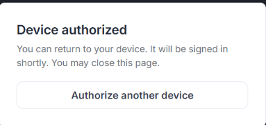

|

Step 4: 
~~~~~~~~~

Back in AIMMS Developer, the :menuselection:`Tools` menu now should show :menuselection:`Cloud Logout`
instead of :menuselection:`Cloud Login`.

Opening Sensai Apps in a New Project
-------------------------------------

With access to Sensai, you can open the Sensai chat via the :menuselection:`Tools` menu:

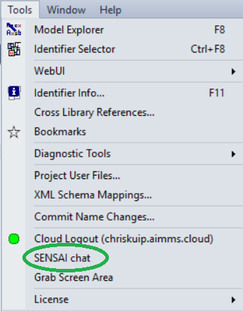

|

In a new project, the opening window looks like this:

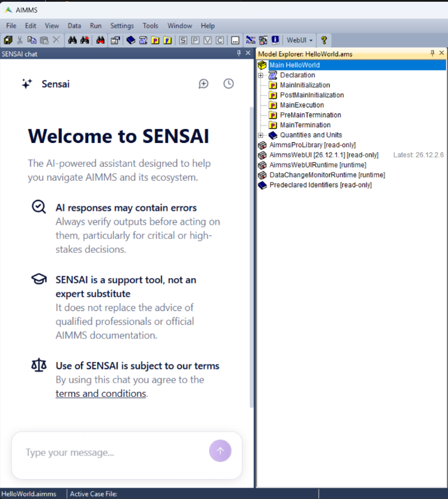

|

To get acquainted, you can ask Sensai a few questions, for example:

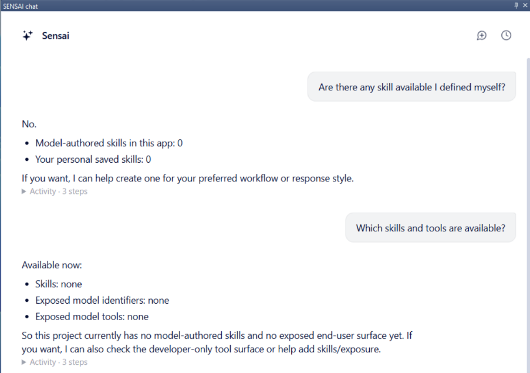

|

Specifying a Small Skill
-------------------------

In my User Support role, I often create a small AIMMS example to illustrate
or test a particular feature. I like that example to be structured
consistently from the start.

That's why I group the initialization and termination procedures together,
and extend the time-duration quantity with some commonly used time units,
every time I start a new project. Instead of doing this by hand each time,
I asked Sensai to turn it into a reusable skill:

.. code-block:: text

   I want to define a new skill: initproject - which adapts a new project.

   This skill should start creating a new section named "app_start_stop" and then
   move the procedures MainInitialization, PostMainInitialization,
   PreMainTermination, and MainTermination into that section.

   Next it should open the Quantity SI_Time_Duration and add the conversions for
   week, day, and hour (one conversion per line, and they are separated by
   commas).

   Can you create that skill and subsequently test it?

   Can you save this skill to the project folder?

Sensai immediately got to work:

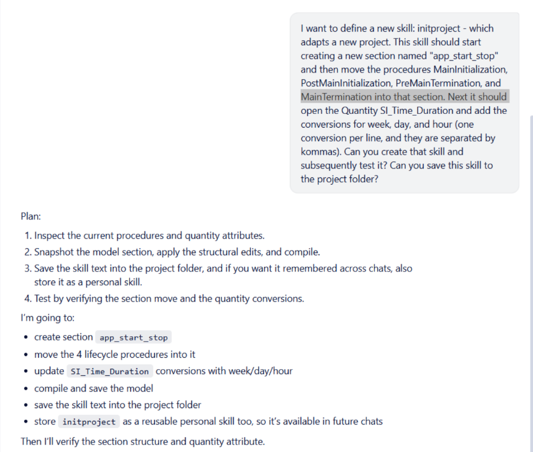

|

Observing the Results
~~~~~~~~~~~~~~~~~~~~~~

Sensai quickly created the skill and applied it to the project, and quickly came back with results:

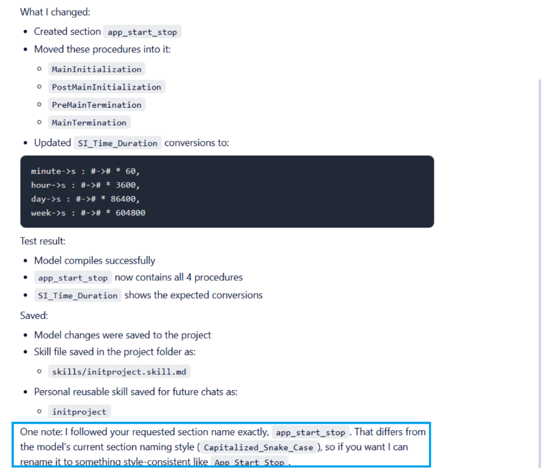

|

Sensai's response includes a proactive style note, boxed in blue above. 

The Model Explorer confirmed the new section and its procedures:

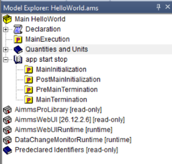

|

And the ``SI_Time_Duration`` quantity showed the updated conversions:

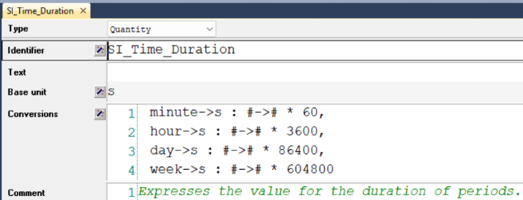

|

.. note::

   The minute conversion wasn't part of the request. It was already present
   in ``SI_Time_Duration`` when the project was created (AIMMS PRO and AIMMS
   WebUI add it by default). Sensai only added the week, day, and hour
   conversions that were actually asked for.

The Skill Definition
~~~~~~~~~~~~~~~~~~~~~~

Sensai saved the skill for reuse in two places: as
``skills/initproject.skill.md`` in the project, and as a personal skill
named ``initproject`` available in future chats. Here is what it saved:

.. code-block:: markdown

   # Skill: initproject

   When asked to adapt a new project:

   1. Create a new section named `app_start_stop`.
   2. Move the procedures `MainInitialization`, `PostMainInitialization`,
      `PreMainTermination`, and `MainTermination` into that section.
   3. Open the quantity `SI_Time_Duration` and update its `conversions`
      attribute so it contains one conversion per line, separated by
      commas, adding conversions for hour, day, and week.
   4. Compile the model.
   5. Verify that section `app_start_stop` contains the four procedures
      and that `SI_Time_Duration` contains the expected conversions.
   6. Save the model if the user asks to persist the structural changes.

In this Hello World walkthrough, we connected AIMMS Developer to Sensai,
opened the Sensai chat in a new project, asked Sensai to create and apply a
small skill, and reviewed both the model changes and the skill definition
it produced and saved for reuse. From here, try asking Sensai to turn one
of your own recurring modeling steps into a skill.

.. seealso::

   -  `Sensai Apps released in preview <https://community.aimms.com/product-updates/sensai-apps-released-in-preview-1995>`_
   -  `Sensai documentation <https://documentation.aimms.com/sensai/index.html>`_

.. spelling:word-list::

   walkthrough
