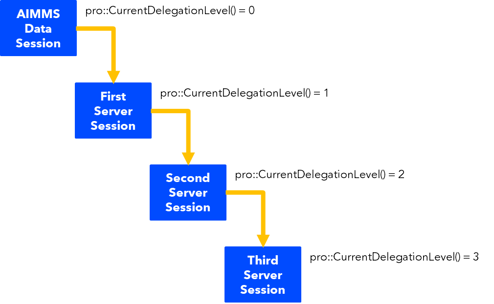

Schedule Regular Jobs
======================

.. meta::
   :description: How to schedule an AIMMS procedure to run regularly.
   :keywords: schedule, job, regular, repeat, recur

.. https://gitlab.aimms.com/Chris/aimms-how-to/issues/80
.. Nirvana project 0006

Some applications involve solving a mathematical program regularly, for instance every night or every ten minutes. 

There are two mechanisms available to achieve this:

#.  `Tasks v2 on AIMMS Cloud <https://documentation.aimms.com/cloud/tasks.html#schedule-task-s>`_ 
    explains clearly how to achieve regular execution easily.

#.  AIMMS Cloud jobs that reschedule themselves. This may be a bit tricky and warrants a detailed example.

In the remainder of this article, we'll discuss how an AIMMS job can reschedule itself, as depicted in the next picture.

|

Effectively, this realizes that the job at hand is solved regularly. As you can see from this image:

* The WebUI session you start via AIMMS Cloud has an associated AIMMS data session. This data session has a ``pro::CurrentDelegationLevel()`` of 0; there is no delegation of work yet.

* The AIMMS solver session started from this AIMMS Data Session has a ``pro::CurrentDelegationLevel()`` of 1; it is the consequence of one delegation.

* The AIMMS solver session started from the above AIMMS solver session has a ``pro::CurrentDelegationLevel()`` of 1 higher than its predecessor.

.. Note: The WebUI session can be closed as soon as the sequence is started; each server job schedules the next before doing its actual work. The WebUI session is only used to start the sequence.

To start this sequence, the following code is used.

.. code-block:: aimms 
    :linenos:

    Procedure pr_OnButtonStartServerSessions {
        Body: {
            ep_PayloadProcedure := StringToElement( AllProcedures, "pr_Friesian", create: 0 );
            pr_IterativeJobScheduling(
                maxDelegateLevel   :  4,
                timeIncrement      :  2[second], 
                epPayloadProcedure :  ep_PayloadProcedure);
        }
    }

Each line is explained as follows:

#. Determine the payload procedure that should be executed by each solver session.  Here it is the ``pr_Friesian``, as Friesian horses are excellent workhorses.

#. A call to the procedure that actually starts each solver session.

#. The number of server sessions started is controlled by ``maxDelegateLevel``

#. The argument ``timeIncrement``, is the time between sessions measured in seconds. 

#. The procedure to be executed regularly passed via the arguments.

The center piece of the project is the procedure ``pr_IterativeJobScheduling``:

.. code-block:: aimms
    :linenos:
    
    Procedure pr_IterativeJobScheduling {
        Arguments: (maxDelegateLevel,timeIncrement,epPayloadProcedure);
        Body: {
            if pro::CurrentDelegationLevel() < maxDelegateLevel then
                if pro::DelegateToServer(
                        requestDescription :  
                            formatString("The %i'th iteration of %e",  
                                pro::CurrentDelegationLevel()+1, 
                                epPayloadProcedure),
                        waitForCompletion  :  0,
                        completionCallback :  'pro::session::EmptyCallback',
                        delegationOverride :  pro::CurrentDelegationLevel() + 1,
                        scheduledAt        :  
                            if pro::CurrentDelegationLevel() then 
                                MomentToString( sp_LocalTimeFormat, [second], 
                                    CurrentToString(sp_ReferenceTimeformat), 
                                    timeIncrement ) 
                            else "" endif
                    ) then
                    return 1 ;
                endif ;
            endif ;
            
            Apply( epPayloadProcedure );  
        }
        Parameter maxDelegateLevel {
            Property: Input;
        }
        Parameter timeIncrement {
            Unit: second;
            Property: Input;
        }
        ElementParameter epPayloadProcedure {
            Range: AllProcedures;
            Default: 'MainExecution';
            Property: Input;
        }
    }

    
Each portion of the procedure code is explained below:

#.  Line 4: Limit the number of recurring jobs.
    When your application does not have a fixed number of jobs, 
    you can remove this line and the argument ``maxDelegateLevel``.

#.  Line 6: ``requestDescription``: to properly identify each job in job overviews and in the session logs.

#.  Line 9: ``delegationOverride``: necessary to submit jobs from within server sessions.

#.  Line 10: ``scheduleAt``: Construct the next time the job is to be executed.   
    By using the Local timezone, ambiguities regarding daylight saving time are avoided.
    Here ``sp_LocalTimFmt = "%c%y-%m-%d %H:%M:%S%TZ('Local')"``.

#.  Line 16: This will execute the payload for each of the server sessions started.
    The `APPLY <https://documentation.aimms.com/language-reference/procedural-language-components/procedures-and-functions/calls-to-procedures-and-functions.html#the-apply-operator>`_ operator is used here.

To operate, the example that can be downloaded :download:`here <downloads/JobRepetition.zip>`.

#.  Create an .aimmspack, publish on your AIMMS Cloud.

#.  Launch it and press the only button

#.  Close the app. Yes, once the sequence of server sessions is started, the WebUI of the enclosed example is no longer of use - it can be closed.

#.  Go to job tab in the AIMMS Portal and watch new jobs being created, queued, running, and finished.

.. image:: images/PROJobs.png
    :align: center

|

.. note::

    * When you check the ``session.log`` files, you may encounter a line like:

        .. code-block:: none

            12:10:46,186 0x7f6389d90700 [INFO] {PRO.Client.Library} pr_Friesian(): At 2018-09-04 12:10:46 (UTC) delegation level is 3

        That is because the procedure ``pr_Friesian`` uses the procedure call ``pro::management::LocalLogInfo(...);`` to log some information about current solver session.

    * When you want to interrupt a sequence of server jobs, please terminate the scheduled session before terminating the running session.

.. note::

    The reference time format is initialized as follows:
    
    .. code-block:: aimms
        :linenos:

        Procedure PostMainInitialization {
            Body: {
                if pro::GetPROEndPoint() then 
                     pro::Initialize();
                endif ;
                
                block ! Determine the reference time format to be used in MomentToString.
                    p_getOPG := OptionGetValue(
                        OptionName :  "use_UTC_forCaseAndStartEndDate", 
                        Lower      :  p_lower, 
                        Current    :  p_current, 
                        Default    :  p_default, 
                        Upper      :  p_upper);
                    if p_getOPG > 0 then
                        if p_current > 0 then
                            sp_ReferenceTimeformat := sp_UTCTimeFormat ;
                        else
                            sp_ReferenceTimeformat := sp_LocalTimeFormat ;
                        endif ;
                    else
                        ! option not defined.  Assume local time format.
                        sp_ReferenceTimeformat := sp_LocalTimeFormat ;
                    endif ;
                endblock ;
            }
            Comment: {
                "Add initialization statements here that require that the libraries are already initialized properly,
                or add statements that require the Data Management module to be initialized."
            }
            Parameter p_getOPG;
            Parameter p_lower;
            Parameter p_current;
            Parameter p_default;
            Parameter p_upper;
        }

.. seealso::
    * :doc:`80-receive-messages`
    * `Tasks v2 on AIMMS Cloud <https://documentation.aimms.com/cloud/tasks.html#schedule-task-s>`_ 
    * `APPLY <https://documentation.aimms.com/language-reference/procedural-language-components/procedures-and-functions/calls-to-procedures-and-functions.html#the-apply-operator>`_

