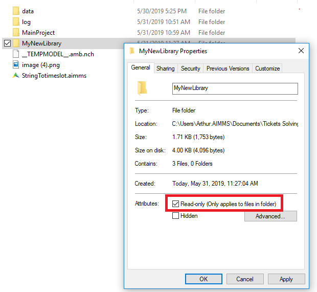

Add AIMMS Libraries
====================

.. meta::
   :description: How to extend project functionality with libraries.
   :keywords: library, system, repository, read-only

In the context of the AIMMS environment, a library is an AIMMS project that can be included in/added to other AIMMS projects.  

Each library in AIMMS contains a subset of project files. You can divide a large project into smaller sub-projects, enabling multiple developers to collaborate easily by sharing parts which are relevant to the entire project.

Read more about libraries in the `AIMMS User Manual <https://download.aimms.com/aimms/download/manuals/AIMMS3UG_OrganizingProjectInLibraries.pdf>`_.

To Add a new library
-------------------------

To add a new library to the current project, go to :menuselection:`File --> Library manager`.

Select a library type:

* New library
   Creates a new library. Name your library and specify location in the *Library* tab. Customize subfolder or model name in the *Optional Naming* tab.

* Existing library
   Selects a saved library folder. You may select from libraries shared with you.

* System library
   Selects a pre-installed AIMMS library. (These libraries are read-only.)

* Library from repository
   Imports an AIMMS library from the cloud. (Requires internet connection to import.)

Libraries have a bi-directional relationship with your project, unless encrypted as read-only (see `Make a Library Read-only`_). You can use identifiers and pages included with the library in other projects, and you can also modify the library identifiers and pages when you link them to your own project.

.. note:: 

   AIMMS assigns a default library prefix when you create a new library project. To view and edit a library's prefix, open the library manager. You can also double click on the library identifier in the Model Tree to view/edit the prefix. Use the prefix to identify the library when accessing the library objects.

   For example, if you add the AXLL library which has a prefix ``axll``, you can invoke functions of this library in your code with ``axll::``. A drop-down list of available functions appears.

Make a Library Read-only 
-------------------------

System libraries like the ``AimmsWebUI`` or ``AimmsPROLibrary`` are read-only libraries. If you would like to turn one of your own library read-only, you may use the property attribute from Windows explorer 

.. note::

    Note that a user will then still be able to see the source inside the library, but not changing it.

.. END DOCUMENT

 