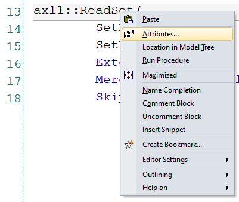

.. IMAGES

.. CONTENT

AIMMS Excel Library - AXLL
==============================

.. meta::
   :description: How to import and export spreadsheet data using the AIMMS Excel Library.
   :keywords: excel, spreadsheet, axll

.. Overview

The AimmsXLLibrary can communicate with Excel files in server environments where Excel is not installed. This is particularly useful when you deploy applications on AIMMS PRO which is typically installed on a machine with no Office / Excel instance. 

The workflow for integrating external Excel files with your AIMMS model is illustrated below. 

|axll-workflow|

The AimmsXLLibrary is a collection of functions to do this and more. It is provided as a system library and you can add it to your project from the library manager, as detailed in :doc:`../84/84-using-libraries`

You can read/write data both in tabular (a list or composite table) or matrix formats. Matrix formats are particularly popular when solving network problems because you need the distances between each nodes in your network and this is typically represented in the form of a distance matrix. 

The functions in this library can be accessed by their prefix, ``AXLL::`` which displays a list of available functions. Documentation of an individual function can be accessed by `Right click -> Attributes`. The comments for that function explain each attribute. 

Opening/closing files
------------------------

When using the ``AXLL`` functions, the Excel file will be loaded into memory. This loading will happen in the background and you will not see any file opened on your computer, as this library works without using an Excel installation. 

To open an Excel file or load it into memory::

    axll::OpenWorkBook(WorkbookFilename : "filename.xlsx" );

To close an Excel file or to remove it from memory::

    axll::CloseWorkBook(WorkbookFilename : "filename.xlsx" );

A call to the function ``axll::OpenWorkBook`` will raise an error if that file was already opened before. So, checking if the file is already open or closing it before opening is recommended. There are three options for you to choose from:

.. code-block:: aimms
    
    if not axll::WorkBookIsOpen(WorkbookFilename : "filename.xlsx" ) then
	    axll::OpenWorkBook(WorkbookFilename : "filename.xlsx" );
    endif;

.. code-block:: aimms

    axll::CloseWorkBook(WorkbookFilename : "filename.xlsx");
    axll::OpenWorkBook(WorkbookFilename : "filename.xlsx" );

.. code-block:: aimms

    axll::CloseAllWorkbooks;
    axll::OpenWorkBook(WorkbookFilename : "filename.xlsx" );

Instead of typing the string "filename.xlsx" multiple times, we recommend you use a string parameter to store the file name and use that string parameter in all calls to ``AXLL`` functions. This also lets you use the auto-complete feature of AIMMS, making it easier to write long and complex data import/export procedures::

    spFileName := "filename.xlsx"

    axll::CloseAllWorkbooks;
    axll::OpenWorkBook(WorkbookFilename : spFileName );

After opening a file, you must select the sheet your data is in before you can read them in::

    axll::SelectSheet(SheetName : "SheetName" );

Reading data
-----------------

Many functions are available to read different kinds of data from an Excel file. Most commonly used are:

#. ``axll::ReadSet``: Read in data to a set. Data in Excel is in a single column or a single row::
    
    axll::ReadSet(
            SetReference              : sSetinAIMMS , 
            SetRange                  : "A2:A33" , 
            ExtendSuperSets           :  1, 
            MergeWithExistingElements :  0, 
            SkipEmptyCells            :  0);
#. ``axll::ReadList``: Read in data to an indexed parameter. Data in Excel must be in a list / composite table format::

    axll::ReadList(
            IdentifierReference    : paraminAIMMS , 
            RowHeaderRange         : "A2:A33" , 
            DataRange              : "D2:D33" , 
            ModeForUnknownElements :  0, 
            MergeWithExistingData  :  0);

#. ``axll::ReadTable``: Read in data to an indexed parameter (with 2+ indices in the index domain). Data in Excel must be in a matrix format::

    axll::ReadTable(
	    IdentifierReference    :  multidimParamInAIMMS , 
	    RowHeaderRange         : "A2:A33" , 
	    ColumnHeaderRange      : "B1:AG1" , 
	    DataRange              : "B2:AG33", 
	    ModeForUnknownElements :  0, 
	    MergeWithExistingData  :  0);

#. ``axll::ReadSingleValue``: Read in data to a scalar parameter. Data in Excel is in a single cell::

    axll::ReadSingleValue(
	    ScalarReference : scalarParaminAIMMS , 
	    Cell            : "A1" );

By setting a different value for the `ModeForUnknownElements` argument of ``ReadList or ReadTable``, you can skip the call to ``ReadSet``. 

.. note::

    The `IdentifierReference` in ``ReadTable`` must be an AIMMS identifier with 2+ (at least 2) indices in its index domain.

Writing data
-----------------------

Similar to reading data, many functions are available to write out data to Excel files. Commonly used are:

#. ``axll::WriteSet``: Writes out the contents of a set to a single column/row::

    axll::WriteSet(
	    SetReference       : sSetinAIMMS , 
	    SetRange           : "A2:A33" , 
	    AllowRangeOverflow :  0);

#. ``axll::WriteCompositeTable``: Writes out an indexed identifier in the composite table format, very convenient to use::

    axll::WriteCompositeTable(
	    IdentifierReference : multidimParamInAIMMS , 
	    TopLeftCell         : "A1" , 
	    WriteZeros          :  0, 
	    WriteIndexNames     :  1);

#. ``axll::WriteTable``: Writes out an indexed identifier in the matrix format, more options to control::

    axll::WriteTable(
            IdentifierReference     : multidimParamInAIMMS,
            RowHeaderRange          : "A2:A33",
            ColumnHeaderRange       : "B1:AZ1",
            DataRange               : "",
            AllowRangeOverflow      : 1,
            WriteZeros              : 1,
            IncludeEmptyRows        : 0,
            IncludeEmptyColumns     : 0,
            IncludeEmptyRowsColumns : 0);

#. ``axll::WriteSingleValue``: Writes out a scalar identifier to a single cell in Excel::

    axll::WriteSingleValue(
	    ScalarReference : scalarParaminAIMMS , 
	    Cell            : "A1" );

There is no ``axll::WriteList`` but a one-dimensional identifier with ``WriteCompositeTable`` will you give the same result. An alternative is to use ``WriteSet`` and ``FillList``. 

.. note:: 

    `IdentifierReference` in ``WriteTable`` must be a 2+ dimensional identifier but for ``WriteCompositeTable``, 1+ is sufficient. 

Example 
-------------

An example project which uses most of the functions described above is included below. 

:download:`Download exampleNFL.zip <exampleNFL.zip>`

See procedures ``prReadFromExcel`` and ``prWriteToExcel``. 

See also :doc:`../228/data-ranges`.

