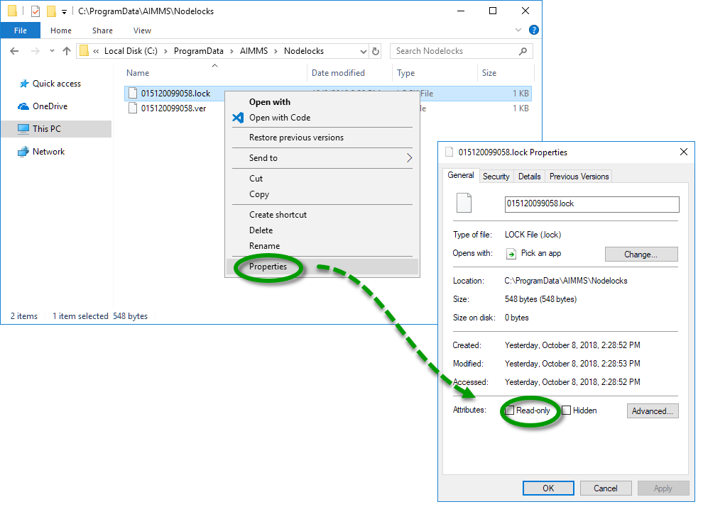
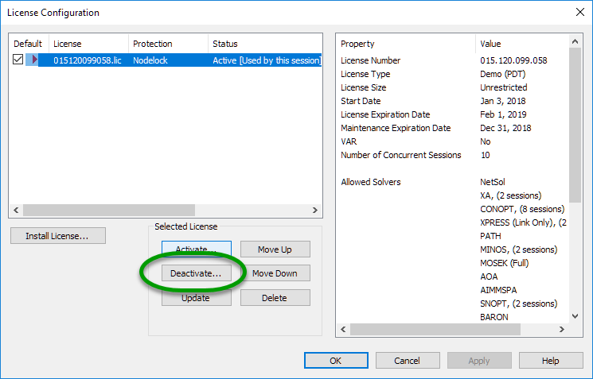
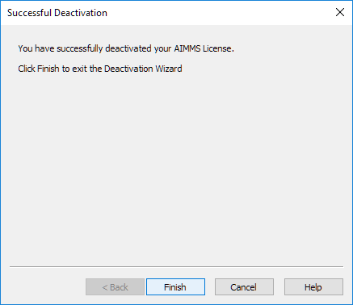

.. IMAGES

.. |nodelock-readonly| image:: images/nodelock-readonly.png

.. |license-config| image:: images/license-config.png

.. |deactivate-yes| image:: images/deactivate-yes.png

.. |program-data| image:: images/program-data.png

.. BEGIN CONTENT

Resolve License Error: Nodelock file is read-only
====================================================

.. meta::
   :description: Resolving AIMMS license update issue regarding the nodelock file.
   :keywords: license, error, nodelock, update, read

.. _ref-update-failed:

Error: Update failed - The nodelock file is read-only
-----------------------------------------------------

Issue:
^^^^^^
You are unable to update your license because the nodelock file is read-only. 

|nodelock-readonly|

Cause:
^^^^^^^
Windows has locked the file as read-only, blocking the update process. 

Solution:
^^^^^^^^^^
In Windows File Explorer, navigate to ``C:\ProgramData\AIMMS\Nodelocks``.

Right-click the ``.lock`` file for the relevant license number and select *Properties*. 

Uncheck the box *read-only* and click *OK*. 

|uncheck-read-only|

If the error occurs again, follow the steps below to completely reset the license activation.

#. 
    In AIMMS, go to *Tools > License > License configuration* and click *Deactivate*.

    |license-config|

    |deactivate|

#. 
    Click *Yes* in the *Deactivate Current License* dialog that appears.

    |deactivate-yes|

#. 
    Follow the prompts in the *Deactivation Wizard*. A success notification appears.

    |deactivate-success|

    Exit AIMMS.
    
.. note::
    If you cannot deactivate the license due to the nodelock, contact `AIMMS Support <mailto:support@aimms.com>`_ and our support team can deactivate the license for you. Meanwhile, you may continue the steps below for an emergency activation which allows you to use your license for 7 days.

4. 
    In Windows File Explorer, navigate to the license files location at ``C:\ProgramData\AIMMS`` (or ``C:\ProgramData\Paragon Decision Technology`` for older AIMMS versions).

    Delete the relevant license files in the ``\Licenses`` and ``\Nodelocks`` subfolders.

    |program-data|

#. 
    Restart AIMMS and activate the license again.

Related issues:
---------------

* :ref:`ref-personal-nodelock`
* :ref:`ref-pending-activation`
* :ref:`ref-ip-subnet`

.. END CONTENT

.. include:: /includes/form.def

.. author: Jessica Valasek Estenssoro
.. checked by: Khang Bui
.. updated: October 8, 2018