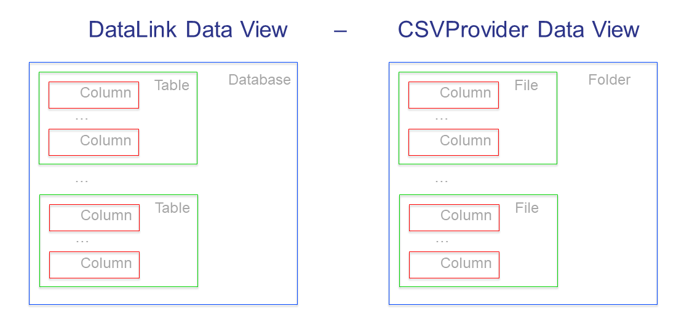

Read and Write CSV Files
=========================

.. meta::
   :description: How to link CSV files to an AIMMS project using DataLink and CSVProvider libraries.
   :keywords:  csv, datalink, csvprovider

CSV files are a *de facto* standard for communication of data. 
AIMMS provides the libraries ``DataLink`` and ``CSVProvider`` in order to serialize CSV files.

This article shows an example of how to read data from a CSV file.

Import ``CSVProvider`` library
------------------------------------------------

First you'll need to import the ``CSVProvider`` library

1. Go to :menuselection:`File > Library Manager > Add Library from Repository...`
2. Select ``CSVProvider``

.. comment

Architecture view and more details
-----------------------------------

The ``DataLink`` and ``CSVProvider`` libraries cooperate to present the following data view:

The ``DataLink`` column maps to an AIMMS set or parameter, and is linked to a CSV column.

A group of columns make up for a table in the ``DataLink`` view, and such a table corresponds to a file in the ``CSVProvider`` view.

A group of ``DataLink`` tables make up for a database in the ``DataLink`` view, and such a database corresponds to a datasource in the ``CSVProvider`` view. 

Procedure
-----------
Using the image above for reference, it is clear we need to provide details in several steps:

#. Provide a name for the mapping between the ``DataLink`` view and the ``CSVProvider`` view.

#. Provide the names of the tables in the ``DataLink`` view that correspond to the filenames in the ``CSVProvider`` view. Note that in the ``CSVProvider`` view, the file suffix ``.csv`` is automatically appended.

#. Provide a mapping between AIMMS Sets and Parameters to columns in CSV files.

#. Define file convention details such as separator characters, and width/precision of numeric data.

#. Put it all together in a read or write call.

We will discuss each of these steps in detail below the code example.

Code example
---------------

.. .. sidebar:: fourRows.csv    
    .. image::  images/CSVFile.png 

    
.. code-block:: aimms
    :linenos:
    
    dl::DataTables += {'fourRows'} ; ! komma/fourRows.csv is the file we're gonna read from.
    
    DataMap(dl::dt,dl::idn,dl::cn,dl::dn) := data {
        ( fourRows, sLocs, 1, 1 ) : "location",     ! from fourRows.csv, read in a 1rst set sLocs from a 1rst csv column named "Location". This column is indexing the rest of the data
        ( fourRows, sProd, 2, 2 ) : "product",      
        ( fourRows, pDem , 3, 0 ) : "demand",       ! from fourRows.csv, read in a data pDem from a 3rd csv data column named "demand". This is a data column
        ( fourRows, spCmt, 4, 0 ) : "comment"
    };
    
    dl::RemoveDataSourceMapping("TheMapping");
    dl::AddDataSourceMapping("TheMapping", DataMap, dl::DependEmpty, dl::TableAttributesEmpty, dl::ColAttributeEmpty);

    spCommunicationAttributes := 
          { 'DataProvider' : csvprov::DataLink , 
            'ContainsHeaders' : "yes"
            ! Note that Separator attribute is left to its default of ",".
          };

    dl::DataRead("komma",                 ! reading from data source "komma" - because we use csvprovider this data source is a folder.
            "TheMapping" ,                ! using relation "TheMapping" between folder komma and AIMMS identifiers.
            spCommunicationAttributes);   ! Technicalities on how to communicate.

    
Provide the file name (line 1)
++++++++++++++++++++++++++++++++++++++

The table names in the ``DataLink`` view are the same as the filenames in the ``CSVProvider`` view, except with suffix ``.csv``.

The AIMMS set ``dl::DataTables`` contains a list of these table names. For instance, adding the table ``fourRows`` to the list of tables is done like this:

    .. code-block:: aimms

        dl::DataTables += {'fourRows'} ; ! komma/fourRows.csv is the file we will read from.

Provide the mapping (line 3 to 8)
++++++++++++++++++++++++++++++++++++++++++++

For each set and parameter in the AIMMS model, we need to specify to which ``DataLink`` table (CSV file) it corresponds and to which column in that table.

We do this using the following 4-dimensional table:

    .. code-block:: aimms

        DataMap(
                    dl::dt,    ! Table name, should be present in dl::DataTables.
                    dl::idn,   ! Full AIMMS identifier name, enclose in '' iff it is declared in a library or module.
                    dl::cn,    ! Column number
                    dl::dn     ! Domain number
                               !     For domain sets: equal to the Column number
                               !     For parameters : equal to 0.
                    ! contents: the names of the columns in the CSV files.
        ) := data {
            ( fourRows, sLocs, 1, 1 ) : "location",
            ( fourRows, sProd, 2, 2 ) : "product",
            ( fourRows, pDem , 3, 0 ) : "demand", 
            ( fourRows, spCmt, 4, 0 ) : "comment"
        };

As you can see in the example above, the column numbers are increasing and **correspond to the column numbers in the ``DataLink`` view**. 

#. When reading a CSV file, the header line of the CSV file, in combination with the value of each element in the ``DataMap``, is used to determine the column numbers in the ``CSVProvider`` view. Thus the column numbers in the ``DataMap`` are not necessarily the same as the column numbers in the ``CSVProvider`` view. 

#. When writing a CSV file, these two column numberings happen to be same.

        
Provide the mapping name (line 10 and 11)
++++++++++++++++++++++++++++++++++++++++++

The DataLink library provides two procedures for managing data source mappings:

#. ``dl::RemoveDataSourceMapping("someMapping")``. When the data link mapping ``someMapping`` exists, it will be removed from the data structures of the ``DataLink`` library. Otherwise this procedure does nothing; it is harmless to call this procedure two times in a row with the same argument.

#. ``dl::AddDataSourcemapping( "someMapping", ... )`` will create a mapping. 

        
        
Provide settings for the link (line 13 to 17)
++++++++++++++++++++++++++++++++++++++++++++++

The communication attributes are specified via a string parameter indexed using ``dl::rwattr``.
The following attributes are supported:

#. ``DataProvider``.  This attribute is mandatory.  For the ``CSVProvider`` use: ``csvprov::DataLink``.

#. ``ContainsHeader``. This attribute is mandatory. Its value must be "yes" when reading CSV files.

#. ``Separator``. This attribute is optional.  The default is ",".  A frequently used alternative is ";".

#. ``Width``. This attribute is optional. This attribute controls the width when **writing** numeric data to a CSV file.

#. ``Precision``. This attribute is optional. This attribute controls the precision when **writing** numeric data to a CSV file.

Example:

    .. code-block:: aimms

        spCommunicationAttributes := 
              { 'DataProvider' : csvprov::DataLink , 
                'ContainsHeaders' : "yes"
                ! Note that Separator attribute is left to its default of ",".
              };

.. note::

    ``DataLink``, the underlying library of the ``CSVProvider`` can be used to read/write other file types than ``CSV``. ``DataLink`` is a generic library for several different providers (CSV,XLS,XML,etc.)

The read and write call (line 19 to 21)
++++++++++++++++++++++++++++++++++++++++++++++++++++

Using the above specifications, we are now ready to actually read from or write to CSV files. 
The following example should be self-explanatory.

    .. code-block:: aimms

        dl::DataRead("semi",                  ! reading from data source "semi" - because we use CSVProvider this data source is a folder.
                "TheMapping" ,                ! using relation "TheMapping" between folder "semi" and AIMMS identifiers.
                spCommunicationAttributes);   ! Technicalities on how to communicate.

Download example
----------------------                
 
You can download the example used in this article: 

* :download:`dlcsv project <downloads/dlcsv.zip>`

.. note::
    
    This project contains also an example procedure to write a ``CSV`` file
                

