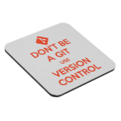

 
AIMMS 4: model sources, version control and aimmspack files
===========================================================

.. note:: Under Construction / Draft status - please do not hesitate to use the form at the end of this article to ask for clarification where needed

In our current AIMMS 4.0 release we have introduced a number of fundamental, and sometimes breaking changes in managing the project sources, about which we got a lot of questions. In this blog post, I will describe these changes and also explain the rationale behind them.

Binary versus text-only source files
------------------------------------

In AIMMS 3, all project sources were stored in a binary format. Originally, we introduced these binary files in AIMMS 3 to reduce the total number of files associated with a project. However, over time it turned out that a major drawback of this approach was that the binary format made it very hard to effectively collaborate on an AIMMS 3 project, because the binary files make it really cumbersome to combine the changes made by multiple developers into a new version of the project. For many years, our larger customers have asked us to address this problem, and we partially mitigated it by introducing libraries in AIMMS 3. This allowed multiple developers to work on separate libraries, thus facilitating a limited form of collaboration. 

In recent years it has become more and more common for developers to use *version control systems* (VCS) such as Git, Subversion and Microsoft Team Foundation Server (TFS) to track changes in their software development tasks, allowing them to collaborate at a much more fine-grained level. Any modern VCS is able to merge changes from multiple developers in the same file into a new version of the file containing both change sets, *as long as the file is a text file*. As AIMMS 3 sources are stored in binary format, this was a real impediment to adopting version control with AIMMS. As a result, many AIMMS 3 developers rely on old-fashioned methods of tracking changes such as setting aside multiple copies of a project folder, or using zip archives or aimmspack files to store project backups as a single file. Because aimmspack files can be generated from within AIMMS itself, they were also used by many AIMMS developers to communicate project changes with their co-developers. As regular users of version control for the sources of AIMMS itself, we at AIMMS experience the benefits of using a VCS at a daily basis. This made us very sympathetic to the almost demand for version control support in AIMMS by our larger customers. This lead to the development of AIMMS 4, the major feature of which is the storage of all development sources in the form of text files. This allows any AIMMS 4 projects to be effectively tracked by the VCS of your choice.

Aimmspack files and encryption
---------------------------------

Aimmspack files were originally introduced in AIMMS 3 as a means to deploy a finished AIMMS project to end-users of that project as a single file. When opening the aimmspack file, the original project was extracted again on the end-user computer, after which AIMMS would start the extracted project. Whether or not the project was protected through encryption was a decision taken independently of deploying it through an aimmspack file, thus also allowing the development sources of a project to be encrypted. In AIMMS 3 this caused no problem at all. Whether a binary file is encrypted or not, does not change its usability with respect to version control in any manner: neither can be effectively tracked by a VCS. For AIMMS 4, however, encrypting the text-based model sources completely defies the intended purpose. All of a sudden, version control becomes useless, because encrypted text-only model sources will become binary files again, and obstruct the effective use of a VCS. Therefore, like with any programming language, you have to make sure that the IP contained within your AIMMS 4 model sources that you want to protect does not leave your secured corporate environment.

Deploying AIMMS projects
--------------------------

With that new situation in AIMMS 4, aimmspack file deployment now serves two purposes instead of just one

#. packing all development sources into a single file, and

#. protecting the IP through encryption.

Many customers have complained throughout the years that the encryption scheme in AIMMS 3 was quite error-prone. Because of the use of VAR files, one really had to be careful to make sure that it wasn’t possible for non-authorized users to have access to the model sources. We therefore decided to greatly simplify the encryption scheme used by AIMMS 4, while at the same time using stronger encryption. As a result, you now have the certainty that the model sources in an aimmspack file are *always* encrypted, and that AIMMS will never again allow access to the model sources of an encrypted model. Moreover, no one without access to the proper key will be able to decrypt the model, including AIMMS employees.

Using aimmspack files for backup
--------------------------------

We’re now arriving at what seems to be a major stumbling block for many of our customers: using aimmspack files for backup and communication of project sources between developers. By always encrypting the sources in aimmspack files in AIMMS 4, we effectively prevent the use of aimmspack files for this purpose. As aimmspack files were never intended to be used for this purpose in the first place, we are not very much inclined to come back on our decision, and again facilitate unencrypted storage of source files inside aimmspack files. While this may appear to be a short-term convenience, I'll show at the end of this post that it actually offers no benefits whatsoever to an approach using zip. More importantly, it does prevent AIMMS developers to at least have to think about the far superior long-term solution to address their concerns: using a VCS.

Starting with a VCS
---------------------

So, how difficult is it to get started using a VCS? My answer is: not at all. If you’re choosing the right tools, you don’t need IT support to setup central facilities, and you can just create a repository on your local developer machine to get started for yourself. At AIMMS, we use Git as a VCS. Git is a so-called *distributed* VCS, which means that there is no difference whatsoever between a local and a central repository. That in itself is a perfect starting point to get acquainted with using a VCS just using a repository on your local computer, while at the same it will not restrict you to effortlessly transition to a setup where multiple developers use a central repository to communicate their changes with each other. I will explain the steps that are necessary to get started with Git just on your local Windows machine using graphical tools that are very easy to understand, even for someone who has never been exposed to a VCS before:

#. Install `Git for Windows <http://git-scm.com/download/win>`_ 

#. Install `TortoiseGit <https://code.google.com/p/tortoisegit/wiki/Download>`_ shell extension 

After you have installed these tools, you can start right away creating a repository for any of your AIMMS projects, through fairly straightforward actions available in the right mouse menu within a Windows Explorer window:

#. Create a repository in your project folder  

#. Add all project sources that you want to track in the repository 

#. Commit these newly added files to the repository 

After this initial step, you can, at any time, view the changes in your working folder compared to the latest commit in the repository, and decide which changes you want to actually commit (or revert). By using a VCS you immediately can reap the immense benefits:

#. Provide a description what every commit was actually about 

#. Being able to see what was actually changed in a particular commit 

#. Create separate development branches to explore new ideas without polluting the main development branch 

#. If successful, merge the ideas implement in such a branch back into the main development branch, or just leave them alone or delete them 

#. Reverting commits which turn out to not work out as well as you anticipated, or even to revert changes in single file. 

#. ...

Obviously, when you want to set up a central repository to collaborate on an AIMMS project with multiple developers, things become slightly more complicated. If you don’t have the expertise in-house, my advice would be to select one of the many commercial offerings to host your repositories in the cloud in a secure manner. While you’re at it, that would also be a perfect time to start using an issue tracker that integrates with the hosted offering, to bring your development process really to the next level.

Backing up sources without using a VCS
--------------------------------------

As you may have understood by now, I’m a strong advocate of using version control to manage AIMMS 4 projects, and my answers are pretty biased towards steering you in that direction as I’m convinced it won’t take long before you’re grateful for me having done so. However, if you’re really not up to using a VCS, then using zip to backup your project folder provides equivalent functionality to using aimmspack files for backup or communicating project sources between developers. By using a commandline version of the zip tool from within a batch file, you can even restrict which files and directories to include into the zip file as you were able to accomplish using aimmspack files. From within such a batch file you could then also include the date and time of the backup in the name of the zip file, or automatically move the backup to the location of your choice. Note, however, that by doing so, you're actually implementing functionality that comes for free with any VCS.

.. include:: ../includes/form.def

