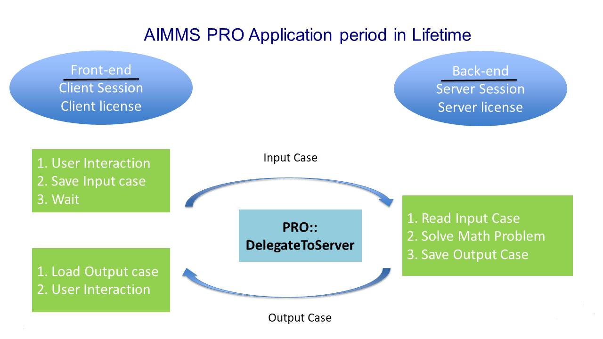
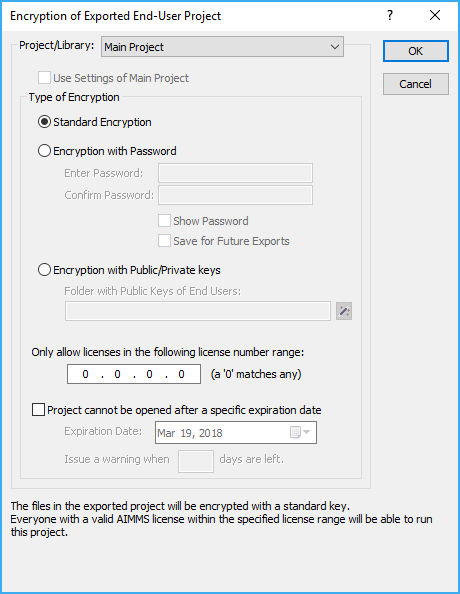
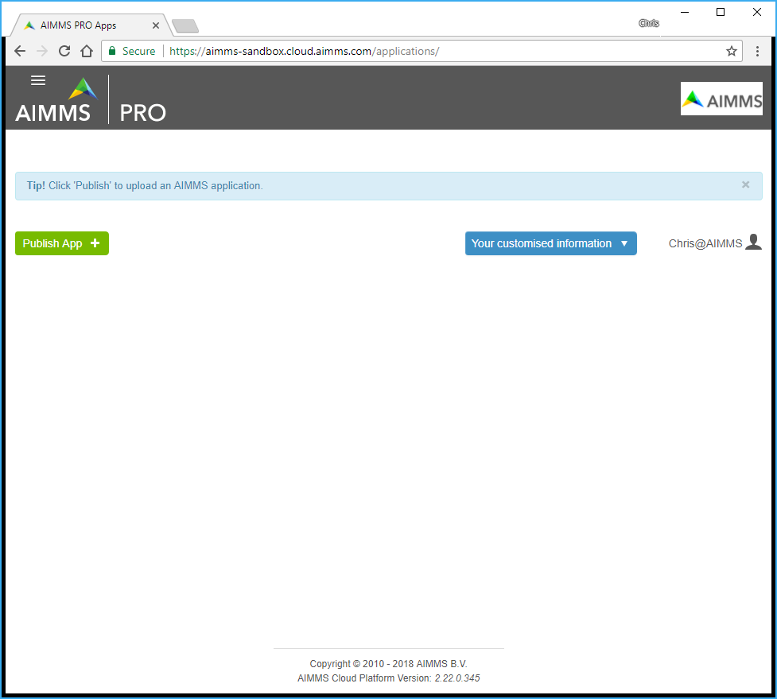
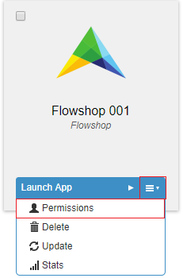
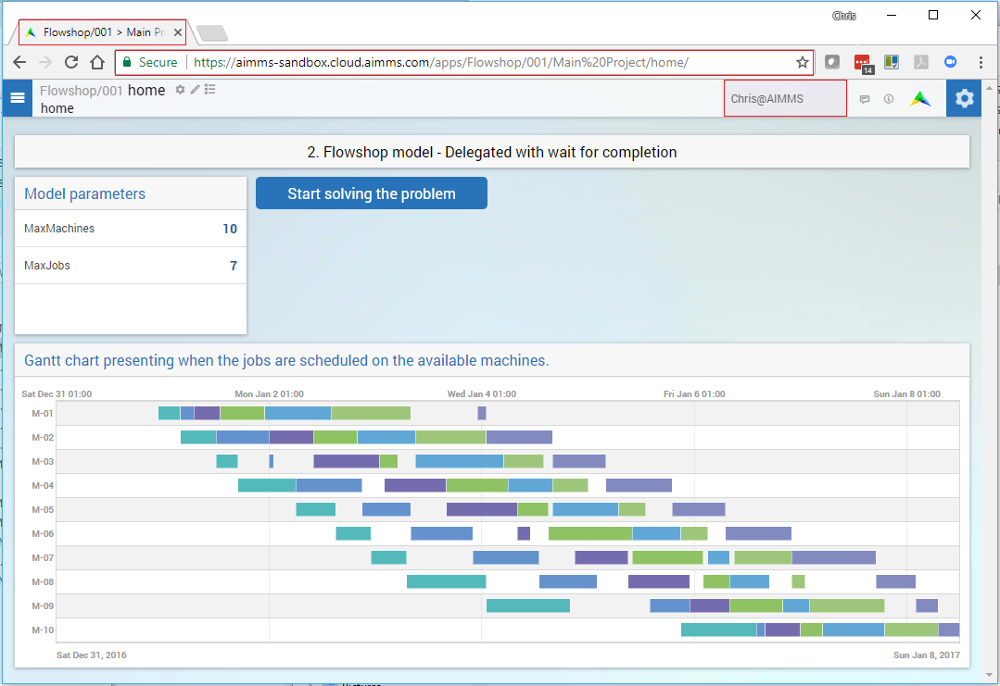

How to publish and share an AIMMS application on the AIMMS PRO Platform? 
========================================================================

Introduction
------------

When you want to share the AIMMS application you developed with your colleagues, they will need an AIMMS developer system and license installed on their Windows PC to be able to use the application. The AIMMS PRO Platform enables you to share your AIMMS applications without your colleagues having AIMMS installed on their PC, and even let the end users access the application in their web browser, via AIMMS WebUI. 

Running Example
---------------

We choose the popular flowshop problem as running example. The question the flowshop model answers is how to order  machines and jobs such that the total time required time to process all jobs is minimal. More details about this model can be found, for instance, on `Wikipedia <https://en.wikipedia.org/wiki/Flow_shop_scheduling>`_. The advantage of the flowshop model for our purposes is that we only need to adapt the number of jobs and machines to illustrate how our application behaves with different running times.

The example AIMMS project can be downloaded from :download:`1. Flow Shop – WebUI – Dev version <../Resources/AIMMSPRO/Deploy_DataServerComm_3_RemoveVeil/Downloads/1. Flow Shop - WebUI - Dev version.zip>`.

You can open this project in the AIMMS Development environment, open the WebUI, and enter the number of machines and jobs before pressing the "Start solving the problem" button. After some time, the solution is presented in a Gantt Chart.

Note that to use this example, you'll need an AIMMS license with a MIP solver. When you want to create an application whereby each user does not need to have a separate license, but can use a license from a pool of licenses on a need be basis, you'll need to publish your application on AIMMS PRO.

When your application solves one or more mathematical programs, or contains some other long running search procedure, you will need to prepare your application for AIMMS PRO. The reason behind this is that the AIMMS session to support AIMMS can be separated from the AIMMS session that does the "heavy weight" computation. This separation of processes is illustrated below:

The story behind this picture is as follows:

#. By starting an AIMMS app on AIMMS PRO, the end user starts a new tab in his browser containing the user interface of the app. Behind this user interface, there is an AIMMS session providing the data for the user interface; the so-called *data session*. This data session is given an end-user license, without the ability to solve.

#. When a solve needs to be executed, execution is delegated to a new session, a so-called *server session*. This server session is equipped with a license that also allows to solve mathematical programming problems. When the solve is finished, the server session sends the results back to the data session. 

#. The data session continues by presenting the results to the end user.

This separation into multiple processes allows to use the license to solve only a limited amount of time, thereby facilitating efficient sharing. However, the required *delegation* needs to be facilitated in the model. Let's discuss the modeling of the delegation next.

Basic Modeling of delegation
----------------------------

A simple way to model delegation is by introducing a new procedure that just handles the delegation. In the remainder of this section, we'll handle the details of that.

To publish an application on the AIMMS PRO platform, the procedure containing the Solve statement in the model needs to be modified first. In our example, the "Start solving the problem" button is linked to the procedure "prDoSOlve".

Perform the following steps:

#.  In the model: create a new procedure, named: ``prSolve``

#.  Give it the following body:

    .. code-block:: aimms
    
        if pro::DelegateToServer( waitForCompletion: 1,
              completionCallback: 'pro::session::LoadResultsCallBack' )
            then return 1;
        endif;
        prDoSolve();

#.  Link the widget ``BtnSolve`` in the WebUI to the new procedure ``prSolve``.

The AIMMS project that does just this, can be downloaded from: :download:`2. Flow Shop - Delegated <../Resources/AIMMSPRO/Deploy_DataServerComm_3_RemoveVeil/Downloads/2. Flow Shop - Delegated.zip>`.

.. caution:: Please do not use the "if pro::DelegateToServer" somewhere in the middle of a procedure; on the server the calling procedure will start from the **beginning**, thus repeating execution steps and this easily leads to confusion.

Now that we have an application developed that is ready to be published, we need to actually publish it. This is discussed next.

Actual publishing on AIMMS PRO
------------------------------

.. comment When we publish this application, we can indeed solve the problem on the PRO server. 

The publication process consists of creating an artifact, the so-called *``.aimmspack``*, transferring this ``.aimmspack`` to AIMMS PRO, and configuring the access rights of the resulting app. Each of these steps is detailed below.

1. Creating an ``.aimmspack``
^^^^^^^^^^^^^^^^^^^^^^^^^^^^^

An ``.aimmspack`` is created using the AIMMS IDE, via AIMMS Menu - File - Export File...
After the standard file selection dialog of Windows where to save a file, you'll get a dialog that looks like:

enabling you to select a non-default encryption.  OK'ing this dialog, you'll get a next dialog to select the contents of the ``.aimmspack``:

.. image::  ../Resources/AIMMSPRO/Deploy_DataServerComm_1_Publish/Images/FileSelectionAimmspack.PNG

Note, AIMMS will store the selection made in the project such that you do not have the make the same selection next time around. 

2. Transferring an .aimmspack to AIMMS PRO
^^^^^^^^^^^^^^^^^^^^^^^^^^^^^^^^^^^^^^^^^^

When you open your AIMMS portal, you should see something like this, in particular the green "Publish App" button.

.. note:: If you do not have the publish button, please contact your AIMMS PRO administrator and ask to become a member of the ``AppPublishers`` group.
   
Pressing the publish button on the AIMMS PRO portal, you will be asked for the .aimmspack file.  After uploading this, you will get you to:

.. image:: ../Resources/AIMMSPRO/Deploy_DataServerComm_1_Publish/Images/PublicationFilledIn.PNG
   :scale: 50 %

Here the areas with a red border need to be filled in.
   
   
3. Configuring the access rights
^^^^^^^^^^^^^^^^^^^^^^^^^^^^^^^^

At the end of the app publication, you can set the access rights. You can also modify the access rights at a later stage, by 

Anyway, you'll get a browser page that looks somewhat like this, and you can point and click to select groups and/or individual users, and you can point and click to give groups and individual rights. 

.. image:: ../Resources/AIMMSPRO/Deploy_DataServerComm_1_Publish/Images/SettingAccessRights.PNG

Here we've given all AimmsCloudUsers of the AIMMS environment the right to read and execute the Flowshop application.

The interface to the end-user looks almost the same, as you can see from the screen shot below.

Some of the minor differences are highlighted in the above screenshot. 
The two major differences are:

#. For the end-users there is no need for an AIMMS Developer license, including solver license, to run the application.
#. The end-users can run the app on almost any device, including tablets, Linux PC's and Windows PC's.

Summary
-------

By a minor change in the application (an additional procedure with some more or less standard text) and some easy straightforward point and click work; we've shared our application with our fellows!

Further study
-------------

Oops, I see several problems that we can work on.  

#. I want to continue working on the app itself using my development environment. Now, the system asks whether I want to solve on a PRO system, while I am clearly not connected to that PRO system – I just want to be able to :doc:`test and debug <Deploy_DataServerComm_2_Develop>` my application.  

#. I want to remove the veil that drops down when a procedure of the data session runs for more than a few seconds. See topic :doc:`Deploy_DataServerComm_3_RemoveVeil`

.. include:: ../includes/form.def
 