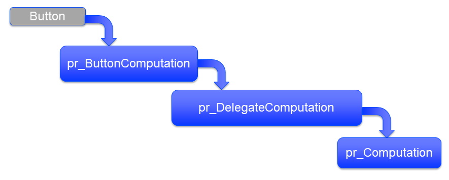

Troubleshooting Unresponsive Applications
============================================================

.. meta::
   :description: The AIMMS Error handling permits explicit recoveries, controlled by the end user, of abnormal environment and system conditions.
   :keywords: error handling, time out, timed out, server session, AIMMS Deployment

Executing a ``pro::DelegateToServer`` from a WinUI AIMMS app launched from a distant AIMMS PRO server may fail due to various causes. 
In this article, we discuss one potential cause for an app not responding for more than a minute after the ``DelegateToServer`` call - an unstable internet connection. Wireless connections are more likely to be unstable compared to wired connections. 

If this behavior is occurring frequently in your applications, you can use the Error Handling functionality offered in AIMMS to mitigate the situation.

Example
----------

The example app executes a procedure on the PRO Server upon pressing the button.

#. A button is pressed

#. The action associated with the button is executing the procedure ``pr_ButtonComputation``.

#. This procedure will call another procedure ``pr_DelegateComputation`` that will handle the delegation to an AIMMS PRO server. This is the procedure with the ``pro::DelegateToServer`` call.

#. Finally, the procedure that contains the actual computation ``pr_Computation`` is called. This is a very trivial procedure in this example but usually contains a ``solve`` statement. 

.. code-block:: aimms

    Procedure pr_Computation {
        Body: {
            pi := 3.14159265359 ;
        }
    }

We will now explain bottom up the procedure calls:
  
The Delegate Procedure
-----------------------------------------

The code for the procedure that delegates work to the server is as follows in this example. More elaborate examples can be found in other articles in the category :ref:`Deployment<ref-deployment>`.

.. code-block:: aimms
   :linenos:

   Procedure pr_DelegateComputation {
      Body: {
         !delay( 5 ); 
         !raise error "oops, timed out again, sigh." ;
         
         if pro::DelegateToServer(                    
                           waitForCompletion:1,
                           completionCallback: 'pro::session::LoadResultsCallback' ) then
                  return ;
         endif ;
         
         ! Do the actual work.
         pr_Computation();
      }
   }

* Lines 3,4: Uncommenting these lines will cause an error.  These are added to test ``pr_ButtonComputation`` as discussed in the next section. 
* Lines 6-10: A typical ``pro::DelegateToServer`` call.

Troubleshoot Procedure
------------------------------------------

The real meat of this article is in the ``pr_ButtonComputation`` procedure where we allow the user to recover from an error.

.. code-block:: aimms
   :linenos:

   Procedure pr_ButtonComputation {
      Body: {
         p01_DelegateCompleted := 0 ;
         while not p01_DelegateCompleted do
               sp_msg := "" ;
         
               block 
                  ! Happy flow here.
                  pr_DelegateComputation();
         
                  ! Mark task as completed.
                  p01_DelegateCompleted := 1 ;
         
               onerror ep_err do
         
                  ! Error handling here.
                  p01_errorHandled := 0 ;
                  sp_msg := errh::Message(ep_err);
                  if StringOccurrences(sp_msg, "timed out") then
         
                     ! On timed out, provide user with the opportunity to retry. 
                     p_ret := DialogAsk(
                              message :  sp_msg, 
                              button1 :  "Retry", 
                              button2 :  "Cancel", 
                              title   :  "Press Retry, if you want to retry the solve, cancel if you want to handle the issue otherwise");
                     if p_ret = 1 then
                           ! Retry button pressed by user.
                           errh::MarkAsHandled(ep_err);
                           p01_errorHandled := 1;
                           ! Note, p01_DelegateCompleted is still 0, so the 
                           ! while loop will re-iterate and 
                           ! pr_DelegateComputation() will be called again.
                     endif ;
                  endif ;
               endblock ;
               if sp_msg and ( p01_errorHandled = 0 ) then
                  break ; ! Error (perhaps intentionally) not handled by user.
               endif ;
         endwhile ;
      }
      ElementParameter ep_err {
         Range: errh::PendingErrors;
      }
      StringParameter sp_msg;
      Parameter p_ret;
      Parameter p01_DelegateCompleted {
         Range: binary;
      }
      Parameter p01_errorHandled {
         Range: binary;
      }
   }
    
* Line 9: The happy flow. When this fails due to a "timed out" condition, an error is raised (see previous procedure).

* Lines 18, 19: We retrieve the message and check for the "timed out" condition.

* lines 22 - 33: We give the user the opportunity to retry. 

* The 01 parameters are auxiliary parameters created to ensure the flow of the troubleshoot procedure. 

.. todo:: p01_errorHandled should not be needed. See https://gitlab.aimms.com/aimms/customer-tickets/issues/970 Adapt article when issue is fixed.
          Fix should appear in AIMMS 4.62 :-)

Further Reading
------------------

* `AIMMS The Language Reference <https://documentation.aimms.com/_downloads/AIMMS_ref.pdf>`_: Section "Raising and handling warnings and errors"

* `AIMMS The Function Reference <https://documentation.aimms.com/_downloads/AIMMS_func.pdf>`_: Chapter "Error Handling Functions"

* `Error Handling Example <https://aimms.com/english/developers/resources/examples/functional-examples/error-handling/>`_ 

.. include:: ../../includes/form.def

