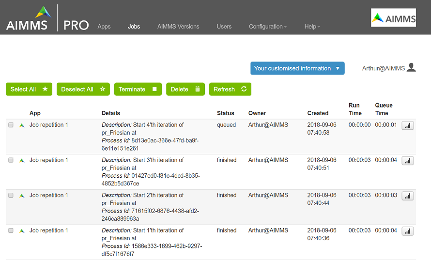

Schedule Regular Jobs
======================

.. meta::
   :description: How to schedule an AIMMS procedure to run regularly.
   :keywords: schedule, job, regular, repeat, recur

.. https://gitlab.aimms.com/Chris/aimms-how-to/issues/80
.. Nirvana project 0006

Some applications involve solving a mathematical program regularly, for instance every night or every ten minutes. 
In this article, we'll discuss how an AIMMS job can reschedule itself, as depicted in the next picture.

.. image:: ../../Resources/C_Deployment/RegularJob/Images/DelegationLevel.png

Effectively, this realizes that the job at hand is solved regularly. As you can see from this image:

* The WebUI session you start via AIMMS PRO has an associated AIMMS data session. This data session has a ``pro::CurrentDelegationLevel()`` of 0; there is no delegation of work yet.

* The AIMMS server session started from this AIMMS Data Session has a ``pro::CurrentDelegationLevel()`` of 1; it is the consequence of one delegation.

* The AIMMS server session started from the above AIMMS Server session has a ``pro::CurrentDelegationLevel()`` of 1 higher than its predecessor.

.. Note: The WebUI session can be closed as soon as the sequence is started; each server job schedules the next before doing its actual work. The WebUI session is only used to start the sequence.

To start this sequence, the following code is used.

.. image:: ../../Resources/C_Deployment/RegularJob/Images/pr_OnButtonStartServerSessions.PNG

Each line is explained as follows:

#. Determine the payload procedure that should be executed by each server session.  Here it is the ``pr_Friesian``, as Friesians are excellent workhorses.

#. A call to the procedure that actually starts each server session.

#. When ``pr_IterativeJobScheduling`` is called by another procedure, then the argument ``delegateLevel`` should be 0.

#. The number of server sessions started is controlled by ``maxDelegateLevel``

#. The argument ``timeIncrement``, is the time between sessions measured in seconds. 

#. The procedure to be executed regularly passed via the arguments.

The center piece of the project is the procedure ``pr_IterativeJobScheduling``:

    .. code-block:: aimms
    
        Procedure pr_IterativeJobScheduling {
            Arguments: (delegateLevel,maxDelegateLevel,timeIncrement,epPayloadProcedure);
            Body: {
                ! pro::DelegateToServer uses the *current* values of local arguments to create a call for a new server session.
                ! We modify the values of these arguments before calling pro::DelegateToServer
                delegateLevel += 1 ;                                                       ! 1)
                
                spRequestDescription :=                                                    ! 2)
                    formatString("Start %i'th iteration of %e at %s", 
                    delegateLevel, epPayloadProcedure, sp_jobTime );

                ! Switch to server sessions.
                if delegateLevel = 1 then

                    if pro::DelegateToServer(                                              ! 3)
                            requestDescription :  spRequestDescription,
                            waitForCompletion  :  0, 
                            completionCallback :  'pro::session::EmptyCallback',
                            delegationOverride :  delegateLevel  ) then
                        return 1 ;
                    endif ;

                elseif delegateLevel <= maxDelegateLevel then   ! Schedule the next job.
                
                    sp_jobTime := MomentToString( sp_LocalTimFmt, [second],                 ! 4)
                                        CurrentToString(sp_LocalTimFmt), timeIncrement );
                                        
                    pro::DelegateToServer(                                                ! 5)
                        requestDescription :  spRequestDescription,
                        waitForCompletion  :  0, 
                        completionCallback :  'pro::session::EmptyCallback',
                        delegationOverride :  delegateLevel,
                        scheduledAt        :  sp_jobTime );

                endif ;

                Apply( epPayloadProcedure );                                              ! 6)
            
                }
                
            Parameter delegateLevel {
                Property: Input;
            }
            Parameter maxDelegateLevel {
                Property: Input;
            }
            Parameter timeIncrement {
                Unit: second;
                Property: Input;
            }
            ElementParameter epPayloadProcedure {
                Range: AllProcedures;
                Default: 'MainExecution';
                Property: Input;
            }
            StringParameter sp_jobTime;
            StringParameter spRequestDescription;
        }

    
Each portion of the procedure code is explained below:
        
#. DelegateLevel increased, to indicate to AIMMS PRO that this is a valid iterative call.
        
#. Job description, to properly identify each job in the session logs.
        
#. The first job starts immediately, but is started from the WebUI session. The WebUI session should NOT execute the payload, that is why we have a test on the return of ``pro::DelegateToServer``

#. Construct the next time the job is to be executed. By using the Local timezone, we avoid any ambiguities regarding daylight saving time; ``sp_LocalTimFmt = "%c%y-%m-%d %H:%M:%S%TZ('Local')"``

#. The iterative call, that might looks like a recursive call.

#. This will execute the payload for each of the server sessions started.

To operate, the example that can be downloaded :download:`here <../../Resources/C_Deployment/RegularJob/JobRepetition.zip>`.

#. Create an .aimmspack, publish on your favorite AIMMS PRO system.

#. Launch it and press the only button

#. Close the app. Yes, once the sequence of server sessions is started, the WebUI of the enclosed example is no longer of use - it can be closed.

#. Go to job tab in the AIMMS PRO portal and watch new jobs being created, queued, running, and finished.

.. note::

    * When you check the session.log files, you may encounter a line like:

        .. code-block:: none

            12:10:46,186 0x7f6389d90700 [INFO] {PRO.Client.Library} pr_Friesian(): At 2018-09-04 12:10:46 (UTC) delegation level is 3

        That is because the procedure ``pr_Friesian`` uses the procedure call ``pro::management::LocalLogInfo(...);`` to log some information about current server session.

    * When you want to interrupt a sequence of server jobs, please terminate the scheduled session before terminating the running session.

.. include:: ../../includes/form.def