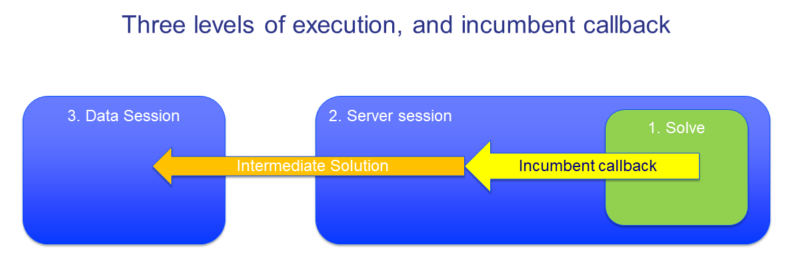
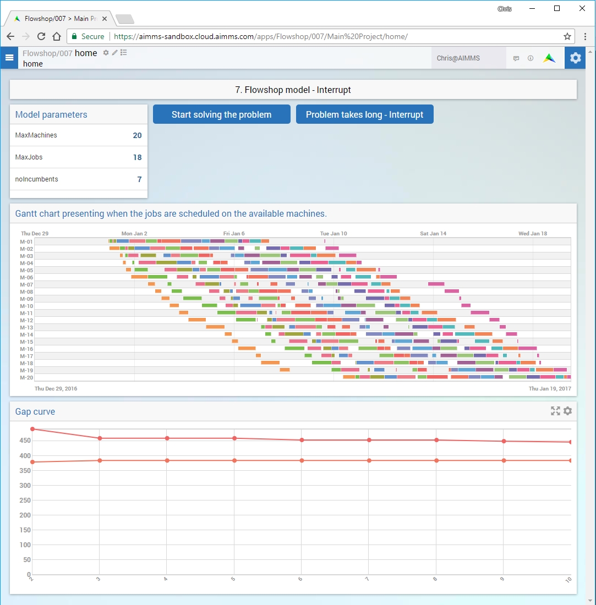

Show Intermediate Solutions
===============================

.. meta::
   :description: How to retrieve intermediate results from a server session to the data session.
   :keywords: intermediate, results, server, data, session

.. todo  Work the following comments.
.. todo  Terminologie: WebUI session vs. server session vs. solver session komt niet overeen met die door het backend/webui team gebezigd wordt. 

Introduction
------------

During a long running solver session (job), we may want to compute intermediate results and show them to the end user as soon as they are available. Consider the following use cases:

#. The submitted job contains multiple decision subproblems, all of which are solved in one batch. Why wait for providing the solution of the first subproblem, while the job is already working on the second subproblem?

#. The optimization of a significant Mixed Integer Problem will compute several intermediate incumbents, and perhaps these incumbents are worth visualizing and studying further.

#. By showing intermediate solutions, the end user may decide that the last shown solution is good enough and decide to terminate the job.

Difference with passing progress information
--------------------------------------------

The differences between progress information and intermediate solutions are:

#. The intermediate solutions will be stored as cases such that they can be retrieved upon demand.

#. There is no limit to the amount of information that can be passed back to the data session.

#. The messages about the presence of the intermediate solutions are guaranteed to arrive at the data session; even if the data session is temporarily unreachable.

Approach
--------

The approach here involves passing information through three levels of execution. 

#. The solver execution on the server session. 
    Construct a new incumbent containing the entire solution. This is done as part of the incumbent callback mechanism. 
    
#. The AIMMS execution on the server session. 
    Retrieve incumbent solution or intermediate result from the solver, also as part of the incumbent callback mechanism. Store this retrieved solution as a case file on the AIMMS PRO storage. 

#. The AIMMS exection on the data session. 
    Execute a procedure to retrieve the name of the case file generated in the previous step, and load the data from the case file into the data session for the end user's viewing. 

This approach is possible because both the data session and the server session have access to the AIMMS PRO storage and storing all the different incumbent solutions as case files allows the user to access them when required to conduct further studies. The following image illustrates how AIMMS PRO storage is organized:

.. image:: ../../Resources/AIMMSPRO/Deploy_DataServerComm_6_Retrieve/Images/Default-folder-layout-of-AIMMS-PRO-Storage.png
    :align: center

We will use the folder ``pro:/UserData/<environment>/<User>/Cases/<app>/`` on AIMMS PRO storage. 

Implementation
--------------

There are two steps to communicate the information from the first to the third level. 

Step 1. From Solver (level 1) to server session (level 2)
^^^^^^^^^^^^^^^^^^^^^^^^^^^^^^^^^^^^^^^^^^^^^^^^^^^^^^^^^ 

Step 1A Construct the incumbent solution on the solver session. 
    
As we want to display/update a new incumbent solution as it becomes available, we use the mathematical program suffix ``CallbackNewIncumbent``. A callback procedure is assigned to this suffix as below, and this executes the assigned procedure whenever a new incumbent solution is found by the solver. Include the below statement before the solve statement in your project. 

    .. code-block:: aimms
        
        FlowShopModel.CallbackNewIncumbent := 'NewIncumbentCallback';

Step 1B Retrieve the incumbent solution generated by the solver to the AIMMS server session. 
    
In the running example, the procedure ``NewIncumbentCallback`` first retrieves the incumbent solution from the solver session, transforms it to be displayed in the gantt chart, creates a case file containing this data and saves it on the AIMMS PRO storage. The intermediate data transformation steps are specific to this example and hence are not explained here. 

The predefined procedure ``RetrieveCurrentVariableValues`` retrieves the current values of the variables as the name suggests. It takes an argument specifying which variable values are to be retrieved and we use the predefined set ``AllVariables`` to get the values of all the variables in the model. TimeSpan is the objective function of the model and we are storing the current incumbent value with the assignment statement. 

    .. code-block:: aimms

        ! Transfer the solution from the solver to AIMMS
        empty JobSchedule;

        RetrieveCurrentVariableValues(AllVariables);
        TimeSpan := FlowShopModel.Incumbent;
        
Create a case file containing this solution.    

    .. code-block:: aimms

        AllCaseFileContentTypes += 'sIncumbentSolutionIdentifiers' ;
        CurrentCaseFileContentType := 'sIncumbentSolutionIdentifiers' ;
        sp_CaseFileName := FormatString( "Incumbent%i.data", pIncumbentNumber );
        P_IncumbentNumber += 1 ;
        sp_FullCaseFileName := "data/" + spCaseFileName ;
        CaseFileSave( spCaseFileName, sIncumbentSolutionIdentifiers );

Now, save the case file on PRO storage and store the name of the case file (including location path) in a string parameter.

    .. code-block:: aimms    

        ! Transfer the case from the data folder of the server session to the AIMMS PRO storage user data folder.
        ! Transfer the GC solution from AIMMS to a case.
        spFullProStorageName := "pro:/userdata/" + pro::GetPROEnvironment() + 
                            "/" + pro::GetPROUserName() + "/Cases/" + pro::ModelName + "/" + spCaseFileName ;
        Pro::SaveFileToCentralStorage(spCaseFileName, spFullProStorageName );

The AIMMS execution side is now triggered using the previously updated string parameters as arguments. 

    .. code-block:: aimms

        ! Run the AIMMS execution on the data session
        UpdateIncumbentToClient(spFullProStorageName);
        
        
Step 2. From server session (level 2) to data session (level 3) 
^^^^^^^^^^^^^^^^^^^^^^^^^^^^^^^^^^^^^^^^^^^^^^^^^^^^^^^^^^^^^^^^

The procedure ``UpdateIncumbentToClient`` is a simple loading case file execution using the predefined procedure, ``CaseFileLoad``.

    .. code-block:: aimms

        if pro::DelegateToClient(flags: 0) then
            return 1; 
        endif ;
                
        ! From here on, only the client (data) session is running.
                
        CaseFileLoad( spArgFullProStorageName );
                
        ! Comment out the next line if you want to retain intermediate solutions.
        pro::DeleteStorageFile( spArgFullProStorageName );

A copy of the flowshop model that is the result of this answer: :download:`Flow Shop - share intermediate <../../Resources/AIMMSPRO/Deploy_DataServerComm_6_Retrieve/Downloads/Flow Shop - share intermediate - after.zip>`.

..  Let's start with an example that is being used elsewhere in `How To <https://how-to.aimms.com>`_  as well.
..    **Todo** URL for end result "remove veil" - "share progress info" needs to be inserted here.
..  Flowshop model - before sharing intermediate results with data session.
..  Flow Shop - share intermediate - after
..  Flow Shop - share intermediate - before

Further reading
---------------

Now that end users know the state of the solution process, they also want to interrupt it when they see that further improvements are not worth waiting for. This is handled in :doc:`Deploy_DataServerComm_7_Interrupt`.

.. include:: ../../includes/form.def

