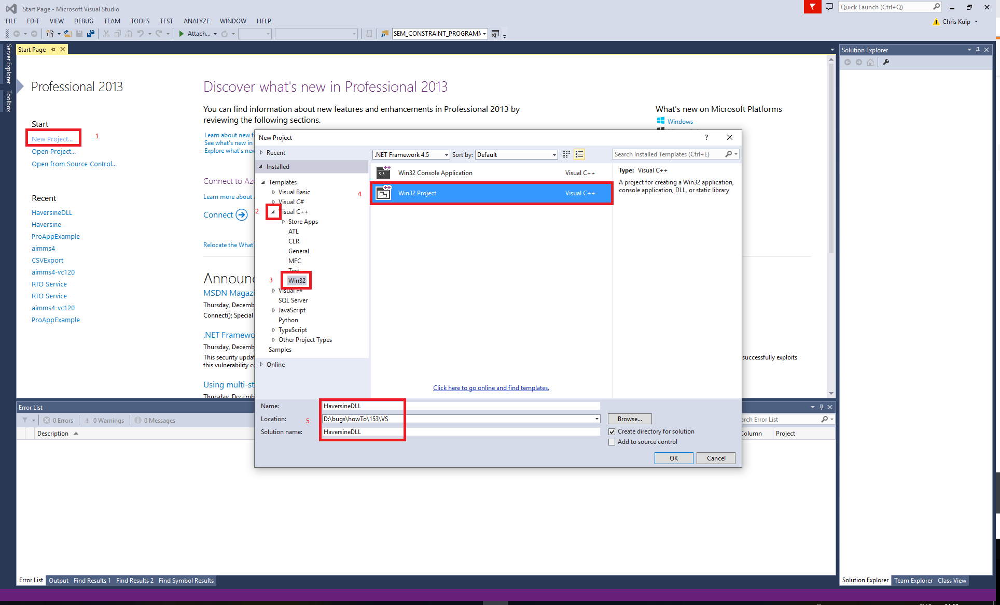

Haversine as external function
==============================

.. note:: Under Construction / Draft status - please do not hesitate to use the form at the end of this article to ask for clarification where needed.

.. sidebar:: Crow in flight - Wikimedia Commons

    .. image:: ../Resources/C_Language/Images/153/Crow_in_flight.jpg

`Haversine code <https://rosettacode.org/wiki/Haversine_formula>`_ in various computer languages is publicly available to compute the distance between locations.
In this article, we use it as an illustration of how to create an external function using `Microsoft Visual Studio <https://visualstudio.microsoft.com/>`_.

Creating a Visual Studio Project
--------------------------------

A Visual Studio Project facilitates incremental building of software components in various computer languages. 
Here we just use it to create a ``.dll`` containing external functions for Haversine.  

After opening Visual Studio, in order:

#. New Project  - To create a new project

#. Visual Studio C++ - Specializing to project to C++

#. A Win32 - Further specializing the project to Win32 (which covers both 32 and 64 bit executables)

#. A generic Win32 project (not a console)

#. Specify destination folders
    
.. image:: ../Resources/C_Language/Images/153/02NewProjectDLL.PNG

#. Make sure we can change further settings

.. image:: ../Resources/C_Language/Images/153/03NewProjectDLL.PNG

#. We want a DLL

#. The default configuration is not correct

.. image:: ../Resources/C_Language/Images/153/05NewProjectDLL.PNG

#. We want a new configuration

.. image:: ../Resources/C_Language/Images/153/06NewProjectDLL.PNG

#. Namely x64

Header code
--------------------

.. code-block:: cpp
    :linenos:

    // HaversineDLL.h Declares the exported Haversine function

    #include "stdafx.h"
    #define _USE_MATH_DEFINES
    #include <math.h>

    #ifdef __cplusplus
    #define DLL_EXPORT_PROTO(type) extern "C" __declspec(dllexport) type WINAPI
    #else
    #define DLL_EXPORT_PROTO(type) extern __declspec(dllexport) type WINAPI
    #endif

    DLL_EXPORT_PROTO(double) Haversine(double lat1, double lon1, double lat2, double lon2);

* Line 3: Needed somehow

* Line 4: Such that we can use pi.

* Line 5: Sin, cos, etc.

* Line 7 - 11: C calling convention is needed for AIMMS to be able to call this function.

Coding the function
-------------------

.. code-block:: cpp
    :linenos:

    // HaversineDLL.cpp : Implements the exported Haversine function for the DLL application.

    #include "stdafx.h"
    #include "HaversineDLL.h"

    static double toRadians(double angle)
    {
        return M_PI * angle / 180.0;
    }
    DLL_EXPORT_PROTO(double) Haversine(double lat1, double lon1, double lat2, double lon2)
    {
        double R = 6372.8; // In kilometers
        double dLat = toRadians(lat2 - lat1);
        double dLon = toRadians(lon2 - lon1);
        lat1 = toRadians(lat1);
        lat2 = toRadians(lat2);

        double a = sin(dLat / 2) * sin(dLat / 2) + sin(dLon / 2) * sin(dLon / 2) * cos(lat1) * cos(lat2);
        double c = 2 * asin(sqrt(a));
        return R * 2 * asin(sqrt(a));
    }

* Line 3: Windows needs this

* Line 4: Declarations of h file should be checked against implementation.

* Line 6-9: Helper function, convert angle from degrees to radians.

* Line 10: Function declaration, use C calling convention

* Line 12 - 20: based on `Haversine code <https://rosettacode.org/wiki/Haversine_formula>`_

Building using Visual Studio
----------------------------

#. Select release

#. Select x64

#. Press Build

Verifying that the exported functions are there
-----------------------------------------------

We need to verify that the .dll's built are valid 32 bit and 64 bit .dll's. 
To do this, we use a nifty free of charge utility named depends.exe.  This can download the x86 and x64 from this `website <http://www.dependencywalker.com/>`_.
Installing is just unzipping. Then start the executable and open the .dll

#. ``depends22_x86\depends.exe`` for the 32 bit dll: ``<HaversineDLL>\release\HaversineDLL.dll``.  

    .. image:: ../Resources/C_Language/Images/153/32BitsDependsCheck.PNG

    * Missing functions in MSVCR120.dll may be reported, but those are covered when starting AIMMS. 
    
    * Important are the functions exported, as highlighted in the red rectangle; at least Haversine needs to be there.  32 bits Win32 will prefix using an ``_`` and postfix using the @ sign and the number of bytes passed over the stack.  The Haversine functions passes four doubles, so the postfix @32 is to be expected.

    
#. ``depends22_x64\depends.exe`` for the 64 bit dll: ``<HaversineDLL>\x64\release\HaversineDLL.dll``.  

    .. image:: ../Resources/C_Language/Images/153/64BitsDependsCheck.PNG

    * Missing functions in MSVCR120.dll may be reported, but those are covered when starting AIMMS. 
    
    * Important are the functions exported, as highlighted in the red rectangle; at least Haversine needs to be there.  64 bits Win32 will not use prefix, nor postfix.
    

Testing the DLL's
-----------------

Create a separate AIMMS project just for testing.

Step 1: Copy the dll's into the AIMMS project:
^^^^^^^^^^^^^^^^^^^^^^^^^^^^^^^^^^^^^^^^^^^^^^

#. Copy the ``<HaversineDLL>\release\HaversineDLL.dll`` to the AIMMS project subfolder ``external\Windows\x86``

#. COpy the ``<HaversineDLL>\x64\release\HaversineDLL.dll`` to the AIMMS project subfolder ``external\Windows\x64``

Step 2: Declare the external function in AIMMS:
^^^^^^^^^^^^^^^^^^^^^^^^^^^^^^^^^^^^^^^^^^^^^^^^

.. code-block:: aimms
    :linenos:

    ExternalFunction fnc_Haversine {
        Arguments: (latFrom,lonFrom,latTo,lonTo);
        DllName: "external\\Windows\\x64\\HaversineDLL.dll";
        ReturnType: double;
        BodyCall: Haversine(scalar: latFrom, scalar: lonFrom, scalar: latTo, scalar: lonTo);
        Parameter latFrom {
            Property: Input;
        }
        Parameter lonFrom {
            Property: Input;
        }
        Parameter latTo {
            Property: Input;
        }
        Parameter lonTo {
            Property: Input;
        }
    }

Step 3: Test the external function in AIMMS:
^^^^^^^^^^^^^^^^^^^^^^^^^^^^^^^^^^^^^^^^^^^^^^

.. code-block:: aimms
    :linenos:

    Procedure MainExecution {
        Body: {
            p_DistNashvilleLosAngeles := fnc_Haversine(36.12, -86.67, 33.94, -118.40);
            
            p_dist1(i_slocFrom, i_slocTo) := fnc_Haversine( p_Latitude(i_slocFrom), p_Longitude(i_slocFrom), p_Latitude(i_slocTo), p_Longitude(i_slocTo) );
            
            display p_DistNashvilleLosAngeles ;
        }
    }

Listing file:
            
.. code-block:: none

    p_DistNashvilleLosAngeles := 2887.260 ; 

which is the expected value.

Good performance; my desktop requires less than 0.3 seconds to fill a 274 X 274 distance matrix.

Downloads
------------

*  :download:`Visual Studio project <../Resources/C_Language/Images/153/VSCPP.zip>` 

*  :download:`AIMMS project <../Resources/C_Language/Images/153/CrowDistExternal.zip>` 

.. include:: ../includes/form.def

