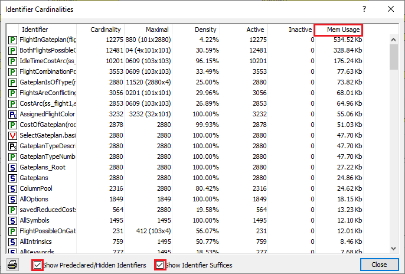

Investigate memory in use
============================

Applications keep acquiring functionality, and it thus expected that over time they need more and more memory.
However, often times memory is used for unexpected reasons or even no reason at all. 
Therefore it is important to keep a wary eye on the memory use of your application.
This article summarizes some techniques to gain insight in the memory use of your application.

Total Memory in use
--------------------

The function MemInUse returns the amount of memory used by AIMMS in Mb. MemInUse calls a system function to obtain its value; it is not based on some internal AIMMS administration. Obviously, by subtracting the memory use at the end of executing a procedure with the memory use at the beginning of a procedure, you'll know how much memory is used by executing a procedure. 

Quick overview of memory used by identifiers
--------------------------------------------

The identifier cardinalities tool (via AIMMS Menu - Tools - Diagnostic tools), tick both selection boxes at the bottom bar, and sort on Mem Usage to get an indication of the identifiers with most memory consumption. 

    Data cardinalities tool for the Gate Assignment problem in the AIMMS Examples repo.

In model analysis of memory used for identifiers
-------------------------------------------------

The function Card( id ), where id is a set,parameter, variable or constraint. This function returns the number of elements, both active and inactive.
It's companion function, ActiveCard(), returns only the number of active elements. Another companion function, IdentifierMemory(), returns the memory in use by an identifier.
Note that the rebuild statement allows to return the memory occupied by "permutations".

In model analysis of memory used for GMPs
-----------------------------------------

The function GMP::Instance::GetMemoryUsed returns the memory used by a GMP. By visiting all elements in the set AllGeneratedMathematicalPRograms you'll know how much memory AIMMS reserved for the generated mathematical programs.

Memory used by element spaces
-----------------------------

AIMMS maintains per root set a mapping between elements(strings) and numbers, this mapping is the so-called element space. There is no function available to return the memory used for an element space, but the element space of the set Integers is very cheap, as this is just an arithmetic operation without the need for additional memory. So when your elements are integers, make sure the corresponding set is a subset of the set Integers.

References
--------------------

* `AIMMS The User's Guide <https://documentation.aimms.com/_downloads/AIMMS_user.pdf>`_: Section "Observing identifier cardinalities"

* `AIMMS Function Reference <https://documentation.aimms.com/_downloads/AIMMS_func.pdf>`_: 

    * Function MemoryInUse   
    
    * Function Card
    
    * Function GMP::Instance::GetMemoryUsed
    
* :doc:`134-Monitoring-Memory-Use`

.. include:: ../includes/form.def
