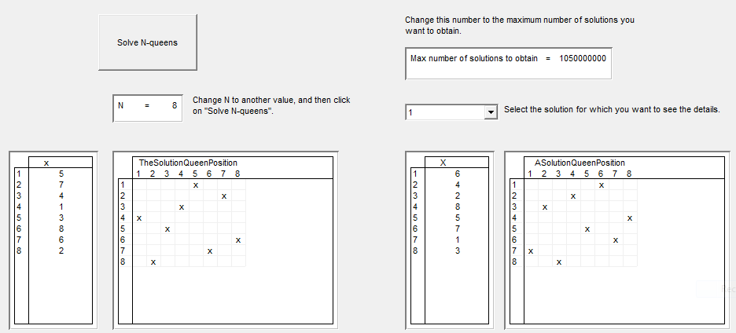

Multiple Solutions
=====================

.. meta::
   :description: How to produce and retrieve multiple solutions in AIMMS.
   :keywords: multiple, solution, solve

.. note::

	This article was originally posted to the AIMMS Tech Blog by Guido Diepen.

.. sidebar:: 8 Queens Solution

    .. image:: ../Resources/C_Solvers/Images/139/Eight-Queens-Solution.png

Some of the solvers in AIMMS, including the CP Optimizer solver for Constraint Programming problems, support not only returning a single (optimal) solution, but also a pool of feasible solutions.

Some time ago, `Hakank's Home Page <http://www.hakank.org>`_ has done a thorough `A first look at AIMMS+CP (AIMMS with Constraint Programming) <http://www.hakank.org/constraint_programming_blog/2012/11/a_first_look_at_aimmscp_aimms_with_constraint_programming.html>`_. One of the remarks he posted at the end was that it was not completely clear how to obtain multiple solutions from the CP Optimizer solver.

In this post I will show how to instruct the solver to create the additional solutions and also how to retrieve them in AIMMS after the solver is finished. I will do this by modifying the original N-Queens problem as implemented by Hakan in his review.

In the case of the solver CP Optimizer, you can influence the number of solutions that are created by the solver (and stored in the GMP solution repository) via the option ``solution_storage_limit``, which you can find under the general section of the solver specific options for CP Optimizer in the project settings.

By setting this option to a very large value, you can instruct the solver to store all solutions to the problem in the GMP solution repository. You can either change this setting explicitly in the project settings, or you can use the block statement to temporary use alternative project settings.  For example:

.. code-block:: aimms

    block where solution_storage_limit := MaxNumberOfSolutions  ;
        solve NQueensPlan;
    endblock ;

After the solve is finished, you can use the AIMMS function ``GMP::Solution::SendToModel`` to transfer the solution values from the GMP solution repository to the variables in your project. This approach does require that for every variable X in your problem, you introduce a new parameter X2 that has the same index domain as X with an index added for indexing the solutions. In the example below, this parameter is XValueInSolution.

.. code-block:: aimms

    !Get the number of solutions
    NumberOfSolutions := gmp::Solution::Count('NQueensPlan') ;
    while LoopCount &lt;= NumberOfSolutions do
        !For each solution that is stored in the GMP solution repository
        !retrieve it
        gmp::Solution::SendToModel( 'NQueensPlan', LoopCount ) ;
     
        !Now store the values for this solution in a parameter that is
        !also indexed over the number of solutions.
        XValueInSolution( LoopCount , i ) := x(i) ;
    endwhile ;

Below you can download the aimmspack containing the modified version of the original project from Hakan.
:download:`AIMMS project download <../Resources/C_Solvers/Images/139/NQueens_converted.zip>` 

Another small modification I made to the project is that it graphically shows the locations of the queens on a chessboard. This allows to quickly compare different solutions, as depicted below:

    Graphical representation of NQueens solution

Other solvers that directly support working with a solution pool are Baron and CPLEX. For Baron, you can influence the behavior with the project setting *number_of_best_solutions* while with CPLEX you can modify the behavior by setting the project setting *do_populate* to the value 1.

Note that with solvers that don't directly support a solution pool but do support the Incumbent callback, you can manually create the solution repository by storing each solution found by using the Incumbent callback.

.. include:: ../includes/form.def

