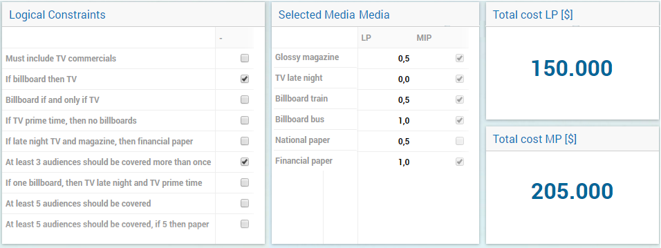

Exploring the differences between the AIMMS WebUI and WinUI through a series of examples
========================================================================================

During the last 5 months, I was fortunate enough to spend 2 days a week doing an 'internship' at AIMMS. Internship might not be the best term to describe my time here, as I already finished my Masters, but nonetheless it was labeled as such and more importantly I learned a lot. I acquired some basic AIMMS knowledge, helped out with new WebUI examples and got a first glimpse behind the curtains of a technology company. Now that my time here is coming to an end, I will try to give you a bit of insight into these past 5 months. This blogpost is the first in a series of two and it covers the WebUI work I did for AIMMS. Specifically, I was asked to translate the Windows User Interface (WinUI) of certain examples from the AIMMS modeling book to the newer web browser User Interface (WebUI). Let's explore the difference between both interfaces through these examples.

WinUI vs. WebUI
-----------------

Although the names are pretty self-explanatory, let me quickly elaborate on the differences. The WinUI is a Windows native GUI, while the WebUI works in a browser. As both UIs have advantages and disadvantages, I'll try to outline the differences in the following paragraphs.

.. figure:: ../Resources/C_UI/Images/113/image001.png

    Figure 1-A pie chart in the WebUI

Graphical presentation
----------------------

Two big improvements in the WebUI, compared to the WinUI, stood out almost immediately. The first, is the new graphical presentation in the WebUI (Figure 1). With the WebUI, interface tables, graphs, maps and buttons look fresh and self-explanatory. In Figure 1, the tea consumption of a number of countries is shown for the period 1987-1989. Here, no legend is needed to clarify what the different colors communicate and when the mouse arrow is hovered over a certain pie part, the necessary information is shown in the black rectangle. In Figure 2, the same information is displayed, but due to the separate legend and the percentages displayed in the graphs, this results in more clouded data presentation. I believe the WebUI has clear visualization advantages.

.. figure:: ../Resources/C_UI/Images/113/image002.png

    Figure 2-The same pie chart in the WinUI

Repositioning of Widgets
------------------------

The ease in which different widgets can be positioned to create a clear overview of the displayed information made my work with WebUI considerably easier. In the WebUI, the position of the widget can be easily altered by dragging the widgets to different positions. This allows for quick changes to existing pages and when creating new pages, it accommodates an easy way to experiment with the layout. This leads to visually 'easy on the eyes' pages. Furthermore, with increasing tablet usage in the professional environment, the browser connectivity of the WebUI becomes more and more practical.

WebUI is still evolving. Some features of the WinUI are not yet available in the current WebUI widgets. Nonetheless, the WebUI functionality is more than sufficient to display a great number of different data sources. All things considered, I believe the advantages (better graphical presentation, tablet connectivity and easy widget repositioning) of the WebUI are well worth exploring.

.. figure:: ../Resources/C_UI/Images/113/image003.png

    Figure 3-Data presentation in WinUI

 

    Figure 4- Data presentation in WebUI

Further examples
----------------

Are you curious about the examples I reworked? Judge them for yourself by clicking on:

* `Diet problem <https://aimms.com/english/developers/resources/examples/modeling-book-examples/diet-problem>`_
* `Employee training <https://aimms.com/english/developers/resources/examples/modeling-book-examples/employee-training>`_
* `Farm planning <https://aimms.com/english/developers/resources/examples/modeling-book-examples/farm-planning>`_
* `Media selection problem <https://aimms.com/english/developers/resources/examples/modeling-book-examples/media-selection-problem>`_

