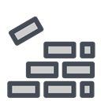

.. |aimmsIcon| image:: ../Images/icons/favicon.png
            :scale: 15 %

.. |aimms| image:: ../Images/aimms-logo-s-rgb.png
                :scale: 10 %
                :target: https://aimms.com/
                
.. |space| image:: ../Images/ThanksSmileySpace.gif

Application UI
==============

.. meta::
   :description: Help and support with building AIMMS application GUI.

AIMMS offers two User Interface builders, the classic WinUI for applications that run on Windows, and the modern WebUI for applications that run in a browser. This section offers guidance in developing an application and building a user interface. You will also find help to add custom styling to your applications.
    
.. toctree::
   :maxdepth: 1
    
   Sub_UI_Features/index
   Sub_Styling/index
.. Sub_Reporting/index

   
*For AIMMS IDE and Editor Settings topics, see* :doc:`../C_Getting_Started/index`