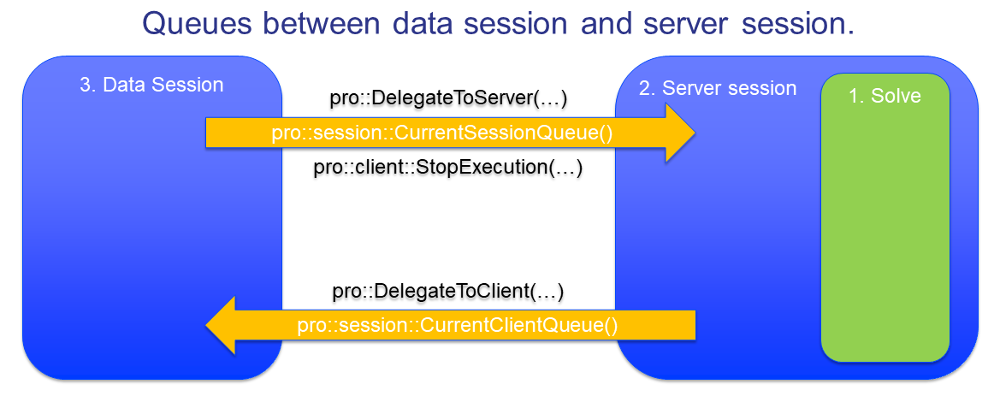

How to interrupt the server session?
==================================== 

Introduction
------------

Assuming we have visibility of the server session via `progress <https://how-to.aimms.com/Deploy_DataServerComm_5_Progress.html>`_ or `intermediate results <https://how-to.aimms.com/RetrieveIntermediateResults.html>`_, we may decide to interrupt the server session. 
This answer takes you through the steps to interrupt a solve process or to interrupt a server session from the client side. 

Implementation
--------------

Interrupting the server session is very direct and can be done by simply calling the AIMMS PRO library procedure, ``pro::client::StopExecution`` . However, you will need to know:

#.  to which message queue is the server process listening? In our example, we have only one server session, and the message queue - a string, can be obtained by using ``pro::session::CurrentSessionQueue()``.  

#.  whether you want to interrupt execution of the procedure, or just interrupt a currently executing solve statement (if any).

The mechanism is illustrated in the code snippet below. Here we interrupt only a solve statement.

    .. code-block:: none

        Procedure prInterruptSolve {
            Body: {
                if pro::GetPROEndPoint() then
                    pro::client::StopExecution(               ! 1 - The procedure that makes an interrupt.
                        pro::session::CurrentSessionQueue(),  ! 2 - The queue leading to the server session.
                        pro::AIMMSAPI_INTERRUPT_SOLVE );      ! 3 - Interrupt SOLVE, not entire server session.
                endif ;
                pSolveInterruptable := 0 ; ! Button BtnInterrupSolve becomes invisible.
            }
        }

Finally, to allow activate this procedure, we link this procedure to a new button widget, named ``BtnInterruptSolve`` in our example.

.. note:: If you want to stop the server session instead of the solver, you will need to replace ``pro::AIMMSAPI_INTERRUPT_SOLVE`` with ``pro::AIMMSAPI_INTERRUPT_EXECUTE`` in the above code.

Now, the user interface when the problem is being solved looks as follows.

.. image::  Resources/AIMMSPRO/Deploy_DataServerComm_3_RemoveVeil/Images/BB07_WebUI_screen.png 

The example AIMMS project with the above demonstrated procedures can be downloaded from :download:`8. Flow Shop - Interrupt <Resources/AIMMSPRO/Deploy_DataServerComm_3_RemoveVeil/Downloads/8. Flow Shop - Interrupt.zip>`.

Summary
-------

The direct support for interruptions makes interrupting a solver or a server session in AIMMS PRO very easy.

Further reading
---------------

An interruption is only one type of communication to a server session.  A generic way to communicate data changes from the data session to the server session is provided `here <https://how-to.aimms.com/Deploy_DataServerComm_8_PassNewData.html>`_ .

.. include:: includes/form.def
