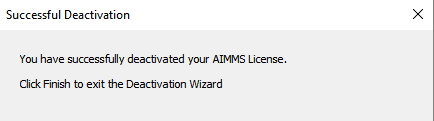
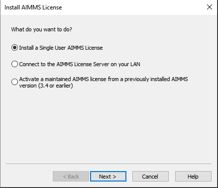
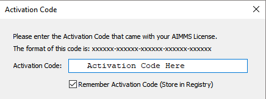

.. |doc| image:: Images/icons/Documentation.png
.. |aimmsIcon| image:: Images/icons/favicon.png
			:scale: 15 %

.. |aimms| image:: Images/aimms-logo-s-rgb.png
				:scale: 10 %
				:target: https://aimms.com/
.. |LicenseConfigurationLocation| image:: Images/LicenseConfigurationLocation.png
.. |LicenseDeactivation| image:: Images/LicenseDeactivation.png

.. |NoValidLicense| image:: Images/NoValidLicense.png

.. |InputLicense| image:: Images/InputLicense.png
.. |LicenseProtection| image:: Images/LicenseProtection.png

.. |NodelockProtection| image:: Images/NodelockProtection.png
.. |SuccessfulActivation| image:: Images/SuccessfulActivation.png

				
				
.. This text will not be shown 				
	.. figure:: Images/aimms-logo-s-rgb.png
					:scale: 70 %
					:align: center
					:target: https://aimms.com/

How To Transfer My Developer License to Another Machine?
==========================================================

There may be situations where you will need to use |aimms| on a different machine but you only have one license. An AIMMS developer license can only be used on one machine at a time and this guide demonstrates how to transfer an AIMMS license such that it can be used on a different computer. [#]_ [#]_

1.	First deactivate your license from the machine it is currently installed on
-------------------------------------------------------------------------------------
	
	a. In AIMMS head to Tools –> License -> License Configuration…
	
		|LicenseConfigurationLocation|
	
	b. Select your developer license and click 'Deactivate...'
	
		|LicenseDeactivation|
	
	c. Follow the Deactivation wizard and if successful the following message will be received:
	
		|SuccessfulDeactivation|

	.. [#] *This applies to Personal Nodelock activated licenses as AIMMS Developer Licenses are typically installed through the Personal Nodelock method.*
	.. [#] *For Free Academic license users make sure the license activation process is done within your university network*
	
2.  Install your AIMMS license on the other machine
----------------------------------------------------	
	a.  Open AIMMS and if no licenses have already been installed, the prompt for configuring a license will appear. Click 'Continue...'
	
		|NoValidLicense|
	b.  Follow the installation steps for 'Install a Single User AIMMS License'
	
		i.  Choose the first option for the regular AIMMS Developer License
		
			|InstallAimmsLicense|
			
		ii.  Input your license number
		
			|InputLicense|
			
		iii.  Choose the activation code option unless an AIMMS dongle was provided for your license.
		
			|LicenseProtection|
		
		iv.	 Input your Activation Code.  Choosing to save the activation code within your registry makes it easier to move the license back and forth.
		
				|InputActivationCode|
		
		v.  Choose the Personal Nodelock method if this license was activated as one before. If the license was activated as a Machine Nodelock, you can only choose that option for future activations.
		
			|NodelockProtection|
			
		vi.	If successful you will receive the following message:
		
			 |SuccessfulActivation|

   
.. note::

	If you encounter any issues with the license transfer process please contact support at support@aimms.com

:Author: Khang Bui
:Version: Last Updated March 04,2018

