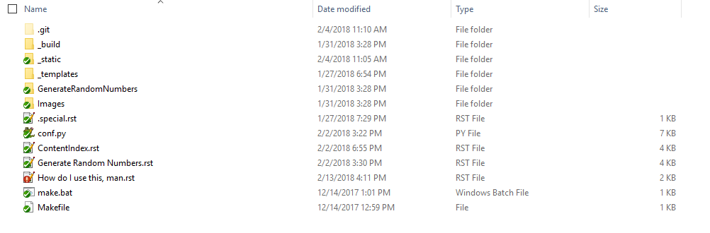
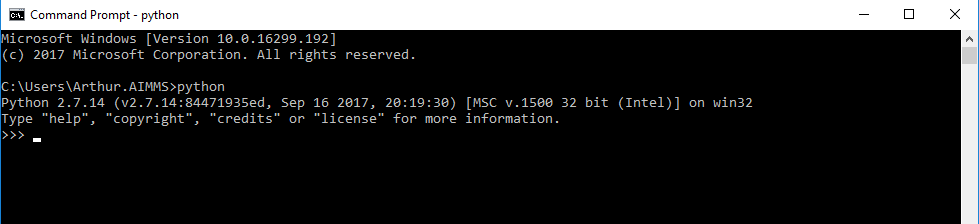
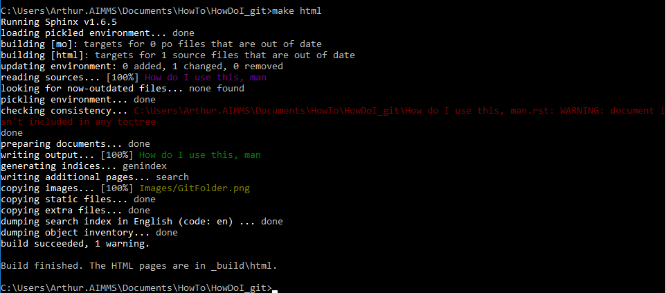

.. warning::
	This page is hidden, so nobody can access it except if one knows the url. You are a lucky one.

How do I use this, man ??
==============================

1/ Install Python 2.7, because Python is life
--------------------------------------------------

1. Double click the ``python-2.7.14.msi`` file  from here : https://www.python.org/downloads/release/python-2714/, 
2. Python 2.7 will be installed in ``C:\Python27``, because Python is life
3. Add python to your environment variables (thus you will be able to access it directly in the command prompt) by using https://superuser.com/questions/143119/how-do-i-add-python-to-the-windows-path (first answer)

.. note::
	
	You should normally be able to call Python directly from the command prompt now, by typing ``python``. If not, call me. It should look like this:
		
		|PythonPath|

2/ Install Sphinx package
--------------------------------------------------

* Install the Sphinx package (+ all depedencies) using the command "``python -m pip install sphinx``" in the command prompt (search *command* in windows menu search)

.. note::

	Along the way, we will use more and more "extensions" to Sphinx (google analytics, last posts addon, sexy pictures, etc.). Those are actually Python packages that you will install exactly as Sphinx package.

3/ Get the Git folder source code
--------------------------------------------------	
* Now, synchronise the git we've already created. ``git@gitlab.aimms.com:Chris/aimms-how-do-i.git`` . you should end up with a bunch of files. If you can't access it, please reach out.
* Here is what the folder looks like (without the non green-synchronised file): 
	|GitFolder|

4/ Build the documentation
--------------------------------------------------
* So far, this git folder only contains the "source" code (the .rst files, the conf.py, make files and potentially some css styling files... you know the drill) So we need to generate the HTML pages from this. To finally generate the HTML pages do the following:
	1. open the git folder
	2. open a command prompt **from this folder**
	3. run ``make html`` command. Voila:
		|SphinxBuild|
	4. find the HTML files in `_build\\html` (from this folder)
	5. those should be exactly the same than those on https://how-do-i.aimms.com/ 

.. note::
	
		Don't bother about the warning in red.. If however you have other red text in the console, please bother.

5/ Create your own How-do-i
--------------------------------
The best way to create your own HowDoI is by far to check the source (.rst file) from this doc, or any doc found online. However, here are some very small stuff to get you onboard:

* In the git folder, copy-paste the :blue:`Generate Random Numbers.rst` , and rename it :red:`MyHowDoI.rst`
* Open this file in notepad++, and start reading/modifing it
* Open a command prompt from the current folder (containing the **make** files)
* run ``make html``
* Go to `_build\\html` : you should have a new html called `MyHowDoI.html` in there