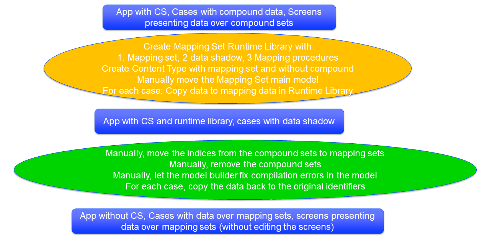

How to Handle the Deprecation of Compound sets
==============================================

:author: AIMMS Customer Support Team.

.. note:: This document and corresponding AIMMS :download:`project <Resources/Other/CompoundSets/Downloads/DeprecateCompoundSets.zip>` with running example and utility library (prefix dcsu) is actively being worked on. Your timely feedback is much appreciated as working your feedback may help others facing the same problem.  Thanks, AIMMS Customer Support Team.

.. _Section-Announcement:

Announcement
------------ 

In the AIMMS Newsletter of May 2018, the deprecation of compound sets was announced by the AIMMS Product owner. 
This announcement raised several questions.  For instance: 

* What?

* Why?

* When?

* How? 

This document attempts to answer these questions.

.. todo:: Ask Kim: should people be offered to register for the AIMMS news letter here? If so, is there a standard page for this? Same for old versions of the news letter.

.. _Section-What:

What are compound sets in AIMMS?
--------------------------------

Consider several one dimensional sets: :math:`S_1, S_2, ..., S_n`. As you know, a relation :math:`R` is a subset of a Cartesian product: :math:`S_1 \times S_2 \times ... \times S_n` with :math:`n \geq 2`.

In AIMMS, a relation :math:`R` is **transformed** to a compound set, say :math:`C`, when its attribute form contains the declaration of an index, say :math:`c` or an element parameter, say :math:`e`. As such a compound set is a one-dimensional set, and like other one-dimensional sets it can have an ordering.

Once a compound set is formed, it allows for the selection of components in tuples via tags. Let's assume :math:`C` is declared with the tags :math:`(T_1, T_2, ..., T_n)`, then selecting component :math:`i` of tuple :math:`c` is obtained by the notation :math:`c.T_i`.

.. seealso::
	
	https://download.aimms.com/aimms/download/manuals/AIMMS3LR_SetDeclaration.pdf

.. _Section-Why:

Why deprecate compound sets?
----------------------------

There are several technical reasons to deprecate compound sets:

#. Many existing components do not support compound sets. Because compound sets are implemented in AIMMS in a manner that sets them apart from all other sets and indexing mechanisms, adding support for compound sets to such components is relatively expensive. These components include

    #. Database tables and procedures exchanging data with `relational databases <https://en.wikipedia.org/wiki/Relational_database>`_. Anyway, there is no concept corresponding to compound sets in relational databases.
    
    #. `WebUI <https://documentation.aimms.com/webui/index.html>`_

    #. `Datalink <https://documentation.aimms.com/datalink/index.html>`_
    
    #. `CDM <https://documentation.aimms.com/cdm/index.html>`_

#. The initial design of compound sets dates back to the late 90's. At the time it was deemed that compound sets should be created '*automagically*' based on root sets and the use of an index or parameter in the set declaration. **This may give an application a 'surprising' behaviour**: 

    #. when the root sets of two conceptually different compound sets collide, then numbering and ordering of elements is different from the numbering and ordering of elements expected.
    
    #. when an index or element parameter is added to the declaration of a relation, suddenly the performance of the application may degrade (see also next point).

#.  The implementation of some indexing constructs involving compound sets exposes performance issues, which caused customers to abandon compound sets, and replace them by alternative approaches. The alternative formulations presented in this document do not suffer from these performance issues.

.. _Section-When:

How to plan for the adaptation of your model?
---------------------------------------------

**The deprecation of compound sets will only be definite after January 1, 2020**, giving AIMMS modellers more than one and a half year between the announcement and the definite deprecation. With the nearing of this deadline, the urgency to do something about it also increases. That is why the following timeline is provided:

#. The first release of AIMMS IDE after July 1, 2018, does not provide the attributes 'index' or 'parameter' in the attribute form of relations. This step prevents the creation of new compound sets.

#. The first release of AIMMS IDE after January 1, 2019, (6 months later) warns the model builder against existing compound sets.  

#. The first release of AIMMS IDE after July 1, 2019 (again 6 months later) issues a non-critical error message in developer mode for compound sets created. (Nb. Here a non-critical error is an error message after which AIMMS is still able to present data and execute procedures).  

#. The first release of AIMMS IDE after January 1, 2020 (again 6 months later), will definitely not be able to work when compound sets are present in the application.

.. _Section-Terminology:

Terminology
-----------

Some terminology is introduced in this section that will be used in this document to clarify the work that needs to be done.

*   One-dimensional sets that are not compound sets are called **atomic** sets. 
    Examples of atomic sets are sets containing names, calendars and subsets of the set Integers. 
    To declare a relation, AIMMS only allows atomic sets in the ``subset of`` attribute of that relation.

*   An **atomic index** is an index in an atomic set. A **compound index** is an index in a compound set.   
    
*   A **set mapping** is a collection of identifiers that together provide an alternative for the functionality of a single compound set. 
    A set mapping consists of:
    
    * A **set mapping set** is an atomic set with elements that look like elements from a compound set. 

    * A **set mapping index** is an index in a set mapping set. Note that a set mapping index is an atomic index.

    * A **set mapping relation** is a relation that contains the same set of tuples as a compound set.

    * A **set mapping parameter** is an element parameter that contains the data to handle the "tags" functionality of a compound set.

*   The parameters, variables and constrains of an application contain the data of that application. 
    A **compound data identifier** is a parameter, variable or constraint, 
    such that at least one index in the index domain of that identifier is a compound index. 
    As a shorthand, **compound data** is the data of a compound data identifier.   

*   A **screen definition** is a serialized representation of a screen. 
    The point and click types of UI provided by AIMMS, both WinUI and WebUI, 
    store these **screen definitions** as text files within an AIMMS project.

*   Consider a parameter ``A``, then a **shadow** parameter, say ``A_Shadow``, is a parameter that holds the same data as ``A``.
    Here, *same data* should be interpreted as, that there is a clear one-to-one correspondence between the elements of ``A`` and ``A_Shadow`` such that the values of the corresponding elements are the same. 
    The use here is compound data identifier ``P``, ie having compound indexes in its index domain, and a shadow ``PS`` having the corresponding set mapping indexes in its index domain. Such a shadow is also called an **atomic shadow identifier** as it has only atomic indexes, some of which are set mapping indexes.
    The ``dcsu`` AIMMS utility library creates atomic shadow parameters in a runtime library and subsequently use them as a stash to store data while the compound data identifiers are transformed to atomic data identifiers.
    Additionally, there are temporary procedures in that runtime library to copy the data from the compound data identifiers to the atomic shadow parameters and later from the atomic shadow parameters to the transformed atomic data identifiers.
    

.. _Section-Conversion-Procedure:

The conversion procedure proposed in this document
--------------------------------------------------

In this section a conversion procedure is proposed.  
First and foremost, this conversion procedure explains the manual actions that needs to be done by a modeller 
to handle the deprecation of compound sets. 
Second this conversion procedure explains the utilities that can be used from the 
AIMMS Utility library ``DeprecateCompoundSetUtilities`` to support these manual actions.

To determine the **scope** that this conversion procedure needs to handle, 
note that compound data is present in AIMMS Cases and compound data identifiers 
are present in the **AIMMS Screen definitions** of that AIMMS application. 
As you know AIMMS cases cannot be edited manually.
In addition, the format of screen definitions is designed for fast serialization instead of for human editing. 
Obviously, this conversion procedure should not overlook the need to adapt the model itself.

The overall deprecation procedure is depicted below:

The conversion procedure consists of the following conversion steps:

#. Create backups of your application and cases.

#. Start with adding the library ``DeprecateCompoundSetUtilities`` to your application.

#. Create the Set Mapping declarations and copy these declarations to your main model.

#. For each case: create a new case without compound data but with shadow data for the compound data identifiers. We call these cases, the shadow cases.

#. Adapt the model such that compound sets are no longer needed. 

#. Move the compound indexes to the corresponding set mapping sets. 

#. For each shadow case, copy that shadow case back to the original case.

#. Remove the library ``DeprecateCompoundSetUtilities`` from your application.

These step are elaborated in the next sections.

.. _Section_conversion_Backup:

Conversion step 1: Make a backup.
++++++++++++++++++++++++++++++++++

The importance of creating backups cannot be overemphasized as it is easily overlooked. The "how to" of making a backup is beyond the scope of this document.

.. _Section_conversion_use_Utility:

Conversion step 2: Copy the utility library
+++++++++++++++++++++++++++++++++++++++++++++++

For now: the download provides an example app, mimicking the running example used in this document. 
This example app also contains the utility library ``DeprecateCompoundSetUtilities``. 
Please copy the library from that example and use it in your application.

.. _Section_conversion_Create_Set_Mapping:

Conversion step 3: Create Set Mapping
++++++++++++++++++++++++++++++++++++++++

In this conversion step a set mapping is created for each compound set in your model. This conversion step consists of the following sub steps:

#. Please open the WinUI page: ``Deprecate Compound Set Control Page`` of the library ``DeprecateCompoundSetUtilities``, and press button ``Create Set Mapping Declarations``. 
   This action will create a section named ``set mapping declarations`` in the runtime library ``CompoundSetMappingRuntimeLibrary`` as runtime libraries are the only place where a library or main model may create new AIMMS code.
   The section ``set mapping declarations`` should be in the main model, however. 
   The subsequent sub steps in this conversion step will move this section to your main model:

#. AIMMS Menu - Edit - Export - to a file, say ``smd.ams``.

#. Select focus on the main model, create a section named ``Set Mapping Declarations``.

#. Select that newly created section and via the AIMMS Menu - Edit - Import - the file created in the first step of this section.

The model explorer should now look something like this:

.. image::  Resources/Other/CompoundSets/Images/SetMappingDeclarations.png 

.. caution:: Using Copy/Paste on the section ``Set Mapping Declarations`` of the runtime library might seem simpler than the sub steps 2 - 4 above. However, when you use copy/paste, the copied section will still contain references to the runtime indexes. A subsequent restart of your application will have compilation errors as the compound indexes still referencing the runtime library are not present upon first compilation.

.. _Section_Conversion_Copy_Input_Cases:

Conversion step 4: Copy the input cases
++++++++++++++++++++++++++++++++++++++++

Shadow cases are cases whereby the compound data is replaced by atomic shadow data.

On the page ``Deprecate Compound Set Control Page`` of the library ``DeprecateCompoundSetUtilities``, there is an area that is designated for copying case files with compound data to shadow cases.

You can either choose to do all cases in one go, or do case by case. Either way, please make sure that the names of the input file / folder and the output file/folder is determined before the button to do the actual conversion.

.. _Section_Conversion_Adapt_Model:

Conversion step 5: Adapt the model such that compound sets are no longer needed.
+++++++++++++++++++++++++++++++++++++++++++++++++++++++++++++++++++++++++++++++++++

In this section, we will discuss several examples of how compound sets are used in your model and provide alternatives using the set mappings created in :ref:`Section_conversion_Create_Set_Mapping`.

Running example
^^^^^^^^^^^^^^^

In this conversion step we will use a running example that contains:

#. One dimensional sets :math:`S, T, U`, with indexes respectively :math:`i, j, k`.

#. A relation :math:`R` that is subset of the Cartesian product :math:`S \times T \times U`.

#. A compound set :math:`C` with index :math:`h` defined as :math:`\{ (i, j, k) | (i, j, k) \in R \}`. The tags of this compound set are :math:`(TS,TT,TU)`

#. A compound subset :math:`D \subset C` with index :math:`g`. Note that :math:`D` inherits its tags from :math:`C`.

#. A parameter :math:`P` declared over the index for the compound set: :math:`P_h`

#. A parameter :math:`P1` declared over the index for the compound subset: :math:`P1_g`

#. A parameter :math:`Q` declared over the indexes for the one dimensional sets: :math:`Q_{i,j,k}`

#. A parameter :math:`Q1` declared over the index :math:`i`: :math:`Q1_i`

Replace use of tags
^^^^^^^^^^^^^^^^^^^

    .. code-block:: none

        Parameter p1 {
            IndexDomain: h;
            Definition: A(h.ts);
        }
        
Will give the error message: ``The "TS" is not a tag that can be associated with index "h".`` You can replace it by

    .. code-block:: none

        Parameter p1 {
            IndexDomain: h;
            Definition: A(epTag_C_TS(h));
        }
        

Replace use of atomic indexes with set mapping index
^^^^^^^^^^^^^^^^^^^^^^^^^^^^^^^^^^^^^^^^^^^^^^^^^^^^

Consider the declaration of compound data parameter ``P``:

    .. code-block:: none

        Parameter P {
            IndexDomain: h;
        }

Then using ``P`` in an expression such as:

    .. code-block:: none

        Parameter PS {
            IndexDomain: (i,j,k);
            Definition: p(i,j,k);
        }

will lead to a compilation error such as ``The number of arguments in the parameter "P" is not correct.`` 
You can replace this definition by: 
        
    .. code-block:: none

        Parameter PS {
            IndexDomain: (i,j,k);
            Definition: sum(h|(i,j,k,h) in sMappingSet_C_Relation,p(h));
        }

.. _Section_Conversion_Move_Indexes:

Conversion step 6: Move the compound indexes to the corresponding set mapping sets.
+++++++++++++++++++++++++++++++++++++++++++++++++++++++++++++++++++++++++++++++++++++++

This step is essential such that screen definitions can be retained unaltered. 

This step may be combined with the previous step; in so doing, the AIMMS compiler will notify you of any compound set syntax on an atomic set in the form of a compilation error.

.. _Section_Conversion_Backward_Copy:

Conversion step 7: For each shadow case, copy that shadow case back to the original case.
+++++++++++++++++++++++++++++++++++++++++++++++++++++++++++++++++++++++++++++++++++++++++++++

This section is similar to :ref:`Section_Conversion_Copy_Input_Cases`, except the area of the screen to use is ``Backward - creating cases with original identifiers without compound data``.

.. _Section_Conversion_Final:

Conversion step 8: Remove the library Deprecate Compound Set Utilities.
+++++++++++++++++++++++++++++++++++++++++++++++++++++++++++++++++++++++++++++++++++++++

As your project no longer depends on compound sets, this library is no longer needed and can be removed.

.. _Section-Tech-trick-explained: 

.. topic:: **Tech trick explained**: *How to find the compound sets already created in your application?*
	
	Repeating the above, a compound set has one of the following two characteristics:

	#. it is a subset of a Cartesian product in conjunction with an index or element parameter declared in its attribute form, or

	#. a subset of another compound set.

	We can use these characteristics to identify the compound sets. 
	To test for a compound set with the first characteristic, we test whether the string in the ``subset of`` attribute has a comma, and whether the attribute ``index`` or the attribute ``parameter`` has content. The sets that have this characteristic are also called compound root sets.
	To test for a compound set with the second characteristic, we check for each set whether its domain set is a compound set.

	The procedure ``dcsu::prIdentifyCompoundSets`` that does just this, and fills the sets ``dcsu::sCompoundRootSets``, ``dcsu::sCompoundSets``, and ``dcsu::sCompoundSetsThatAreNotRootSets``.

|

.. _Section_Summary:
    
Summary
-------

The functionality of compound sets described in the overview "Summary of what you can do with compound sets" can be achieved with a set mapping. 
In this "How to" document, we've described how you can replace the compound sets with a set mapping. As a set mapping is in essence no more than a normal one-dimensional root set and a relation, existing parallelized technology can be deployed to efficiently handle the statements involved. 

.. _Section_Collateral:

Collateral benefits
-------------------

Instead of continuing to let applications deploying compound sets suffer from the above disadvantages, this document describes a rewrite procedure.
This rewrite procedure is designed to make minimal changes to your application and at the same time:

#. Avoid the pitfalls due to the "automagic" design of compound sets (mentioned in :ref:`Section-Why` point 3 above).

#. Allow to deploy the efficiency improvements already implemented in the new parallel execution engine.

.. todo::

	#. Develop and test with compound set declared in library

	#. Defined compound sets, can set mappings also be defined definitions?

.. _Section-Further-Information:

Further information
-------------------

To obtain further information on the deprecation of compound sets, please send an e-mail to support@aimms.com or fill in the form, including your e-mail address, below:

.. include:: includes/form.def
