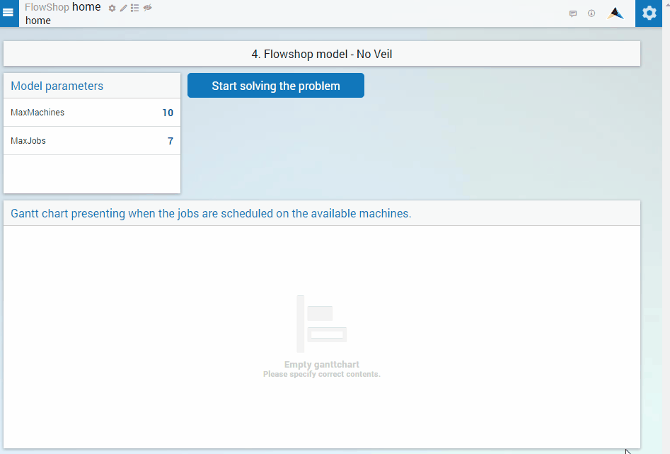

How to keep the AIMMS WebUI interactive while a solve process is running in the background ?
============================================================================================

:author: Mohan Chiriki, Chris Kuip

Introduction
------------
While solving decision problems using the AIMMS WebUI and PRO platform, the browser window is made inactive by default to represent a solve process running in the background. The window is active again when the results from the solve session are available for the user. However, for longer running procedures - the user might want to start a background procedure and continue working on other parts of the application. This next article in the series about AIMMS PRO will take you through the required steps to keep the AIMMS WebUI interactive while a solve session is undergoing. 

.. Please review the last line of the above paragraph

The Flowshop Problem As Running Example
---------------------------------------
We continue with the flowshop problem we used as example in the previous article in this series. 

.. insert hyperlink for previous article, which will be "How to publish an AIMMS app to the PRO platform". 
.. the flowshop problem or The Flowshop Problem ? What is the style for capitalization

This is a very good illustrative example for this case because the solving time of this problem depends on the number of machines and the number of jobs. For the default 10 Machines and 7 Jobs, you will have results almost instantaneously. If you change the number of jobs to 15 jobs, it will take much longer to solve the problem which can be seen below. 

Keep WebUI Session Active
-------------------------

We can keep the WebUI session active, or in other words - remove the veil by simply modifying the waitForCompletion argument in the pro::DelegateToServer statement. It can either be removed or the value set to 0. The code will look something like the following;

	.. code-block:: C

		if pro::GetPROEndPoint() then
			if pro::DelegateToServer(  
				completionCallback :  'pro::session::LoadResultsCallBack' )  
			then return 1;
			endif ;
		endif ;

This modification in the waitForCompletion argument reduces the inactive time of the browser window during a solve session drastically. There still could be inactive periods, especially during the initialization of the background procedures. The previously illustrated example will now look as follows. 

.. image:: Resources/AIMMSPRO/RemoveVeil/Images/NoVeil.gif

The example AIMMS project can be downloaded from :download:`Flow Shop - No Veil <Resources/AIMMSPRO/RemoveVeil/Downloads/4. Flow Shop - No Veil.zip>`

.. Insert link to next article - click here for if you want to have control on when to load results after a solve session. 
 

